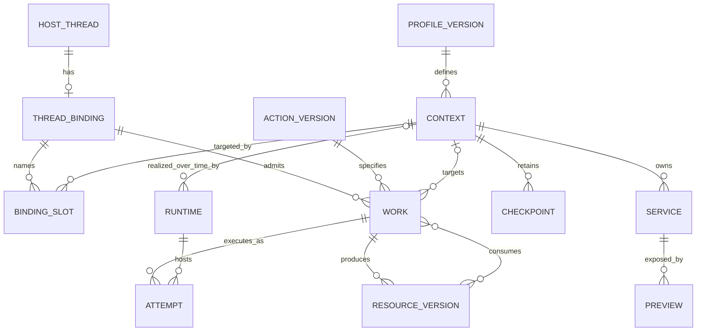
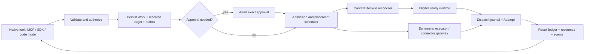
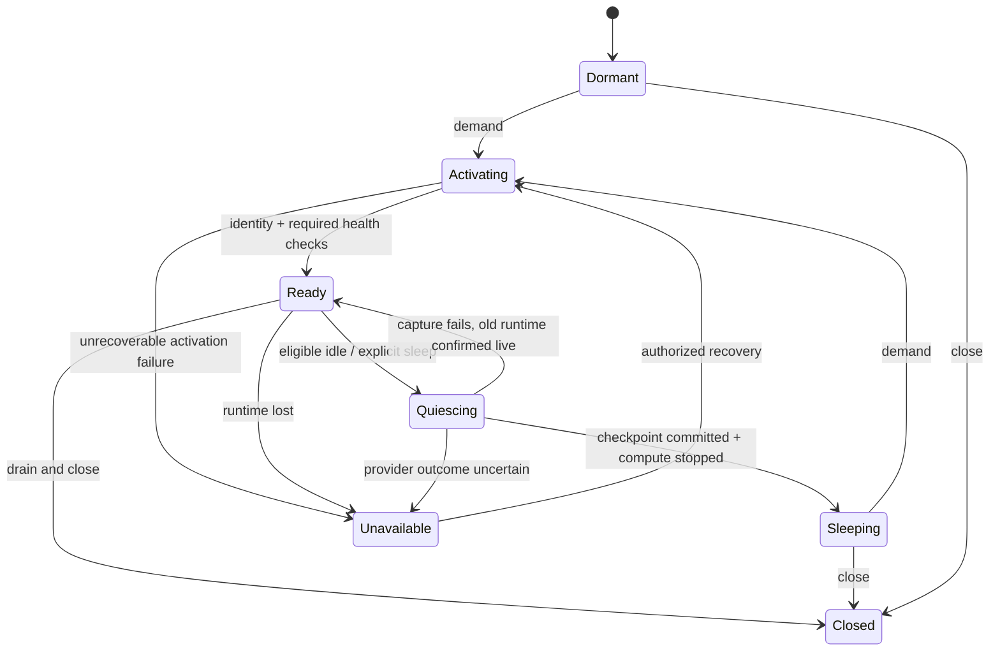
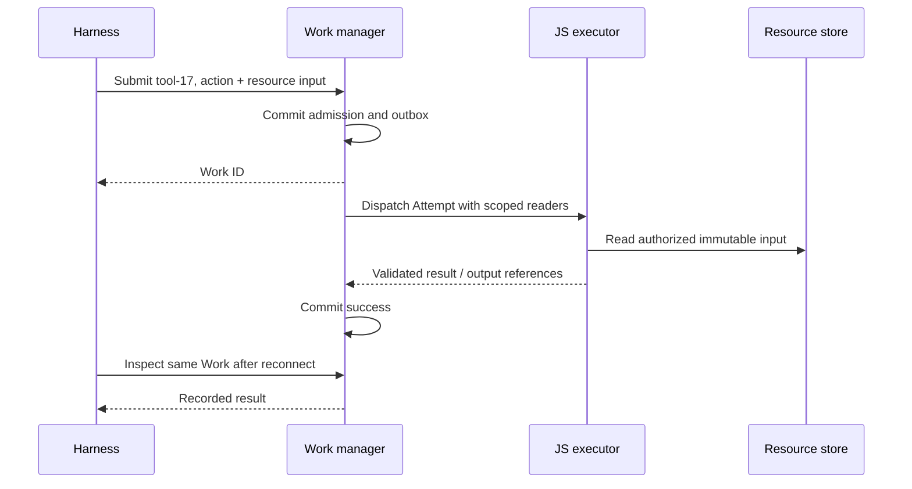
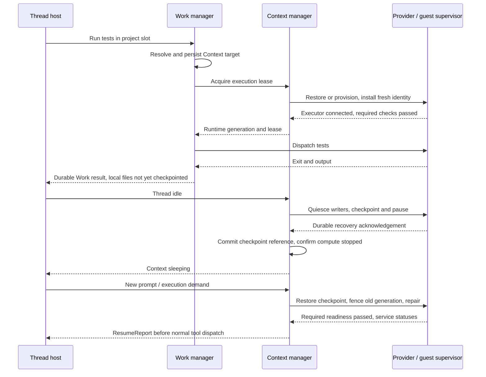
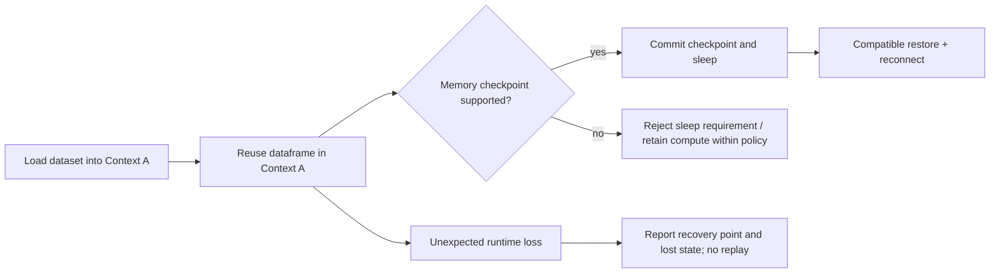
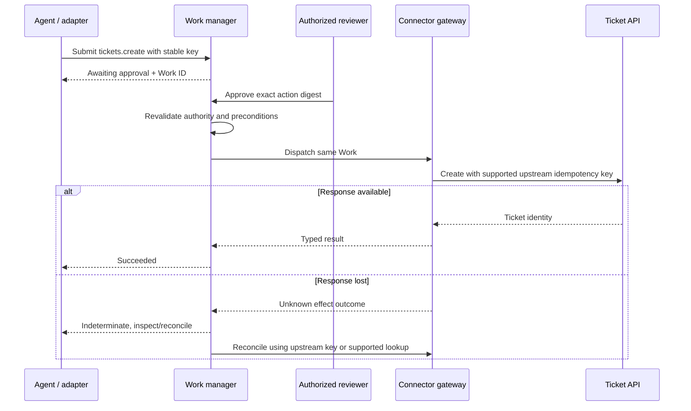
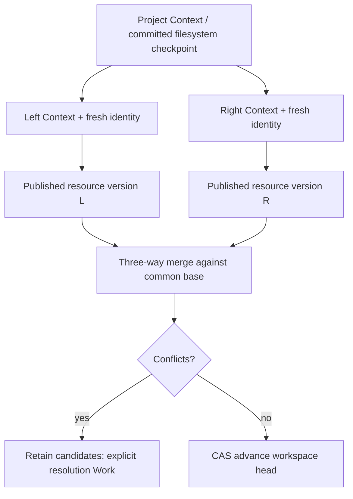

# Action Space: a work manager with stateful execution contexts

Working-backwards architecture · Draft 0.2 · September 12, 2026

> **Implementation status:** Historical proposal. [README](README.md) and [Executor integration](providers/executor/INTEGRATION.md) define the current API. Code execution records one Work with diagnostic MCP calls, not the nested child-Work or business-approval machinery proposed below. Service/preview and broader host APIs remain design material.

> **Comparison artifact:** The original design below is preserved for comparison, not the current launch schema. The [current Action Space API overview](ARCHITECTURE_ASTRA_XHIGH.md#api-at-a-glance) defines two capabilities: Code execution (`code_execution`/`invocation`, `code.execute`) and Sandbox (`sandbox` with `ephemeral` or `persistent` lifecycle profiles, `sandbox.run`, `sandbox.shell`/`sandbox.read`). The agent API is `execute({code})` with in-program `tools.*`; persistent continuity covers declared workspace state, not arbitrary root filesystem or RAM. Historical names and broader contracts below are not new promises.

**Status:** Proposed domain and contracts, not an implemented service. This document is the cohesive design baseline. It supersedes the workspace-first allocation model in [PR_FAQ.md](PR_FAQ.md), retains the interface principles in [AGENT_INTERFACE.md](AGENT_INTERFACE.md), and applies the evidence and caveats in [ORB_IMPLEMENTATION_RESEARCH.md](ORB_IMPLEMENTATION_RESEARCH.md). TypeScript is the contract sketch; Mermaid shows ownership and runtime order, not verified deployed infrastructure.

## 1. Work backward from the experience

### Proposed launch: agents ask for work; the platform supplies continuity

Action Space gives managed agents one action space for calling APIs, running code, working in repositories, controlling browsers, and using computers. Developers bind a thread to approved execution contexts. Agents use ordinary tools; Action Space admits the work, chooses eligible execution, retains its result, and reports what state survived.

A coding agent can edit a repository, run tests, and start a private preview. When the reviewer returns tomorrow, the thread resumes against the same files and a restarted service. An analytical agent can begin with a cheap JavaScript transformation, move explicit input artifacts into Python, and retain an interpreter only when its work requires one. An API-only task never allocates a machine.

Developers no longer need to infer whether a timed-out tool ran, whether a sleeping machine retained its files, or whether closing an MCP connection destroyed a browser session. Those answers are durable records and explicit contracts. The system does not promise that restoring a machine undoes external effects or that every command can safely retry.

**Customer promise:** “Perform this work within my authority and budget. Reuse the state I named. Tell me what completed, what is durable, and what needs reconciliation.”

### Product decisions

- The unit of scheduling is **Work**, not a conversation, VM, or arbitrary workflow program.
- Stateful work names a **Context**. Stateless work does not need one.
- A **ThreadBinding** supplies defaults and authority for tools; it is not the context's identity.
- Execution placement follows compatibility and state constraints before cost optimization.
- Conversation history lives in the managed-agent platform, not in a sandbox snapshot.
- One typed action registry backs the SDK, native tools, MCP, and bounded code composition.
- Sleep releases compute; close rejects new work; delete removes retained data. They are different commands.

Non-goals: model orchestration, scheduling future agent prompts, a general durable-JavaScript workflow engine, transparent cross-provider memory migration, exactly-once external effects, and a new hypervisor. Action Space schedules admitted execution work; the host schedules conversations and future prompts.

## 2. Ubiquitous language: six central nouns

| Noun | Definition and identity | Principal verbs | Owner / invariant |
| --- | --- | --- | --- |
| **Action** | Immutable versioned contract for a capability, e.g. `process.run@1` | describe, invoke through Work | Registry owns schemas and reviewed execution semantics. A version never changes meaning in place. |
| **Work** | Durable request to perform one Action with fixed inputs and target | submit, inspect, wait, cancel, reconcile | Work manager owns admission, attempts, outcomes, and output events. One admitted request key identifies one Work. |
| **Context** | Stable identity for a stateful environment and its continuity contract | ensure, activate, sleep, checkpoint, fork, close, delete | Context manager owns state lineage and exclusive execution authority. A context may exist without compute. |
| **Runtime** | Current provider allocation realizing a Context, or an ephemeral execution attempt | provision, connect, drain, fence, release | Runtime controller owns observed provider state. A VM ID is not a public context ID. |
| **ThreadBinding** | Versioned association of a host thread with authorized named context slots | bind, resolve, revise, detach | Integration boundary owns default resolution. Admission freezes the resolved target; rebinding cannot redirect admitted Work. |
| **Resource** | Independently retained data consumed or produced by work | read, publish, retain, delete | Resource service owns immutable versions, provenance, access, and retention. A resource is not a live path. |

Supporting concepts have narrow roles:

- **Profile:** immutable environment recipe, requirements, continuity, hooks, and allowed service specifications; e.g. `linux-project@3`.
- **Checkpoint:** immutable, committed recovery point for one Context. May reference portable resources or provider-bound snapshots. It is not necessarily a project template.
- **Attempt:** one dispatched execution of Work. Attempts do not get new business-operation identities.
- **Lease:** bounded authorization to use a runtime or control a context. Activity leases also block idle sleep; their expiry alone does not prove a process stopped.
- **Service:** desired long-lived process owned by a context supervisor, not by the tool invocation that started it.
- **Preview:** authorized route to a Service, with independent audience, expiry, and readiness.
- **Grant / Approval:** current authority / authorization of an exact pending action. Only the trusted policy path can issue them.

Avoid an `ExecutionEnvironment` entity alongside Context and Runtime. **Context is the logical environment; Runtime is its physical realization.** “Action space” means the authorized catalog plus these bound targets, not another aggregate.

## 3. Entity relationships and transaction boundaries



`HOST_THREAD` is an external identity, not a copied conversation table. A thread has at most one binding record in this integration; it can name several contexts. A context can be explicitly shared by several bindings, but writers are serialized. A fork creates a different Context; a thread message does not copy data or execution state. Runtime rows are historical: at most one generation may hold write authority for a context, even if an old provider machine has not yet been destroyed.

Resource production includes an initial import Work for uploaded inputs. Immutable resource versions are separate from mutable workspace branch heads. A workspace is an optional resource collection, not a prerequisite for Work. A provider machine checkpoint can preserve a whole root disk without requiring a distributed workspace filesystem.

### Bounded contexts

| Boundary | Authoritative records | Does not own |
| --- | --- | --- |
| Action registry | Action versions, input/output schemas, reviewed effect and retry policies | User authority or runtime placement |
| Work management | Work, attempts, request-key index, approvals linkage, execution events | VM snapshots or conversation state |
| Environment management | Contexts, lifecycle commands, runtime generations, leases, services | Business meaning of an external API effect |
| Resource management | Blobs, manifests, checkpoint metadata, durable publication receipts | Running processes |
| Policy and integration | Binding revisions, grants, host event inbox, audit identity | Agent planning |

These are module boundaries in an initial **modular monolith**, not five required microservices. Use a relational database for control records, object storage for outputs and snapshots we own, and a transactional outbox to wake reconcilers. Buy compute and browser isolation through provider adapters. Keep provider credentials and queue access outside agent-controlled machines.

Local transactions enforce local invariants. Cross-boundary transitions use durable intents plus idempotent reconciliation. Never put a provider network call inside a database transaction and pretend that it is atomic with the database commit.

## 4. Types make the important distinctions explicit

The blocks marked `typescript` form one compilable contract sketch, including the journeys. Omitted implementations are declared interfaces, not working SDK methods. Production schemas must be the source of generated static types and runtime validators; TypeScript alone is not input validation or authorization.

### Context kinds describe different persistence, not ascending permission

```typescript
type Id<K extends string> = string & { readonly __kind: K };
type ContextId = Id<"Context">;
type WorkId = Id<"Work">;
type ResourceId = Id<"ResourceVersion">;
type CheckpointId = Id<"Checkpoint">;
type BindingId = Id<"ThreadBinding">;
type ThreadId = Id<"HostThread">;
type RuntimeId = Id<"Runtime">;
type CommandId = Id<"LifecycleCommand">;
type RequestKey = string;

type ContextKind = "linux" | "python" | "browser" | "computer";
type ContextRef<K extends ContextKind = ContextKind> = {
  id: ContextId;
  kind: K;
};

type Continuity =
  | { kind: "filesystem"; onAbruptLoss: "last-checkpoint" }
  | { kind: "memory"; compatibility: string; reconnectRequired: true }
  | { kind: "browser-profile"; pages: "reopen" }
  | { kind: "attached-device"; recovery: "owner-managed" };

type RecoveryPoint = {
  id: CheckpointId;
  committedAt: string;
  expiresAt: string;
  consistency: "filesystem" | "application";
  location:
    | { kind: "portable"; resource: ResourceId }
    | { kind: "provider"; provider: string; compatibility: string };
};

type ActiveRuntime = {
  id: RuntimeId;
  generation: number;
  leaseExpiresAt: string;
};

type ContextState =
  | { phase: "dormant"; recovery: RecoveryPoint | null }
  | { phase: "activating"; command: CommandId }
  | { phase: "ready"; runtime: ActiveRuntime }
  | { phase: "quiescing"; runtime: ActiveRuntime; command: CommandId }
  | { phase: "sleeping"; recovery: RecoveryPoint }
  | { phase: "unavailable"; recovery: RecoveryPoint | null; reason: string }
  | { phase: "closed"; recovery: RecoveryPoint | null };

type ResumeReport = {
  context: ContextRef;
  generation: number;
  restoredFrom: CheckpointId | null;
  files: "restored" | "initial" | "owner-managed";
  memory: "retained" | "reset" | "not-applicable";
  services: { name: string; state: "ready" | "starting" | "failed" }[];
  reconnect: string[];
  outstandingWork: WorkId[];
};

type ThreadBinding = {
  id: BindingId;
  thread: ThreadId;
  revision: number;
  grant: Id<"Grant">;
  slots: Record<string, ContextRef>;
  admission: "open" | "detached";
};
type ContextRecord = {
  id: ContextId;
  revision: number;
  profile: { name: string; version: number };
  continuity: Continuity;
  desired: "active" | "idle" | "closed";
  observed: ContextState;
  latestRecovery: RecoveryPoint | null;
  retainedUntil: string;
};
```

`sleeping` requires a committed recovery point; `dormant` covers a never-allocated or owner-managed detached environment. An attached device is detached rather than snapshotted or powered off. A context requiring memory continuity cannot report successful sleep with only a filesystem checkpoint. Provider restore handles remain internal, authenticated references—not credentials supplied by the model.

A runtime generation fences old executors and observations. The agent uses stable Context references. The manager selects the current generation at dispatch and enforces it at storage and controlled effect gateways. For browser observations and explicit process handles, generation is part of handle validity, so stale state is rejected rather than rebound.

Aggregate methods validate profile/continuity compatibility, recovery-point ownership, and legal transitions; a structural record type does not encode every cross-record invariant. `desired` is reduced from current demands and explicit commands, not copied from the last thread signal. `latestRecovery` remains available while compute is active. Context workload identity is separate from each Work's acting principal: shared contexts never receive the union of every participant's grants. Sharing a writable authenticated environment requires explicit compatible trust and authority policies; otherwise fork or reject the binding.

### Actions correlate input, output, and target

```typescript
type ActionMap = {
  "js.run@1": {
    target: null;
    input: { source: string; inputs: ResourceId[] };
    output: { value: unknown; artifacts: ResourceId[] };
  };
  "process.run@1": {
    target: ContextRef<"linux">;
    input: { argv: string[]; cwd: string; deadlineMs: number };
    output: { exitCode: number; stdout: ResourceId; stderr: ResourceId };
  };
  "python.run@1": {
    target: ContextRef<"python">;
    input: { source: string; inputs: ResourceId[] };
    output: { display: string; artifacts: ResourceId[] };
  };
  "browser.observe@1": {
    target: ContextRef<"browser">;
    input: { url?: string };
    output: { observation: Id<"Observation">; nodes: { ref: string; text: string }[] };
  };
  "browser.act@1": {
    target: ContextRef<"browser">;
    input: { observation: Id<"Observation">; node: string; gesture: "click" };
    output: { navigationChanged: boolean };
  };
  "tickets.create@1": {
    target: null;
    input: { connection: Id<"Connection">; title: string; body: string };
    output: { ticketId: string; url: string };
  };
};

type ActionName = keyof ActionMap;
type RequestFor<A extends ActionName> = {
  action: A;
  target: ActionMap[A]["target"];
  input: ActionMap[A]["input"];
  requestKey: RequestKey;
};
type WorkRequest = { [A in ActionName]: RequestFor<A> }[ActionName];

type EffectDisposition = "none" | "possible" | "confirmed";
type WorkState<T> =
  | { phase: "awaiting-approval"; approval: Id<"Approval"> }
  | { phase: "queued"; reason: "capacity" | "context" | "admitted" }
  | { phase: "running"; attempt: number }
  | { phase: "succeeded"; output: T }
  | { phase: "failed"; code: string; effects: EffectDisposition }
  | { phase: "cancelled"; effects: EffectDisposition }
  | { phase: "indeterminate"; effects: "possible"; reconciliation: string };

interface WorkHandle<T> {
  id: WorkId;
  inspect(): Promise<WorkState<T>>;
  wait(options: { timeoutMs: number }): Promise<WorkState<T>>;
  // Returns output only on success. Throws a typed pending-approval,
  // failure, cancellation, or indeterminate receipt; never retries work.
  result(): Promise<T>;
  cancel(): Promise<void>;
}

interface BoundClient {
  submit<R extends WorkRequest>(request: R):
    Promise<WorkHandle<ActionMap[R["action"]]["output"]>>;
  context<K extends ContextKind>(slot: string, kind: K): Promise<ContextRef<K>>;
}
```

The union rejects Python targets for Linux process actions and malformed action arguments. `js.run` deliberately returns `unknown` for arbitrary program values; a named action can have a stronger output schema. Versioned resource IDs are immutable references, not strings interpreted as paths. Runtime validation additionally checks ownership, observation freshness, actual context kind, and grant scope; branded IDs are not access controls.

Action descriptors also declare reviewed requirements, concurrency class, effect category, and retry strategy. These are server-owned metadata, not caller assertions. `process.run` is not presumed safe to retry because its name says “process”; a shell command can perform arbitrary external writes. Unknown connectors are denied or approval-gated until reviewed.

### Lifecycle commands are durable, but are not fake user actions

```typescript
type ProfileRef<K extends ContextKind> = { name: string; version: number; kind: K };
interface Command<T> {
  id: CommandId;
  result(): Promise<T>;
}
interface ContextManager {
  ensure<K extends ContextKind>(input: {
    binding: BindingId; slot: string; profile: ProfileRef<K>; requestKey: RequestKey;
  }): Promise<Command<ContextRef<K>>>;
  activate(input: { context: ContextRef; requestKey: RequestKey }):
    Promise<Command<ResumeReport>>;
  sleep(input: { context: ContextRef<"linux" | "python" | "browser">; requestKey: RequestKey }):
    Promise<Command<{ recovery: RecoveryPoint }>>;
  fork(input: {
    source: ContextRef<"linux">; checkpoint: CheckpointId; requestKey: RequestKey;
  }): Promise<Command<ContextRef<"linux">>>;
}
interface HostPort {
  bind(input: {
    thread: ThreadId; grant: Id<"Grant">; requestKey: RequestKey;
  }): Promise<{ id: BindingId; revision: number }>;
  client(binding: BindingId): BoundClient;
  signal(input: {
    binding: BindingId; eventId: string; sequence: number;
    state: "active" | "idle" | "archived";
  }): Promise<void>;
}
declare const exec: { contexts: ContextManager; host: HostPort };
```

Commands have their own admission keys, progress, and reconciled outcomes. A durable `sleep` command orchestrates several provider calls; it is not one arbitrary user-code Attempt. Agent-facing `contexts.ensure` can wrap a command as an Action/Work, linking the child command ID without duplicating lifecycle state.

`ensure` has uniqueness on binding + slot. Same profile returns the existing Context; an incompatible profile conflicts. The host persists the resulting binding revision. Closing a context and replacing a slot is explicit and compare-and-set, never an accidental side effect of `ensure`.

These negative fixtures are part of the contract sketch. Removing a required restriction should make the corresponding `@ts-expect-error` fail compilation:

```typescript
declare const typedClient: BoundClient;
declare const pythonTarget: ContextRef<"python">;
declare const deviceTarget: ContextRef<"computer">;
// @ts-expect-error A Python context cannot satisfy a Linux process action.
typedClient.submit({ action: "process.run@1", target: pythonTarget, input: { argv: ["ls"], cwd: "/workspace", deadlineMs: 1000 }, requestKey: "negative/wrong-target" });
// @ts-expect-error A stateless JS action still requires its declared input fields.
typedClient.submit({ action: "js.run@1", target: null, input: { argv: ["ls"] }, requestKey: "negative/wrong-input" });
// @ts-expect-error Sleeping is not an operation on an owner-managed device.
exec.contexts.sleep({ context: deviceTarget, requestKey: "negative/device-sleep" });
// @ts-expect-error Sleeping without a committed recovery point is not representable.
const invalidSleep: ContextState = { phase: "sleeping", recovery: null };
async function assertOutputCorrelation() {
  const work = await typedClient.submit({ action: "js.run@1", target: null, input: { source: "return 1", inputs: [] }, requestKey: "negative/output" });
  const output = await work.result();
  // @ts-expect-error JS output does not acquire process-specific fields.
  return output.exitCode;
}
```

## 5. The scheduler optimizes only eligible work



Admission atomically records normalized input hash, binding revision, resolved context ID, policy reference, deadlines, and a tenant/principal-scoped request key. Duplicate key + same payload returns existing Work; different payload conflicts. Budget and policy are checked again before effects. Revocation after admission still blocks dispatch. Accepted Work is queued through the outbox, so a controller crash cannot lose it between storage and enqueue.

Scheduling proceeds in this order:

1. **Authority and feasibility:** action allowed, approved where needed, budget available, execution/data/model-output locality satisfied.
2. **Continuity and affinity:** a bound context constrains placement. Restore its compatible checkpoint, or reuse its runtime. Never replace an unavailable device with a cloud machine.
3. **Concurrency:** acquire required context writer/control lease. V1 serializes foreground stateful actions; explicit read-only operations may overlap where their consistency contract permits.
4. **Placement:** choose among eligible providers using expected queue delay, startup, transfer, execution, and retention cost. Prefer an already-warm compatible runtime when it wins end-to-end.
5. **Fairness:** per-tenant weighted queues and concurrency caps prevent one large task from consuming the fleet. Admission reserves bounded budget; accounting settles actual usage.

Deadlines expire queued work with no effects. Dispatch uncertainty is different: a missing acknowledgement is not proof that work never started. Automatic retries require connector idempotency, a provably effect-free attempt, or explicit reconciliation. No speculative race of an effectful action across providers.

**No invisible “promotion.”** A pure JS program cannot be rerun on Linux merely because it failed. The action contract determines compatible runtimes. Moving data to a new capability is another explicit Work or context action. A cheaper provider is not justification to discard a Python heap or logged-in browser.

## 6. Lifecycle semantics depend on context kind

| Kind | Preparation | Active state | Sleep / retention | Wake and loss |
| --- | --- | --- | --- | --- |
| Stateless JS / connector call | Approved module graph or connection config | One bounded Attempt; no Context | Persist output and Work; release execution | New attempt only under retry policy; no heap continuity |
| Linux project | Immutable prepared template | Working tree, processes, supervised services | Quiesce writers; commit required disk checkpoint; optionally memory | Restore files; rotate identity; repair and restart services; report process loss |
| Python session | Pinned interpreter and packages | Interpreter heap plus files | Memory-preserving provider checkpoint when required | Compatibility-checked resume; sockets reconnect; no automatic replay to reconstruct heap |
| Browser session | Browser version + scoped auth setup | Profile, pages, observations | Encrypted profile checkpoint; v1 closes/reopens pages | New observation generation; expire old node handles; reauthenticate if needed |
| Attached computer | Authorized outbound runner registration | Device and exclusive control lease | Release control/connection; do not snapshot or power off owner device | Reattach only to same authorized device; reobserve; state remains owner-managed |

Browser-inside-Linux can later be a composite profile whose children share an explicit lifecycle. V1 uses separate contexts and resource transfer to avoid pretending that unrelated sessions share a transaction.



This is the managed-context lifecycle. Attached devices use detach to return to Dormant; kinds without a required checkpoint do not claim Sleeping. Closing an unavailable or activating context also reconciles through a persisted command; the diagram omits those cleanup edges for readability. Close retains data under policy and rejects new work. Explicit deletion tombstones the Context and schedules provider/blob cleanup after dependent references and retention rules are checked.

### Safe sleep is a protocol, not a timer callback

1. Persist the desired sleep command and a new lifecycle revision; stop granting new mutation leases.
2. Reconcile active Attempts, human control, and service activity. Wait or return busy; do not kill foreground work merely because the thread is idle.
3. Quiesce *all* relevant writers, including services and human terminals. Run application flush hooks where required. If a writer cannot be frozen or fenced, reject an application-consistent capture claim.
4. Ask the provider to checkpoint/pause with a stable command key. Inspect on timeout rather than issuing another non-idempotent capture blindly.
5. Commit checkpoint metadata only after provider durability acknowledgement and compatibility/retention checks. Filesystem capture alone does not certify a database's application consistency.
6. Confirm compute stopped or release it, then publish Sleeping. If capture and release are separate provider steps, retain the committed checkpoint and reconcile the release. Until resolved, report Quiescing and possible ongoing compute charges.

A wake arriving during quiescence is retained as desired Active demand. Finish or safely abort capture, then reconcile toward Ready. Do not race two create/resume calls. A database lease and revision CAS serialize controllers; provider keys and `inspect` recover partial progress. If the provider cannot deduplicate or discover an ambiguous create, do not create a replacement that might duplicate live effects.

### Hooks are scoped, bounded, idempotent lifecycle extensions

| Hook | Identity and purpose | Failure contract |
| --- | --- | --- |
| `prepare` | Build identity; install dependencies into a reusable template | Fail template publication; no personal credentials or live agent processes in shared image |
| `activate` | Fresh context workload identity; authenticate mounts and dependencies | Required checks gate Ready; optional warmup runs separately with degraded status |
| `beforeCheckpoint` | Current context identity; flush application state and quiesce | Required failure prevents claiming the requested consistency |
| `afterRestore` | New identity/generation; reconnect and repair | Required failure leaves context unavailable for normal work; report retained recovery point |
| `beforeClose` | Best-effort cleanup | Cannot be the only revocation/deletion mechanism; controller enforces those externally |

Hooks receive context ID, lifecycle command ID, generation, reason, and prior recovery receipt—not the full conversation or admin credentials. They may run again after a controller crash. Hooks must not send emails or perform non-idempotent business operations. Service startup belongs to the supervisor. A hook's bounded completion is distinct from an optional service's health.

## 7. Thread state and environment state interact through a durable port

The host owns prompts, messages, model turns, and its thread status. Action Space owns execution state. Neither mirrors the other's state machine mechanically.

| Host input | Action Space reaction | Event returned to host |
| --- | --- | --- |
| Binding created | Persist slot and grant association; no mandatory allocation | `binding.changed` |
| Thread active / new work | Record activity; optionally prewarm selected slots; dispatch Work resumes its target | `context.ready` + ResumeReport |
| Thread idle | Remove thread activity demand; begin idle grace only if no other blockers | `context.sleeping` or reason sleep is deferred |
| Thread archived | Disable optional prewarm and request idle policy evaluation; do not imply delete or cancellation | Outstanding Work and retained-context summary |
| Binding detached | Reject new work through that binding; reconcile existing Work under its admitted policy | `binding.detached`; Context can remain shared |
| Provider lost | No host input required | `context.unavailable` + affected Work + latest durable recovery |
| Approval decided by trusted actor | Revalidate exact action and current authority | Work queued, denied, or precondition-expired |

Host events have a durable event ID and monotonic sequence per binding. Action Space stores an inbox, ignores duplicates/stale state signals, and acknowledges only after commit. Its outbox publishes ordered events per aggregate with resumable cursors; no global event order is promised. The host deduplicates and records its cursor with the applied thread update. An expired cursor returns a current snapshot plus an explicit history gap.

Bindings are pinned to the native tool adapter or authenticated MCP scope. No global `set_current_context`. A slot revision affects subsequent admission only; an already-admitted test remains targeted at the original context. Policy and context closure can still prevent its dispatch.

Sleep requires absence of effective activity: foreground Work, human control, preview demand, and explicitly configured service keepalive. Leases have TTLs and heartbeat owners. On expiry the controller reconciles execution before sleeping; a network partition does not mean the process stopped. Shared contexts consider every binding's demand. Preview polling is capped so an abandoned tab cannot reserve compute indefinitely.

## 8. End-to-end journey: the common tool call allocates no machine

The following examples use trusted host code. `requestKey` values represent IDs persisted by the host before submission, not fresh random keys on each transport retry. Resource and connection IDs come from authenticated imports/configuration.

```typescript
declare const thread: ThreadId;
declare const grant: Id<"Grant">;
declare const inputData: ResourceId;

async function analyzeSmallInput() {
  const binding = await exec.host.bind({
    thread, grant, requestKey: "task-482/bind",
  });
  const client = exec.host.client(binding.id);
  const work = await client.submit({
    action: "js.run@1", target: null,
    requestKey: "task-482/tool-17",
    input: {
      inputs: [inputData],
      source: "const rows = await inputs[0].json(); return {count: rows.length};",
    },
  });
  return work.result();
}
```

The JS executor supplies only declared resource readers and approved bindings. The source string is sandbox input, not evaluated by the SDK. There is no ambient filesystem, network, Node environment, or durable heap. The scheduler selects a bounded isolate, persists its result, and releases it. The host can recover the Work even if its wait connection disappears.



## 9. End-to-end journey: code, sleep, and resume like an orb

The host chooses a filesystem-continuous project profile. The agent never picks a provider or VM generation for routine shell work.

```typescript
async function codingThread() {
  const binding = await exec.host.bind({
    thread, grant, requestKey: "task-483/bind",
  });
  const project = await (await exec.contexts.ensure({
    binding: binding.id, slot: "project",
    profile: { name: "linux-project", version: 3, kind: "linux" },
    requestKey: "task-483/project",
  })).result();
  const client = exec.host.client(binding.id);
  const tests = await client.submit({
    action: "process.run@1", target: project,
    input: { argv: ["pnpm", "test"], cwd: "/workspace", deadlineMs: 120_000 },
    requestKey: "task-483/tool-8",
  });
  const result = await tests.result();
  // A nonzero exit is a completed program, not a dispatch failure.
  if (result.exitCode !== 0) return { testsFailed: true, log: result.stdout };

  await exec.host.signal({
    binding: binding.id, eventId: "host-event-40", sequence: 40, state: "idle",
  });
  // Explicit here to illustrate the durability boundary; idle policy normally does this.
  const saved = await (await exec.contexts.sleep({
    context: project, requestKey: "task-483/sleep-40",
  })).result();

  // A later host activation or bound tool call normally triggers this automatically.
  const resumed = await (await exec.contexts.activate({
    context: project, requestKey: "task-483/wake-41",
  })).result();
  return { saved: saved.recovery.id, resumed };
}
```

Native tool schema exposed to the model can simply be `process_run({argv, cwd, deadline_ms})`. The adapter obtains the Context from the pinned binding and supplies the durable tool-call key. A generic MCP gateway exposes the same action with a described schema; its authenticated scope replaces reliance on a transient MCP session ID.



If snapshot upload fails, the host must not receive “saved.” If the live runtime is confirmed healthy, resume accepting work there and report failed sleep. If provider state is unknown, reconcile before dispatch. If the host dies after tests finish, recover the same Work; do not rerun tests as a substitute for retrieving its result.

Supervised preview creation is a curated `services.ensurePreview` action: reconcile a declared service, configure the private route, and return `{url, serviceState, health}`. It can return `starting` or `unhealthy`; an existing URL is not proof of readiness. A preview access can wake the Context without starting a model turn.

## 10. End-to-end journey: sticky Python is not an ephemeral script

```typescript
async function repeatedAnalysis(binding: BindingId) {
  const python = await (await exec.contexts.ensure({
    binding, slot: "analysis",
    profile: { name: "python-memory", version: 1, kind: "python" },
    requestKey: "task-484/python",
  })).result();
  const client = exec.host.client(binding);
  await (await client.submit({
    action: "python.run@1", target: python, requestKey: "task-484/load",
    input: { source: "df = read_resource(inputs[0])", inputs: [inputData] },
  })).result();
  return (await client.submit({
    action: "python.run@1", target: python, requestKey: "task-484/group",
    input: { source: "display(df.groupby('region').revenue.sum())", inputs: [] },
  })).result();
}
```

`read_resource` is a declared runtime helper that materializes an authorized input. The profile pins interpreter semantics and library versions. Both calls run in the same serialized interpreter; a later call may rely on `df`. Sleep must preserve its memory under the negotiated compatibility contract. Unsupported memory preservation fails `ensure` or activation before executing dependent code; it never silently selects a filesystem-only profile.

If the interpreter is abruptly lost after the first call but before a checkpoint, the last durable recovery point might not contain `df`. Emit that loss and block dependent work pending explicit recovery acceptance. Do not replay the first source string: it might have performed an external write. The agent can choose to reload immutable data in a new context, with a new Work identity.



## 11. End-to-end journey: browser continuity and an approved external action

Browser profiles preserve authentication state only under an explicit retention and origin policy. Observations do not survive wake. An old observation fails even if the page looks identical.

```typescript
declare const connection: Id<"Connection">;

async function inspectAndProposeTicket(binding: BindingId) {
  const client = exec.host.client(binding);
  const browser = await client.context("research", "browser");
  const page = await (await client.submit({
    action: "browser.observe@1", target: browser, requestKey: "task-485/observe",
    input: { url: "https://example.com/status" },
  })).result();
  const proposal = await client.submit({
    action: "tickets.create@1", target: null, requestKey: "task-485/ticket",
    input: {
      connection, title: "Investigate service status",
      body: page.nodes.map(node => node.text).join("\n"),
    },
  });
  const state = await proposal.wait({ timeoutMs: 1000 });
  // The trusted host presents approval or pending progress; the agent cannot approve itself.
  return { work: proposal.id, state };
}
```

The configured ticket action requires approval. Approval binds its normalized input, action version, connection, acting identity, expiry, and preconditions. Source web content is untrusted input; it does not change authority. Approval permits only this pending action, after rechecking current policy.



If the upstream API has neither idempotency nor a reliable lookup, leave the outcome indeterminate for human reconciliation. Never claim exactly-once because admission was deduplicated. Restoring a browser or workspace does not roll back the ticket.

Strict action-level approval also cannot inspect arbitrary browser clicks or shell network traffic semantically. Use brokered typed writes or read-only external credentials in strict profiles. Broader authenticated browsing is a coarser grant with explicitly different guarantees.

## 12. End-to-end journey: parallel agents branch state, not machines blindly

Two host threads can share read access to one Context. To edit independently, checkpoint and fork, then bind each child thread to its own Context. Explicit resource publication and merge combine changes; conversation messages alone do not.

```typescript
async function branchProject(project: ContextRef<"linux">, checkpoint: CheckpointId) {
  const left = await (await exec.contexts.fork({
    source: project, checkpoint, requestKey: "review-7/left",
  })).result();
  const right = await (await exec.contexts.fork({
    source: project, checkpoint, requestKey: "review-7/right",
  })).result();
  return { left, right }; // Host authorizes and binds these to separate child threads.
}
```

The checkpoint must belong to the authorized source and support filesystem fork. V1 excludes memory/browser-profile forks that could duplicate authenticated sessions or repeat in-flight external effects. New contexts receive fresh identity; parent grants do not automatically transfer. Portable output merge uses a base resource version and compare-and-set head update. Conflict retains both candidates instead of last-writer-wins.



## 13. Failure contracts and durability boundaries

**Work success means the action's output was durably recorded, not that every local write was checkpointed.** Each method defines its success boundary. `process.run` succeeds at execution/result recording, including nonzero exit status. `resources.publish` succeeds only after bytes and manifest are durable. `contexts.sleep` succeeds only after required checkpoint commitment and confirmed compute suspension.

| Failure boundary | Required behavior |
| --- | --- |
| Submit response lost | Same request key retrieves same Work; retain key tombstones after result expiry rather than treating old keys as new |
| Controller dies after recording intent | Outbox/reconciler resumes the command using its ID and provider inspection |
| Old executor reconnects after replacement | Reject stale generation at dispatch, storage, and controlled effect gateways |
| Provider creates VM but response is lost | Discover by provider command key; quarantine ambiguity instead of blindly creating another writer |
| Agent wait or MCP connection ends | Work continues under its deadline; no implicit cancel or context deletion |
| Cancel races with success | Record actual outcome; cancel is not rollback |
| Live disk lost before checkpoint | Last committed recovery survives; lost local changes are reported, not called durable |
| Snapshot committed but database acknowledgement lost | Reconcile provider receipt and commit metadata idempotently; do not discard a usable recovery point |
| Required restore hook fails | Preserve checkpoint, report unavailable, do not dispatch normal work |
| Output schema validation fails after effects | Record contract failure with possible/confirmed effects; preserve restricted raw evidence |

Generation fencing cannot undo traffic already sent or control direct external writes from an unfenced guest. Before replacement or retry, isolate/terminate the old runtime or reconcile its effects. Broad direct egress weakens fencing guarantees; do not claim a guest-local lock solves a network partition.

Retained data is encrypted, tenant-scoped, and subject to explicit expiry. Checkpoint retention must be no shorter than the promised context recovery window. Retention extensions are successful only after the provider accepts them. If a provider cannot meet the requested window, reject the profile or explicitly negotiate a shorter contract before work begins. Deleting a binding never implicitly deletes resources still referenced by other authorized contexts.

Code mode composes the same admitted actions with stable child identities and bounded concurrency. Its heap is ephemeral. On approval interruption, return completed/in-flight child receipts and the pending action; approval dispatches that child only. Continuing arbitrary program execution is not achieved by rerunning the whole script.

## 14. Type-driven implementation order and proof obligations

1. **Define executable schemas and branded identifiers.** Generate SDK and tool descriptors from versioned action definitions. Add negative type fixtures for wrong target, wrong input, and mismatched result. Add runtime fixtures for forged IDs and invalid upstream output.
2. **Implement Work admission and recovery first.** Durable keys, receipts, outbox, cursor recovery, approval binding, and connector reconciliation before adding several providers.
3. **Implement Context and binding aggregates.** CAS revisions, explicit desired/observed lifecycle, serialized mutation leases, generation fencing, and durable host inbox/outbox.
4. **Add one Linux adapter and one stateless executor.** Filesystem checkpoint-first, prepared templates, supervised services, private previews. Prove that ordinary shell calls survive host disconnection without requiring model-side lifecycle calls.
5. **Add browser and memory-continuous Python profiles.** They must pass their distinct recovery contracts. Attached computers follow; no silent cloud fallback.
6. **Add optimization after correctness.** Warm reuse and admission fairness first; adaptive placement only after measuring real completion cost and locality/continuity failures.

Provider conformance must fault-inject at create acknowledgement, dispatch acknowledgement, checkpoint commitment, release, and restore. The useful tests are competing outcomes: wake during pause; duplicate host events out of order; two controllers restoring one Context; an approval whose grant was revoked; an old executor writing after replacement; and a Python heap lost after a successful call but before capture.

Acceptance journeys: an API-only task allocates no VM; a paused coding thread returns with uncommitted files and honest service health; a new host recovers a running test by Work ID; a stale browser node is rejected after wake; and an uncertain external write is never silently repeated. Measure end-to-end successful outcomes, queue/start latency, retained-state loss, wrong-context dispatch, indeterminate effects, and total compute/storage cost. These are planned tests, not measured results.

## 15. Why this design follows the prior art without copying its limits

| Prior art | Borrowed principle | Our explicit contract |
| --- | --- | --- |
| [Cloudflare Project Think](https://blog.cloudflare.com/project-think/#the-execution-ladder) | Allocate only the execution capabilities needed | Typed action requirements + state-aware eligible placement, not a universal VM or a permission ladder |
| [Amp Orbs](https://ampcode.com/docs/orbs) and [lifecycle hooks](https://ampcode.com/docs/orbs/customizing) | Thread-bound tools, retained environment, prepare/restore, supervised services | Separate Binding, Context, Runtime, checkpoint receipt, and ResumeReport |
| [Executor](https://executor.sh) | Discoverable capabilities and bounded code composition | Same action registry and enforcement for native tools, MCP, and code mode |
| [Neon tools](https://neon.com/blog/give-your-agent-neon-tools) | Generated contracts plus curated SDK workflows | Ergonomic actions such as ensure-preview, rather than exposing raw provider endpoints to every agent |
| [Anthropic managed-agent architecture](https://www.anthropic.com/engineering/managed-agents) | Separate session/harness and execution | Durable host integration port; Context does not own the conversation or model loop |
| [E2B](https://docs.e2b.dev/sandbox/persistence) and [Modal](https://modal.com/docs/guide/sandbox-snapshots) | Runtime-specific preservation and compatibility | Negotiated continuity, provider-bound recovery, no invisible downgrade |

These are design inspirations grounded in the companion research, not claims that those products implement this domain model or these retry guarantees.

**The architecture in one sentence:** the host binds a thread to authorized contexts; agents submit typed work; the manager schedules it against eligible runtimes, preserves explicitly promised state, and returns durable outcomes and continuity reports.
