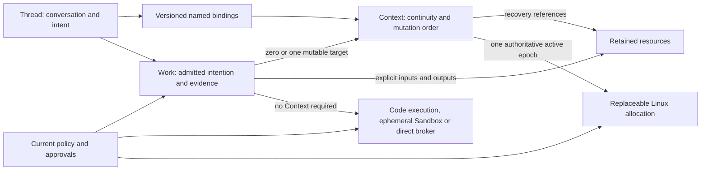
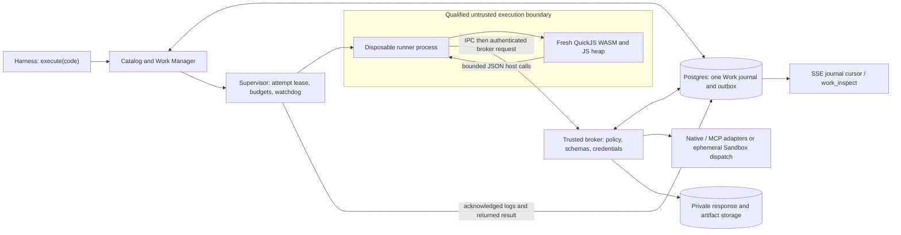
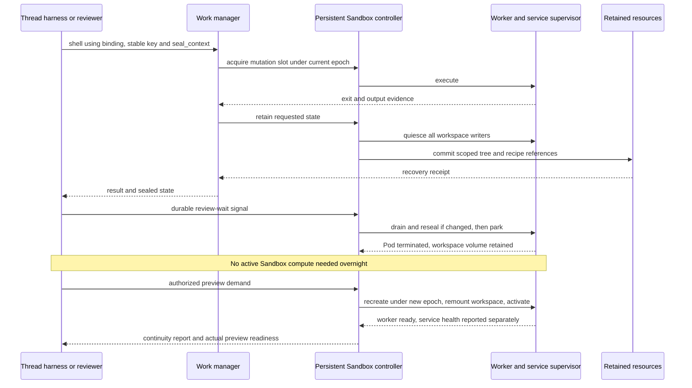
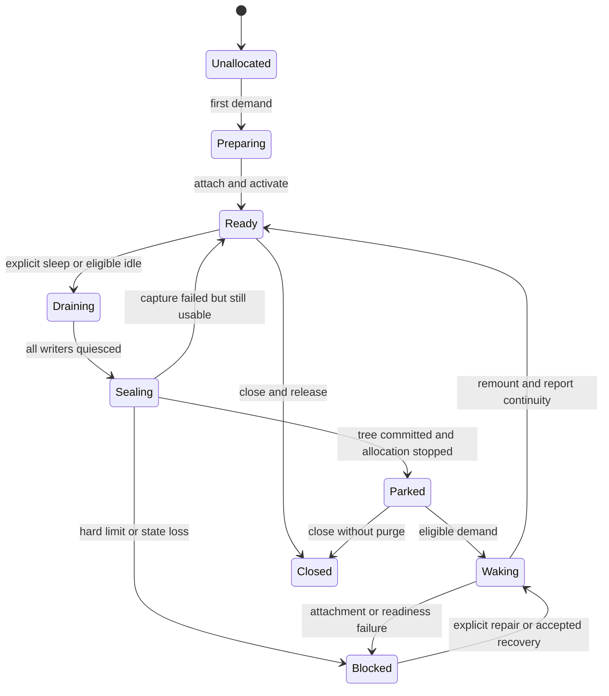
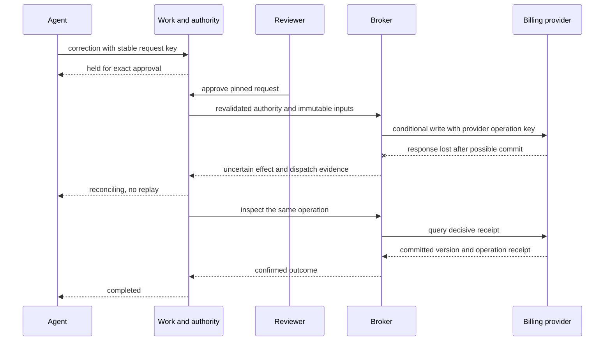

# Action Space: schedule the work, preserve its place

Consolidated architecture · September 12, 2026

> **Implementation status:** Historical design, not a shipped API specification. [README](README.md) and [Executor integration](providers/executor/INTEGRATION.md) are the current implementation contract. In particular, code execution now records one Work; nested MCP calls are diagnostic, business approvals belong to servers/harnesses, and service/preview proposals below are not implemented. Private deployment references have been generalized for publication.

**Status:** Proposed product and contracts, not an implementation or recovered vendor API. This is the standalone design: it incorporates the execution-options decision and evaluates Kubernetes Agent Sandbox as a possible Linux substrate. [ARCHITECTURE.md](ARCHITECTURE.md) remains the original comparison artifact; [EXECUTION_ENV_OPTIONS.md](EXECUTION_ENV_OPTIONS.md) records the preceding exploration. Neither is required to follow this document.

## 1. Customer promise and two execution capabilities

**Action Space is the work manager behind a managed agent.** Give it an action, explicit inputs and any state that must continue. It admits the work under policy, selects eligible execution, follows the outcome and keeps the evidence independently of the conversation or machine.

> Your agent can compare API results without a machine, run native analysis and return a report, or keep a coding workspace for tomorrow's review. Ordinary shell and file tools already know the thread's Sandbox. When execution stops, the platform says what completed, what survived and what needs checking before continuing.

The developer integrates a scoped action client and a thread-lifecycle port. The agent sees ordinary bound tools, progressive discovery and precise continuity notices. The reviewer sees outputs, diffs, private previews and exact approval requests—not VM IDs.

### API at a glance

**Integrate two surfaces: scoped tools for the agent, and a trusted host SDK for the harness.** Both use one versioned typed action catalog and one durable **Work journal**. A Work reference identifies accepted work, not proof that it finished; a Context identifies retained Sandbox state, not a VM. The two initial capabilities are **Code execution** and **Sandbox**; Sandbox has **ephemeral** and **persistent** lifecycle profiles.

| Agent-facing surface | What the caller supplies → what it receives |
| --- | --- |
| `execute({code})` | An async JavaScript body → `{work, catalog, status}`. Inside it, discover with `tools.search({query, limit?})`, describe with `tools.describe.tool({path})`, call `tools[path](args)` or `tools.billing.list(args)`, and `return` the answer. `work` is a durable `WorkRef<CodeExecutionOutput>`; `status` is a bounded observation. |
| `work_inspect({work, waitMs})` | Existing Work identity and observation wait → current `WorkState<unknown>`, including child links and retained outcome. No new execution or extended deadline. |
| Native adapters / `action_call` for `sandbox.run`, `sandbox.shell`, `sandbox.read` | Ephemeral: approved profile, code/input references, argv and declared outputs; no Context. Persistent: command/`cwd` or file `path`, routed through the thread's `sandbox` binding. Same Work-backed typed results; no VM selection. These are catalog Action names, not new tool aliases. |

The agent supplies task inputs, **not credentials, tenant identity or fleet authority**. For Code execution the outer argument is only `code`; the harness injects the pinned catalog, persisted request key, actor/grants, accessible resources and approved bounds. Search/describe return immediate metadata inside the invocation without creating child Work; even a discovery-only `execute` has a parent Work receipt. Native adapters likewise inject authority and request identity; persistent Sandbox adapters resolve the binding. Every dispatch still validates current policy.

| Trusted host SDK / control surface | Contract and return boundary |
| --- | --- |
| `exec.work.submit(call, {key, finish?})`; `exec.work.inspect(work, {waitMs})`; `exec.work.cancel(workId, {key, reason})` | Submit a versioned Action with typed input/target → `WorkRef<T>`. Inspect reads `WorkState<T>` and retained output/resource references. Cancel acknowledges a request, not rollback or confirmed stop. Immutable tree reads use the existing `files.readVersion` Action. |
| `exec.threads.bind(...)`; `exec.threads.accept(signal)`; `exec.threads.inspect(thread)` | Bind with an expected revision → `ThreadBinding`; record a lifecycle signal → `{recorded: true}`; inspect → Context/Work references. These are routing/intake/read results, not execution Work or readiness promises. |
| `exec.contexts.ensure(...)`, `exec.contexts.seal(...)`, `exec.contexts.sleep(...)`, `exec.contexts.wake(...)`, `exec.contexts.recover(...)`, `exec.contexts.fork(...)` | Supply stable keys and typed lifecycle inputs → `WorkRef<T>` for the persistent Sandbox identity, recovery point, sleep receipt or continuity report. Lifecycle work uses the same journal; it is not a second job system. |
| `exec.services.ensurePreview({key, target, service})` | Declare a supervised persistent Sandbox service → `WorkRef<PreviewResult>`, whose result includes the private URL and actual readiness. |

The host retains idempotency keys, binding revisions and approved profiles/limits; the agent does not recreate them on each call. Host lifecycle methods are **not automatically agent tools**. Administrative close/purge/grant authority stays outside the agent catalog.

For example, after discovering the billing contract, with account-scoped access already supplied by the harness, the agent previews up to three invoice IDs:

```ts
async function previewInvoiceIds() {
  const { work } = await agent.execute({ code: `
    const response = await tools.billing.list({ limit: 3 });
    if (!response.ok) return response;
    const page = response.data;
    return { invoiceIds: page.items.map(x => x.id), incomplete: page.hasMore };
  ` });
  return { work, status: await agent.work_inspect({ work, waitMs: 1_000 }) };
}
```

`execute` may already contain the completed result at `status.outcome.output.result`; inspection follows the same receipt when more observation is needed, never reruns the source. Continue with the [complete Code execution schemas and transcript](#3-lightweight-executor-one-execute-tool-with-brokered-discovery-and-calls), [Sandbox lifecycle journeys](#4-native-journeys-deliver-an-artifact-or-retain-a-workbench), [typed SDK contracts](#5-typed-contracts-keep-execution-publication-and-continuity-distinct) and [thread integration](#6-thread-integration-lifecycle-and-scheduling).

### Two capabilities, with explicit Sandbox lifecycle profiles

| | **Code execution** | **Sandbox · ephemeral** | **Sandbox · persistent** |
| --- | --- | --- | --- |
| Customer job | “Use these tools and calculate the answer.” | “Run this native program and return its outputs.” | “Keep this place where the agent and reviewer work.” |
| Example | Join ledger and billing responses into a bounded discrepancy summary | OCR supplied PDFs with Python/native libraries | Edit a repository, run tests repeatedly and review a private preview tomorrow |
| Runtime affordance | Fresh bounded JS invocation; lazy, typed `tools` broker proxy | Isolated Linux process tree; prepared native dependencies | Isolated Linux workbench; live files, shell, local dependencies and supervised services |
| Runtime lifetime | One bounded composition | One Work attempt plus bounded output finalization | Demand-driven allocations for a retained Context |
| Continuing state | No cross-call heap or ambient filesystem | No machine/heap between runs | Declared workspace volume, initially `/workspace`; not the container root layer or RAM |
| Durable result | Returned value, bounded logs, explicit artifacts and child Work receipts | Logs and a committed declared output tree | Work results, scoped recovery trees, pinned recipe and Service definitions |
| Thread binding | None | None; a preferred image is not a Context | Versioned `sandbox` slot supplies ordinary shell/file targets |
| Idle transition | Invocation ends | Finalize outputs and release; no retained environment to sleep | Drain, seal workspace, park; later remount and restart |
| Initial exclusions | No Node, shell, arbitrary network, native addons or durable JS continuation | No continued terminal, interpreter, daemon or preview after completion | No implicit retention of ad hoc root installs, processes, sockets or Python heap |

**Code execution is fast, stateless code mode—not a tiny Linux sandbox. Sandbox supplies Linux/native/files/processes.** Its ephemeral profile delivers finite outputs without retained-environment ownership; its persistent profile retains a workspace Context. Both profiles share the same Sandbox capability and may share an isolated Linux substrate, image preparation and process transport. They are not separate products or permission tiers. “Fast” is a design goal, not a latency SLA.

[Project Think's execution ladder](https://blog.cloudflare.com/project-think/#the-execution-ladder) is workspace → isolate → npm → browser → sandbox. Borrow incremental capability selection, not a mandatory route. Durable resources are common primitives; reviewed JS libraries can extend Code execution. **Browser remains a future orthogonal capability**, not a required rung. A large ephemeral Sandbox can use more compute than a small persistent Sandbox; a permitted brokered write can have more authority than offline Linux execution.

| Plausible middle | Assessment |
| --- | --- |
| **Ephemeral Sandbox** | Recommended lifecycle for finite native artifact delivery. Its advantage is less retained state, not inherently cheaper VM-seconds or another capability. |
| Persistent interpreter | Prefer it only if customers mainly mutate costly in-memory datasets across questions. A Python process is not automatically a new infrastructure product; heap continuity needs a separately proven lifecycle. |
| Managed browser | An independent interaction/session capability, not a midpoint between JS and Linux. Do not launch it merely to fill a rung. |

If native tasks nearly always become interactive, stage the ephemeral profile's UX later without changing this two-capability model. Initial ephemeral images are approved and execution is offline except scoped input/output transfer. Persistent Sandbox continuity is **workspace-preserving**, not whole-machine preservation. These are consequential choices, not provider details to hide.

## 2. Domain model: Work owns the intention; Context owns continuity

An aggregate owns an invariant and updates it transactionally. Start with two execution aggregates, **Work** and **Context**. Other records have narrower responsibilities.

| Noun | Definition | Verbs and ownership |
| --- | --- | --- |
| **Action** | Immutable versioned capability contract: schemas, target, effects, limits and reviewed retry semantics | Discover, describe, invoke. Catalog owns definitions, not authority. |
| **Work** | One admitted intention with frozen inputs/target, actor, attempts, child links and outcome evidence | Submit, inspect, follow, cancel, reconcile. Work Manager owns admission and one journal for actions **and lifecycle requests**. |
| **Context** | Independently continuable mutable state, retained without compute; initially a persistent Sandbox | Ensure, bind, use, seal, sleep, wake, recover, fork, close. Context Manager owns lifecycle, mutation order and exclusive execution authority. |
| **ThreadBinding** | Versioned association from a thread's named tool slot to a Context | Bind, resolve, rebind, detach. Thread integration owns routing; a binding is neither a grant nor an allocation. |
| **Resource** | Independently retained immutable artifact, file tree or recovery point | Read, publish, retain, expire. Resource module owns bytes, manifests, provenance and retention. A reference does not grant access. |
| **Allocation** | Internal replaceable execution placement with a lease: an isolate invocation or Linux sandbox/Pod | Reserve, provision, fence, release. Scheduler and driver own placement; it is not the agent's identity. |

`Thread` belongs to the managed-agent platform: conversation, prompts, inference, delegation, timers and human review. `Grant` and `Approval` belong to trusted authority. A `Profile` pins capability, lifecycle, runtime compatibility, dependencies and continuity. A `Service` is a desired supervised process under a persistent Sandbox; a `Preview` is an authorized route with separate readiness, audience and expiry. These do not create competing task journals. Control-only lifecycle Work has no compute capability (`null`), not a third public capability; backend interfaces preserve the two Sandbox lifecycle contracts rather than hide a three-offering enum.



**Ownership invariants:**

- A thread has zero or more named bindings. Several authorized threads may reference one Context, but shared mutation requires one control owner; independent agents normally fork files instead.
- A Work targets at most one mutable Context in v1 and can consume many immutable resources. Composition creates child Work; the parent holds no Context lock while waiting for children.
- A Context has many historical allocations and recovery points, but at most one authoritative execution epoch. Lease expiry alone does not prove the old executor stopped.
- A **state cursor** identifies a lineage and ordered mutation step. An **allocation epoch** fences an executor. A new Pod can continue the same lineage; accepting rollback to older content creates a new lineage. Never use an epoch increment to conceal lost state.
- A workspace is a live file view or an immutable tree, not a mandatory execution owner. A file-tree head can advance with compare-and-swap without compute; there is no implicit synchronization with a live persistent Sandbox.

Admission atomically records canonical request, idempotency entry, resolved binding, budget reservation and dispatch outbox. Context mutation admission claims its slot and cursor/epoch. Resource publication uploads immutable bytes first, then commits manifest and recovery pointer in the control database. Provider calls happen outside database transactions and are reconciled by stable operation identity.

Initially use one control-plane application with Postgres, object storage and outbox-driven reconcilers. The broker, untrusted executors and privileged provider controller need separate security identities, not necessarily separate business-service layers. The following journeys use the proposed SDK; complete contract sketches appear in section 5.

## 3. Lightweight executor: one execute tool with brokered discovery and calls

### Match Executor's simple API; keep Action Space's recovery contract

**Code execution exposes one entry point: `execute({code})`.** Inside an async JavaScript body, the agent discovers tools, requests exact descriptions, invokes them through a lazy `tools` proxy and returns a value. This follows [Executor's source-verified interaction](COMPOSE_STACK_RESEARCH.md#executors-actual-code-mode-implementation). It supersedes the earlier Amp-style split between discovery and code execution; there are no competing aliases, import ceremony or custom output helper to learn.

The distinction is deliberate: **we match the agent interaction, not every Executor implementation choice or wire response**. Action Space adds durable Work receipts and preserves its own schema validation, limits and approval interruption. Initial source is JavaScript, not Executor's broader TypeScript-erasing/body-recovery convenience. There is no ambient filesystem, network, Node API, arbitrary import or cross-invocation heap. A brokered tool can reach a Sandbox or external API without giving the JS runtime that environment's capabilities. Amp's private code-mode engine remains unknown; its observed tools are prior art, not this API.

Our proposed surface is intentionally small:

| Agent tool | Contract |
| --- | --- |
| `execute({code})` | Admit `code.execute` with host-injected identity, pinned catalog and limits; return `{work, catalog, status}`. A completed `status.outcome.output` contains `result`, `logs` and `artifacts`. |
| `work_inspect({work, waitMs})` | Follow existing Work and child receipts without rerunning it; bounded waits never extend execution deadlines |

Inside `execute`, `tools.search({query, limit?})` returns ranked bounded `{catalog, items, incomplete}` metadata; `tools.describe.tool({path})` returns exact input/output types, schemas and semantics. Ordinary `tools[path](args)` and dotted calls return Promises of `{ok: true, data}` or `{ok: false, error}` for known tool failures. Metadata methods return their own described objects directly, not that tool-result envelope. Empty search is optional bounded inventory, never a prerequisite. A known path may be called without rediscovering it.

Curated direct tools and a generic `action_call` adapter use the same admission path. Read-only reads, artifact retrieval and one connector call can bypass composition entirely; a bound persistent Sandbox need not wake. Discovery reduces descriptor load; composition reduces intermediate model round-trips. Metadata aids choice, while trusted validation and policy enforce every call.

The model supplies **only `code`** to the entry point. Before presenting it, the harness pins a catalog snapshot to its tool-view revision. Every discovery response and admitted composition reports that catalog. Concurrent discovery never changes it. The harness persists the provider tool-call ID → request key → Work mapping and injects actor, grants, explicit accessible resources and approved bounds. A retry recovers that mapping before resolving anything anew; a new model call with identical source is a new intention, not deduplicated by source hash. Stale/unavailable catalog versions fail before dispatch rather than silently selecting newer tool contracts. Revoked authority still fails at call time.

These are the **exact proposed input JSON Schemas** for the outer tool and two in-program metadata methods. Search defaults to 5 results and permits 1–20 in this initial contract; `incomplete` calls for a narrower query, not silent completeness. Source/path/query byte bounds, nonblank source and a valid catalog path are additionally enforced by the versioned profile:

```json
{
  "execute": {
    "type": "object", "additionalProperties": false, "required": ["code"],
    "properties": { "code": { "type": "string", "minLength": 1 } }
  },
  "tools.search": {
    "type": "object", "additionalProperties": false, "required": ["query"],
    "properties": {
      "query": { "type": "string" },
      "limit": { "type": "integer", "minimum": 1, "maximum": 20 }
    }
  },
  "tools.describe.tool": {
    "type": "object", "additionalProperties": false, "required": ["path"],
    "properties": { "path": { "type": "string", "minLength": 1 } }
  }
}
```

**Use `return` for the answer and bounded `console.log(...values)` for diagnostics.** `code` is the body of an async function, so both `await` and `return` work directly. A final expression alone is not returned; falling through or returning `undefined` yields `result: null`. Other output must be JSON-compatible: reject cycles, nonfinite numbers, functions and nested unsupported values rather than silently discard them. Serialize under guest and total output limits; logs have a separate bounded string-line representation. Initial Code execution needs no `text`, `shapeOf`, `.raw` or `emit` helper. Publish files through explicit resource tools, which return retained references. An interrupted invocation has no committed return value; only acknowledged logs, published resources and child evidence survive.

The lazy proxy resolves a canonical catalog path only on invocation; it is not an enumerable object graph of installed integrations. `tools["billing.list"]` and `tools.billing.list` address the same contract. Reserve metadata namespaces and dangerous prototype members at catalog admission; make the proxy non-thenable and reject enumeration, assignment and unknown paths without dispatch. Discovering a path does not authorize it. Descriptions aid the model's next submission; reading a schema inside JavaScript cannot generate the model's next program or upgrade an unknown output to a checked type.

### A complete simulated tool flow: compare two ledgers

This flow and its finance data are **illustrative Action Space contracts**, not live Executor tools or executed billing integrations. The catalog scopes the account outside the source and guarantees unique invoice identifiers within each page. Both inputs accept integer `limit` from 1 through 300; output totals are validated safe-integer cents. The same schema source generates wire validators and these declarations.

**1. Search for the job**, without listing every integration. The transcript shows the outer tool input and the completed return value extracted from `status.outcome.output.result`; Work-envelope repetition is omitted in these first two steps:

```json
{
  "tool": "execute",
  "input": { "code": "return await tools.search({ query: 'compare ledger entries with billing invoices', limit: 5 });" },
  "completedResult": {
    "catalog": "finance-v3",
    "incomplete": false,
    "items": [
      { "path": "ledger.list", "description": "List ledger invoice totals for the bound account", "effect": "read" },
      { "path": "billing.list", "description": "List billing invoice totals for the bound account", "effect": "read" }
    ]
  }
}
```

**2. Request an exact description, still through `execute`.** Here is `billing.list`; `tools.describe.tool({path: "ledger.list"})` describes the other contract with `invoiceId` instead of `id`. The two descriptions can be requested together with `Promise.all`:

```json
{
  "tool": "execute",
  "input": { "code": "return await tools.describe.tool({ path: 'billing.list' });" },
  "completedResult": {
    "catalog": "finance-v3",
    "path": "billing.list", "version": "v1", "effect": "read",
    "inputTypeScript": "{ limit: number }",
    "outputTypeScript": "{ items: { id: string; totalCents: number }[]; hasMore: boolean }",
    "signature": "tools.billing.list(input: { limit: number }): Promise<ToolResult<{ items: { id: string; totalCents: number }[]; hasMore: boolean }>>",
    "inputSchema": {
      "type": "object", "additionalProperties": false, "required": ["limit"],
      "properties": { "limit": { "type": "integer", "minimum": 1, "maximum": 300 } }
    },
    "outputSchema": {
      "type": "object", "additionalProperties": false, "required": ["items", "hasMore"],
      "properties": {
        "hasMore": { "type": "boolean" },
        "items": { "type": "array", "maxItems": 300, "items": {
          "type": "object", "additionalProperties": false, "required": ["id", "totalCents"],
          "properties": {
            "id": { "type": "string", "minLength": 1 },
            "totalCents": { "type": "integer", "minimum": -9007199254740991, "maximum": 9007199254740991 }
          }
        } }
      }
    },
    "returns": "value", "waitMs": 5000,
    "semantics": "finance.read on the host-bound account; unique IDs per page; hasMore makes comparison incomplete; not an atomic cross-system snapshot"
  }
}
```

The generated declaration slice is below; the complete proxy/metadata types appear in section 5. Unique IDs require an adapter-level check in addition to JSON Schema. An absent upstream output schema yields `ToolResult<unknown>`; it does not get a precise declaration merely from example data. `ok: false` means a known tool failure, not a general claim that nothing happened remotely; its error includes the child reference when one was admitted.

```ts
type ToolResult<T> =
  | { ok: true; data: T }
  | { ok: false; error: { code: string; message: string; work: { id: WorkId } | null } };
type FinanceTools = {
  "ledger.list": (input: { limit: number }) => Promise<ToolResult<{
    items: { invoiceId: string; totalCents: number }[]; hasMore: boolean;
  }>>;
  "billing.list": (input: { limit: number }) => Promise<ToolResult<{
    items: { id: string; totalCents: number }[]; hasMore: boolean;
  }>>;
};
```

**3. Submit one bounded composition.** This host-side example submits the exact agent-facing `execute({code})` payload. For this simulated run the harness has retained key `audit-482/comparison-v1`, pinned `finance-v3`, no resource inputs, a 30-second execution deadline and a 1-second initial observation wait. Those are illustrative host settings, not model-required arguments, product limits or performance predictions.

```ts
async function compareInvoices() {
  return agent.execute({
    code: `
      const [ledgerResult, billingResult] = await Promise.all([
        tools["ledger.list"]({ limit: 100 }), tools.billing.list({ limit: 100 })
      ]);
      if (!ledgerResult.ok) return { source: "ledger", ...ledgerResult };
      if (!billingResult.ok) return { source: "billing", ...billingResult };
      const ledger = ledgerResult.data;
      const billing = billingResult.data;
      const expected = new Map(ledger.items.map(x => [x.invoiceId, x.totalCents]));
      const billedIds = new Set(billing.items.map(x => x.id));
      const differences = billing.items.flatMap(x => {
        const cents = expected.get(x.id);
        if (cents === undefined || cents === x.totalCents) return [];
        const deltaCents = x.totalCents - cents;
        if (!Number.isSafeInteger(deltaCents)) throw new RangeError("Unsafe difference in cents");
        return [{ invoice: x.id, ledgerCents: cents, billedCents: x.totalCents, deltaCents }];
      });
      const billingWithoutLedger = billing.items.filter(x => !expected.has(x.id)).map(x => x.id);
      const ledgerWithoutBilling = ledger.items.filter(x => !billedIds.has(x.invoiceId)).map(x => x.invoiceId);
      return {
        differences: differences.slice(0, 10), differenceCount: differences.length,
        billingWithoutLedger: billingWithoutLedger.slice(0, 10),
        ledgerWithoutBilling: ledgerWithoutBilling.slice(0, 10),
        previewLimited: [differences, billingWithoutLedger, ledgerWithoutBilling].some(xs => xs.length > 10),
        incomplete: ledger.hasMore || billing.hasMore
      };
    `,
  });
}
```

**4. Follow the same Work.** For ledger rows `(inv-19, 12340)` and `(inv-20, 8100)`, and billing rows `(inv-19, 12340)`, `(inv-20, 8700)`, `(inv-21, 2500)`, with both `hasMore: false`, the simulated completed response is:

```json
{
  "work": { "id": "work-compare-1" },
  "catalog": "finance-v3",
  "status": {
    "phase": "settled",
    "children": ["work-ledger-1", "work-billing-1"],
    "outcome": {
      "kind": "completed",
      "output": {
        "result": {
          "differences": [{ "invoice": "inv-20", "ledgerCents": 8100, "billedCents": 8700, "deltaCents": 600 }],
          "differenceCount": 1,
          "billingWithoutLedger": ["inv-21"],
          "ledgerWithoutBilling": [],
          "previewLimited": false,
          "incomplete": false
        },
        "logs": [],
        "artifacts": []
      },
      "effects": { "kind": "none" },
      "state": { "kind": "not_stateful" }
    }
  }
}
```

If the 1-second observation ends first, return `phase: "running"` and that same handle. `work_inspect` continues observation; it does not restart the 30-second invocation. The independent child records retain validated responses or authorized resource references, so a new program can consume prior results through brokered reads. Raw IDs in this display are wire representations; they are not caller-created typed receipts.

When `incomplete` is true, unmatched rows are provisional, not proven missing from the whole account. Concurrent API reads are not an atomic cross-system snapshot; a consequential correction must read and recheck the provider's current version separately. Two safe-integer totals can have an unsafe difference: the example rejects that case rather than emit rounded financial data; retained read results remain available for a new explicitly exact-arithmetic calculation.

### The implementation boundary and interruption contract

Run a fresh, bounded async JS body with only the reviewed `tools` proxy and host bridges. Warm clean capacity, cached code/schema bundles and broker connection pools avoid VM startup and repeated discovery. Never reuse tenant heap or credentials. Initial dependencies are standard JS builtins and the generated proxy; no source imports, arbitrary `npm install`, native addons or full Node compatibility. Extra pure-JS libraries require a separately versioned, reviewed surface rather than restoring an alternative tool-import API.

| Boundary | Trusted enforcement |
| --- | --- |
| Source and proxy | Parse an async function body; reject import/export and dynamic imports; generate pinned tool declarations and validate canonical paths at the broker. Types and proxy checks are not the security boundary. |
| Every broker call | Validate exact inputs, current actor/delegation/resource scope, approval, destination and output schema; credentials stay in the broker, outside source and isolate |
| Work admission | Allocate a durable child identity before dispatch, reserve policy-approved budget, pin target/schema and bound call count/concurrency; never use source line number alone as an idempotency key |
| Runtime and output | Bound wall/CPU/heap, source size, returned bytes, logs and outstanding children; validate/redact disclosure independently of where execution ran |
| Resource access | Use explicit authorized artifact/file-tree references and brokered reads/writes; a resource reference is neither a local path nor an ambient grant |

A short tool returns `{ok: true, data: validatedOutput}` within a bounded child wait, or `{ok: false, error}` for a known failure. A reviewed long-running tool returns `{ok: true, data: workHandle}` after admission; its descriptor explicitly says `returns: "work"`. Unschematized success data remains `unknown`. Completing JS after handling a tool failure is not proof that the child succeeded. Unexpected bridge defects throw sanitized errors; approvals, wait exhaustion and **uncertain effects** close the parent gate rather than become recoverable `ok: false` values that invite another write. Decoding repair reads the retained response through Work/resource inspection, never a replaying helper.

Keep these cases distinct:

- **Observation timeout:** only the client wait ended; the code invocation or its children may still run.
- **Composition deadline or isolate loss:** stop new child admission and settle the parent as interrupted, with acknowledged logs/resources and child links. Already accepted children keep their own deadlines and cancellation contracts. Missing parent output is not evidence that a child failed.
- **Approval interruption:** hold the exact child Work without a machine or mutation slot. Close the parent's admission gate and terminate its JS invocation; already dispatched siblings may finish. Approval resumes that child, **not the parent's heap**. The harness inspects receipts and submits a new explicit composition if needed.
- **Child remains pending after its bounded wait:** return an interrupted parent with the child handle; do not keep arbitrary JS alive indefinitely. Unawaited submissions also appear in the journal. No invisible background child may escape accounting.
- **Partial effects or invalid output after a write:** retain evidence and reconcile. Catching a JS error does not remove the hold or authorize another overlapping call.

The control-plane gate, not user code catching an exception, enforces interruption. A replacement harness can recover the parent's and children's records. It cannot reconstruct the invocation heap by replaying the program. Connector calls with unknown external outcomes remain in reconciliation even when the isolate has gone.

### Code execution stack decision: QuickJS-WASM with a separate broker; hosted Dynamic Workers as fallback

**Assuming deployment portability matters, start with `quickjs-emscripten`'s synchronous WASM build, a TypeScript runner on supported Node LTS, and a separate trusted TypeScript broker using the existing Postgres Work journal.** The runner never evaluates agent source in Node itself. A new WASM instance, QuickJS runtime and context execute each composition; deferred guest Promises bridge asynchronous broker calls and a bounded job pump resumes them. A local probe of **0.32.0** confirmed bare imports, top-level await and two overlapping host calls without Asyncify. This is API feasibility evidence, not a hardened implementation.

The probed release uses a patched vendored **QuickJS 2025-09-13**, not current Bellard 2026-06-04. Its engine/patch provenance must be reviewed before production; the npm version is not a security approval. The companion records the release-source pin and tested WASM digest.

**Executor's implementation supports this direction, not a drop-in lifecycle.** The [September 13 source review](COMPOSE_STACK_RESEARCH.md#executors-actual-code-mode-implementation) traces MCP `execute({code})` through body recovery/TypeScript erasure, a lazy `tools.*` proxy, deferred guest Promises and a policy/credential broker. Self-host uses QuickJS; Cloudflare uses Dynamic Workers when configured, otherwise QuickJS. Adopt its simple execution/discovery/call interaction and borrow the bridge and approval-before-credential-resolution ordering. Keep our validated pinned schemas and Work journal: Executor's resetting timeout is not our deadline, output-preview truncation is not a total output budget, and resident approval pauses plus a narrow single-call restart fallback are not durable parent/child Work recovery.

| Component | Concrete starting choice and responsibility |
| --- | --- |
| Contract/catalog build | Reviewed JSON Schema 2020-12 subset → Ajv 8 validators and `json-schema-to-typescript` declarations; curated workflow schemas for awkward integrations. Pin source schema, adapter and generated bundle digests together. |
| Source preparation | TypeScript compiler parser/checker for an async JS body against ES2022 and generated proxy declarations. No imports, TS source syntax, `@types/node`, npm resolution, user compiler plugins or execution in the compiler host. Bounded preparation worker; preserve source filename/map. |
| Invocation runner | `quickjs-emscripten` release-sync WASM; lazy non-enumerable `tools` proxy, JSON-only async bridge, bounded return/log capture; no module loader or QuickJS `std`/`os` capabilities exposed to source. Pin the exact WASM asset/engine revision, not just the wrapper's package version. |
| Outer containment | One invocation per disposable restricted runner process; prewarm never-used capacity. For hostile tenants use a qualified gVisor/Kata or comparable VM-backed boundary, no cross-tenant dirty sandbox reuse, cgroup memory/CPU controls and a watchdog outside the guest process. This can use a Kubernetes substrate only after qualification, without changing Sandbox lifecycle contracts. |
| Broker/control integration | Length-bounded local IPC to the supervisor; authenticated HTTPS/JSON to metadata reads, Work admission, receipt inspection and bounded log/result persistence. Server-side attempt binding/fencing; credentials and tenant connections live only in the broker. Native and MCP adapters share this path. |
| Evidence/operations | Postgres state/events/outbox and object storage for bounded large responses; SSE with journal cursors; OpenTelemetry spans/metrics. No Redis/DO/queue becomes another authoritative Work store. |

The shortlist separates **engine features**, **containment**, and **authorization**. QuickJS gives explicit module interception and interpreter memory/interrupt controls, but not a complete process budget or tenant boundary. Standalone `workerd` supports Workers modules/bindings, yet its [README warns it is not hardened](https://github.com/cloudflare/workerd/blob/10c0673595ff30fc520e5d0da1c74be9b68b6977/README.md) and its [standalone server installs null limit enforcers](https://github.com/cloudflare/workerd/blob/10c0673595ff30fc520e5d0da1c74be9b68b6977/src/workerd/server/server.c%2B%2B#L3271-L3340). Native QuickJS removes WASM overhead but adds native memory-safety exposure and a custom embedding stack; it is not the first choice for this TS/broker-shaped product.

**Fallback: managed Cloudflare Dynamic Workers**, if code/data residency, procurement, private broker connectivity and beta status are acceptable. Use one `LOADER.load()` per Work, a supplied module map, `globalOutbound: null`, no Node compatibility, a scoped broker binding, explicit CPU/subrequest limits and our independent admission/deadline controls. Do not use cached `get(sourceHash)` as a fresh-heap guarantee. Hosted Workers' security/limits are not supplied merely by running OSS `workerd`. The fallback still needs our Work journal and approval semantics; do not adopt Think's abort-and-replay continuation.



The invocation lifecycle is **admit and pin → prepare under limits → assign a clean runner → install the scoped proxy → evaluate and pump → retain output/child evidence → close admission → dispose**. Every tool call receives a bridge request ID; Work admission deduplicates transport retransmission before dispatch, not source replay. A write requiring approval closes the parent gate and terminates JS; its exact child remains resumable. Cancellation/deadline revokes new admission before disposal and requests cancellation only where the child's contract permits it. A late result still updates the child's Work. Finish commits the validated return value, accepted logs and final parent state before reporting completion; `console.log()` returning means locally buffered, not independently durable, and interruption can lose an unacknowledged tail.

Prefer this self-hosted stack for bounded JSON/API composition, not heavy JS analytics. Its costs are Promise/handle lifecycle code, interpreter throughput, isolation-capacity overhead and patch ownership. Switch to managed Dynamic Workers if approved hosting and measured representative workload/operations results favor it; retain QuickJS if in-company placement is mandatory. If neither containment option can be qualified, there is no launch-ready hostile-code executor. “Fast” comes from cached schemas, clean warm capacity and fewer model round-trips; no latency or cost ranking is established. [COMPOSE_STACK_RESEARCH.md](COMPOSE_STACK_RESEARCH.md) records the requirements, source pins, detailed comparison, broker protocol, spike and conformance plan.

## 4. Native journeys: deliver an artifact or retain a workbench

### Ephemeral Sandbox: native OCR with no machine to revisit

Code execution cannot promise a native OCR library, Python ABI or OS binary. Select an ephemeral Sandbox when the deliverable is a report. The prepared image supplies Python/OCR; code and inputs are read-only at `/code` and `/inputs/<name>`, with writable `/scratch` and `/out`. A build needing a mutable checkout copies its input into scratch. Initial ephemeral runs have externally enforced offline execution except scoped resource transfer.

```ts
async function extractInvoices(code: FileTree, invoices: Artifact) {
  const work = await exec.work.submit({
    action: "sandbox.run", version: "v1", target: null,
    input: { profile: profiles.ephemeralSandbox, code, inputs: { invoices },
      argv: ["python", "/code/extract.py", "/inputs/invoices", "/out"],
      deadlineMs: 600_000,
      outputs: { root: "/out", required: ["report.json", "rows.csv"] } },
  }, { key: "invoice-review-19/extract-v1" });
  return { work, status: await exec.work.inspect(work, { waitMs: 1_000 }) };
}
```

The manager follows **allocate → materialize → execute → quiesce writers → publish → release**. Client disconnection does not cancel the Work. Success requires zero exit **and** the committed required output manifest. A nonzero exit is failure evidence; missing success-only outputs must not erase its logs. On zero exit with publication failure, keep exit/log evidence, retry publication within a bounded finalization lease and report `OUTPUT_FAILED` if it cannot complete. Do not rerun user code to fix an upload. Release at lease expiry and identify unexported data that was lost.

New ephemeral runs have no affinity to previous runs; a running attempt still has affinity to its allocation. Reuse clean image capacity, not prior writable scratch. Retry only after fencing the old attempt and under the Action's reviewed contract. Offline is not a promise of deterministic results. Required output paths are relative to `/out`; export validates traversal, links, entry types and byte limits and returns immutable content, not a live URL to the guest.

### Persistent Sandbox: retain the parser when the work becomes iterative

If the report is enough, stop: persistent state adds no value. If the reviewer wants repeated parser edits, import exact source and outputs into a new Context. This works after the ephemeral allocation is gone; it is **not adoption of its VM**, heap or unexported scratch. Changing the Sandbox lifecycle profile requires an explicit new request, not an in-place promise that discarded state survived.

```ts
async function continueInPersistentSandbox(
  thread: ThreadId, code: FileTree, invoices: Artifact, output: SandboxRunOutput,
) {
  const context = await completed(await exec.contexts.ensure({
    key: "invoice-review-19/sandbox", owner: thread, name: "sandbox",
    spec: { kind: "sandbox", profile: profiles.persistentSandbox, seed: code,
      imports: { invoices, priorOutput: output.files },
      retentionUntil: "2026-10-12T00:00:00Z", idle: "seal_and_park" },
  }));
  return exec.threads.bind({ key: "invoice-review-19/bind", thread,
    slot: "sandbox", expectedRevision: null, context });
}
```

### A persistent Sandbox stays bound across overnight review

A separate Node coding thread already has its `sandbox` slot bound under the `sandbox-linux-persistent-v1` profile with a pinned Node workspace recipe. Tests and a preview share its live working tree, so ordinary commands stay there.

```ts
async function testAndPreview(bound: ThreadBinding) {
  const tests = await completed(await exec.work.submit({
    action: "sandbox.shell", version: "v1", target: bound,
    input: { command: "pnpm test", cwd: "/workspace", deadlineMs: 300_000 },
  }, { key: "feature-81/test-edits-v3", finish: "seal_context" }));
  const preview = await completed(await exec.services.ensurePreview({
    key: "feature-81/preview", target: bound,
    service: { name: "web", argv: ["pnpm", "dev", "--host", "0.0.0.0"],
      cwd: "/workspace", port: 3000, healthPath: "/", idle: "stop_and_restart" },
  }));
  return { testsPassed: tests.exitCode === 0, preview };
}
```

The native shell adapter injects `bound`; the model supplies command and workdir, never a provider VM ID. `sandbox.shell` reports the program's nonzero exit **as data**; unlike `sandbox.run`, it promises process execution, not a successfully delivered output tree. The distinction follows the action/lifecycle contract, not different public capabilities.

The initial persistent Sandbox profile retains `/workspace`: uncommitted code, compatible workspace-local dependency environments and declared application data. Its pinned image/recipe supplies OS packages. `/inputs` can be rematerialized from retained references. Ad hoc installs into the writable container root layer, `/tmp`, processes, sockets and an unexported dataframe heap are disposable on suspension. Move a needed OS tool into the recipe rather than silently promising its survival. Recipe changes with incompatible native dependencies require explicit rebuild/recovery, not a transparent version bump.



`ensurePreview` stores a versioned desired Service, reconciles its supervisor and returns a private route with actual `ready`, `starting` or `failed` status after a bounded health wait. A URL alone is not a working app. Service ownership is independent of shell-call lifetime; service processes restart after parking. Worker/daemon replacement may interrupt processes unless the deployed supervisor explicitly survives it—never infer that guarantee from a process API.

An authorized preview visit can wake service execution without inference. Authorize the viewer first, cap activity against abuse and keep preview origin, application login and control-plane credentials separate. A human terminal needs an exclusive control lease and participates in quiescence. Hooks and services cannot be invisible writers while a recovery tree is captured.

Illustrative return-to-work summary:

```text
Sandbox (persistent): workspace remounted under pinned Node recipe; uncommitted edits retained.
Recovery: scoped tree rp-18 covers /workspace through lineage L1, step 18.
Volatile state: root-layer changes, processes and sockets discarded during parking.
Tests: work-91 completed, exit 0; output readable without waking compute.
Preview: starting a new service process; previous connections must reconnect.
Billing correction: held for exact approval; no write dispatched.
```

Normal remount is not rollback to `rp-18`. After abrupt loss the volume may contain newer but uncertain writes. If it cannot be trusted or attached, explicitly recover from the retained tree and report any rollback/new lineage before dependent work. A successful shell result alone is not proof of a recovery point.

### Independent work transfers resources, not running environments

For parallel test shards, export a quiescent source tree once and dispatch independent ephemeral runs. For independent coding agents, the harness creates child conversations and `contexts.fork` creates separate persistent Sandboxes from that tree and a recipe. New identity, narrowed grants, separate cursors and leases are mandatory; no shared writable volume or cloned pending effect.

Each child returns logs or a candidate tree with its base reference. Integration is a separately admitted mutation with an expected destination cursor/head; it cannot overwrite newer parent work. Thread messages, branch names and paths do not transfer local files. Native data analysis can pass Parquet/CSV explicitly; reloading data is not restoration of an arbitrary mutated Python heap.

## 5. Typed contracts keep execution, publication and continuity distinct

These are a small catalog/SDK slice, not an implementation or all administrative APIs. Generate validators, TypeScript and proxy declarations from versioned schemas. TypeScript is not an authorization mechanism. The host snippets concatenate into one module; embedded async JS bodies are checked against the generated guest declarations without host SDK or Node globals.

### Profiles and action inputs describe the actual launch promises

```ts
type Id<N extends string> = string & { readonly __id: N };
type ThreadId = Id<"thread">;
type WorkId = Id<"work">;
type ResourceId = Id<"resource">;
type Artifact = { kind: "artifact"; id: ResourceId; mediaType: string };
type FileTree = { kind: "file_tree"; id: ResourceId };
type InputResource = Artifact | FileTree;
type Cursor = { lineage: Id<"lineage">; step: number };
type SandboxRef = { kind: "sandbox"; id: Id<"context:sandbox"> };
type ThreadBinding = {
  thread: ThreadId; slot: "sandbox"; revision: number; context: SandboxRef;
};
type SandboxTarget = SandboxRef | ThreadBinding;
type Capability = "code_execution" | "sandbox";
type Lifecycle = "invocation" | "ephemeral" | "persistent";
type ProfileRef<L extends Lifecycle = Lifecycle> = L extends "invocation"
  ? { capability: "code_execution"; lifecycle: L; id: string }
  : { capability: "sandbox"; lifecycle: L; id: string };
type Profile =
  | { capability: "code_execution"; lifecycle: "invocation"; runtime: "isolate";
      continuity: "none"; bundle: string }
  | { capability: "sandbox"; lifecycle: "ephemeral"; runtime: "linux";
      continuity: "none"; image: string }
  | { capability: "sandbox"; lifecycle: "persistent"; runtime: "linux"; recipe: string;
      continuity: { kind: "workspace"; roots: readonly string[]; recovery: "portable_tree" } };
const persistentSandboxProfile = {
  capability: "sandbox", lifecycle: "persistent", runtime: "linux", recipe: "node-workspace-v4",
  continuity: { kind: "workspace", roots: ["/workspace"], recovery: "portable_tree" },
} satisfies Profile;
type CodeExecutionInput = { catalog: string; code: string; resources: InputResource[];
  deadlineMs: number };
type CodeExecutionOutput = { result: unknown; logs: string[]; artifacts: Artifact[] };
type SandboxRunOutput = { exitCode: 0; files: FileTree; log: Artifact };
type Contract<T, I, O> = { target: T; input: I; output: O };
type Actions = {
  "code.execute": Contract<null, CodeExecutionInput, CodeExecutionOutput>;
  "sandbox.run": Contract<null,
    { profile: ProfileRef<"ephemeral">; code: FileTree; inputs: Record<string, InputResource>;
      argv: string[]; deadlineMs: number; outputs: { root: "/out"; required: string[] } },
    SandboxRunOutput>;
  "sandbox.shell": Contract<SandboxTarget,
    { command: string; cwd: string; deadlineMs: number },
    { exitCode: number; stdout: Artifact; stderr: Artifact }>;
  "sandbox.read": Contract<SandboxTarget, { path: string },
    { text: string; cursor: Cursor; truncated: boolean }>;
  "files.readVersion": Contract<FileTree, { path: string },
    { text: string; truncated: boolean }>;
  "billing.correct": Contract<null,
    { account: string; invoice: string; expectedVersion: string; newTotalCents: number },
    { invoice: string; newVersion: string; providerReceipt: string }>;
};
type ActionName = keyof Actions;
type Invocation = { [A in ActionName]: {
  action: A; version: "v1"; target: Actions[A]["target"]; input: Actions[A]["input"]
} }[ActionName];
type Output<A extends ActionName> = Actions[A]["output"];
```

The host selects an allowed Code execution profile; `catalog` selects its pinned tool contracts, not its grants. Sandbox profile references resolve to immutable approved definitions, not arbitrary provider configuration. Runtime validation checks reference ownership, binding revision, resource paths, correlated capability/lifecycle, profile compatibility, bounds and output schema. A Sandbox Context is persistent; ephemeral runs cannot borrow one implicitly. Arbitrary returned values and unschematized upstream output remain `unknown`; precise types require a registered validated schema, not an agent's assertion. For interrupted Code execution, a non-null `partial` has `result: null` plus acknowledged logs/resources, never a fabricated return value.

This is a pre-release wire-vocabulary change: preserve incompatible existing journals/profile data and reject them explicitly rather than deleting data or silently reinterpreting old names. New examples use the agreed profile IDs below; backend contracts distinguish ephemeral execution from persistent continuity without another offering enum.

### Work's evidence is independent of recoverable workspace state

```ts
type WorkspacePoint = {
  id: ResourceId; context: SandboxRef; cursor: Cursor;
  content: { kind: "workspace"; tree: FileTree; roots: readonly string[];
    recipe: string; inputs: Record<string, InputResource> };
  consistency: "application" | "filesystem"; expiresAt: string;
};
type StateReceipt =
  | { kind: "not_stateful" }
  | { kind: "unsealed"; at: Cursor; lastSeal: WorkspacePoint | null }
  | { kind: "sealed"; at: Cursor; point: WorkspacePoint }
  | { kind: "unavailable"; lastSeal: WorkspacePoint | null; lostAfter: Cursor | null };
type Effects =
  | { kind: "none" }
  | { kind: "confirmed"; level: "local_execution" | "provider_operation";
      receipts: string[] };
type Outcome<T> =
  | { kind: "completed"; output: T; effects: Effects; state: StateReceipt }
  | { kind: "failed"; code: string; programExit: number | null;
      evidence: Artifact[]; effects: Effects; state: StateReceipt }
  | { kind: "seal_failed"; output: T; reason: string; effects: Effects;
      state: Extract<StateReceipt, { kind: "unsealed" | "unavailable" }> }
  | { kind: "interrupted"; reason: "approval" | "child_pending" | "limit" | "isolate_lost";
      partial: T | null; effects: Effects; state: StateReceipt }
  | { kind: "cancelled"; effects: Effects; state: StateReceipt };
type WorkState<T> = { children: WorkId[] } & (
  | { phase: "queued" }
  | { phase: "held"; reason: "approval" | "capacity" | "context" | "budget"; detail: string }
  | { phase: "running"; attempt: number; after: string }
  | { phase: "finalizing"; stage: "output_publication" | "workspace_seal" }
  | { phase: "reconciling"; caseId: Id<"case">; known: string[]; uncertain: string[];
      safeNext: "inspect" | "read_back" | "human_review" }
  | { phase: "settled"; outcome: Outcome<T> }
);
declare const outputBrand: unique symbol;
type WorkRef<T> = { id: WorkId; readonly [outputBrand]: T };
type SubmitOptions<A extends ActionName> = { key: string;
  finish?: A extends "sandbox.shell" ? "record_result" | "seal_context" : "record_result" };
interface WorkManager {
  submit<C extends Invocation>(call: C, options: SubmitOptions<NoInfer<C["action"]>>):
    Promise<WorkRef<Output<C["action"]>>>;
  inspect<T>(work: WorkRef<T>, options: { waitMs: number }): Promise<WorkState<T>>;
  cancel(work: WorkId, input: { key: string; reason: string }): Promise<void>;
}
```

`unsealed` means no immutable recovery receipt covers the current cursor; it does **not** claim that a mounted PVC has no persistence. A `WorkspacePoint` covers only its declared roots, portable representation and pinned dependencies. It is never a whole-machine or memory snapshot. Actual retention, contents, ownership and consistency require provider/storage validation, not just constructing this type.

`record_result` retains output without forcing a capture. `seal_context` is opt-in: retain the mutation slot through workspace sealing, then return result plus scoped recovery evidence. Its finalizer remains inside that Work, not a child command competing for the same slot. `seal_failed` retains executed output and last known state; repair capture rather than rerun the program. A later explicit `contexts.seal` is a new lifecycle Work at the then-current cursor, not retroactive proof of the old command's exact state.

Code execution completion means its JS finished and its return value/logs were retained; child Work outcomes remain separately inspectable, including handled tool failures. An interrupted parent can be settled while its child remains held, running or reconciling; a reconciling child interrupts its parent with `child_pending`. `Effects` describe that record's contract-scoped evidence, not a blanket claim about all descendants. Unknown outcomes belong in `reconciling` on the responsible Work, not in a terminal failure that invites replay. Shell exit confirms local execution, not all remote effects a shell script attempted. The journal validates which result variants apply to each Action and retains child summaries and links.

### Lifecycle methods share Work identity without sharing runtime semantics

```ts
type PersistentSandboxSpec = { kind: "sandbox"; profile: ProfileRef<"persistent">; seed: FileTree;
  imports: Record<string, InputResource>; retentionUntil: string; idle: "seal_and_park" };
type VolumeRef = { id: Id<"volume"> }; // Internal storage identity, not an agent target.
type PersistentSandboxPhase =
  | { state: "unallocated" }
  | { state: "preparing" }
  | { state: "ready"; epoch: number; cursor: Cursor }
  | { state: "draining" }
  | { state: "sealing"; through: Cursor }
  | { state: "parked"; volume: VolumeRef; point: WorkspacePoint }
  | { state: "waking"; volume: VolumeRef }
  | { state: "blocked"; reason: "state_lost" | "hook_failed" | "seal_failed" | "attachment_failed" }
  | { state: "closed" };
type SleepReceipt =
  | { kind: "already_unallocated" }
  | { kind: "parked"; point: WorkspacePoint };
interface ContextManager {
  ensure(input: { key: string; owner: ThreadId; name: string; spec: PersistentSandboxSpec }):
    Promise<WorkRef<SandboxRef>>;
  seal(input: { key: string; context: SandboxRef }): Promise<WorkRef<WorkspacePoint>>;
  sleep(input: { key: string; context: SandboxRef }): Promise<WorkRef<SleepReceipt>>;
  wake(input: { key: string; context: SandboxRef }): Promise<WorkRef<ContinuityReport>>;
  recover(input: { key: string; context: SandboxRef; point: WorkspacePoint;
    expectedCursor: Cursor; acceptRollback: true }): Promise<WorkRef<ContinuityReport>>;
  fork(input: { key: string; owner: ThreadId; name: string; from: FileTree;
    profile: ProfileRef<"persistent">; retentionUntil: string }): Promise<WorkRef<SandboxRef>>;
}
type ServiceSpec = { name: string; argv: string[]; cwd: string; port: number;
  healthPath: string; idle: "stop_and_restart" };
type PreviewResult = { url: string; audience: "thread_members";
  readiness: "ready" | "starting" | "failed" };
interface ServiceManager {
  ensurePreview(input: { key: string; target: SandboxTarget; service: ServiceSpec }):
    Promise<WorkRef<PreviewResult>>;
}
type Json = null | boolean | number | string | Json[] | { [key: string]: Json };
type JsonSchema = boolean | { [key: string]: Json };
type ToolDescriptor = {
  catalog: string; path: string; version: string; effect: "read" | "write";
  inputTypeScript: string; outputTypeScript: string; signature: string;
  inputSchema: JsonSchema; outputSchema: JsonSchema | null;
  returns: "value" | "work"; waitMs: number; semantics: string;
};
// Generated finite path set for this finance catalog slice, not a universal tool catalog.
type ToolPath = keyof FinanceTools;
type ToolSearchResult = { catalog: string; incomplete: boolean;
  items: { path: ToolPath; description: string; effect: "read" | "write" }[] };
interface AgentCodeTool {
  execute(input: { code: string }): Promise<{
    work: WorkRef<CodeExecutionOutput>; catalog: string; status: WorkState<CodeExecutionOutput>;
  }>;
  work_inspect(input: { work: { id: WorkId }; waitMs: number }): Promise<WorkState<unknown>>;
}
interface CodeExecutionGlobals {
  tools: FinanceTools & {
    search(input: { query: string; limit?: number }): Promise<ToolSearchResult>;
    describe: { tool(input: { path: string }): Promise<ToolDescriptor> };
    ledger: { list: FinanceTools["ledger.list"] };
    billing: { list: FinanceTools["billing.list"] };
  };
  console: { log(...values: unknown[]): void }; // Runtime enforces JSON and byte bounds.
}
declare const agent: AgentCodeTool;
const profiles = {
  codeExecution: { capability: "code_execution", lifecycle: "invocation", id: "code-js-v1" },
  ephemeralSandbox: { capability: "sandbox", lifecycle: "ephemeral", id: "sandbox-python-ephemeral-v1" },
  persistentSandbox: { capability: "sandbox", lifecycle: "persistent", id: "sandbox-linux-persistent-v1" },
} satisfies { codeExecution: ProfileRef<"invocation">;
  ephemeralSandbox: ProfileRef<"ephemeral">; persistentSandbox: ProfileRef<"persistent"> };
declare const exec: { work: WorkManager; contexts: ContextManager;
  threads: ThreadPort; services: ServiceManager };

// Host-example convenience only; never resubmits non-completed Work.
class WorkNeedsAttention<T> extends Error {
  constructor(readonly work: WorkRef<T>, readonly status: WorkState<T>) {
    super(`Inspect work ${work.id}`);
  }
}
async function completed<T>(work: WorkRef<T>): Promise<T> {
  const status = await exec.work.inspect(work, { waitMs: 60_000 });
  if (status.phase === "settled" && status.outcome.kind === "completed") {
    return status.outcome.output;
  }
  throw new WorkNeedsAttention(work, status);
}
```

`ensure` is unique by owner/name and canonical specification: a duplicate recovers the same Context; changing the spec conflicts rather than resets it. Its success retains the identity/contract, not necessarily ready compute. First action or `wake` supplies demand. `seal` requires initialized state; `sleep` on an unallocated Context truthfully has no recovery point. Bound targets and Work brands are server-issued evidence; reconstructing a typed handle requires checking the retained schema identity. Administrative close/purge/grant methods stay outside the agent code catalog.

## 6. Thread integration, lifecycle and scheduling

### The thread tells Action Space about demand, not what provider state to assume

```ts
type ThreadSignal = { thread: ThreadId; eventId: string; sequence: number } & (
  | { kind: "prompt_accepted" | "turn_quiescent" | "review_wait" | "archived" }
  | { kind: "trigger_due"; occurrence: string }
  | { kind: "human_control"; context: SandboxRef; take: boolean }
);
type ContinuityReport = {
  context: SandboxRef;
  continuation:
    | { kind: "created"; epoch: number; cursor: Cursor }
    | { kind: "remounted"; epoch: number; cursor: Cursor; lastSeal: WorkspacePoint | null }
    | { kind: "recovered"; epoch: number; cursor: Cursor;
        point: WorkspacePoint; previousLineage: Id<"lineage"> }
    | { kind: "blocked"; lastEpoch: number | null; lastCursor: Cursor | null; reason: string };
  discarded: ("root_layer" | "empty_dir" | "processes" | "sockets")[];
  services: { name: string; state: "ready" | "starting" | "failed" }[];
  outstanding: WorkId[];
};
interface ThreadPort {
  accept(signal: ThreadSignal): Promise<{ recorded: true }>;
  bind(input: { key: string; thread: ThreadId; slot: "sandbox";
    expectedRevision: number | null; context: SandboxRef }): Promise<ThreadBinding>;
  inspect(thread: ThreadId): Promise<{ contexts: SandboxRef[]; work: WorkId[] }>;
}
```

Host outbox events are deduplicated by `(thread, eventId)` and applied using an execution-relevant sequence; gaps require replay or an authoritative activity snapshot. Do not discard discrete trigger/control commands as old activity. `recorded` means intake, not readiness. Action Space emits durable Work/continuity/Service events; the harness deduplicates conversation insertion by event ID. The thread can be waiting while a build runs, or working while its persistent Sandbox is parked.

| Event | Execution response |
| --- | --- |
| Prompt accepted | Return state/Work summary; wake only a needed Context. Prewarm is an optional measured cost choice. |
| Turn quiescent / review wait | Reevaluate all activity leases. An active build can continue without inference. Waiting for an approval holds neither compute nor a mutation slot. |
| Approval decided | Revalidate the exact child/action Work and enqueue it; never replay the code-mode program or previous model turn. |
| Trigger due | Host resumes inference or submits a fixed action with occurrence identity. Scheduling intent is not authorization for changed inputs. |
| Human control | Drain or interrupt agent mutation, establish exclusive control and include the human in capture barriers. |
| Archived | Apply explicit drain/retention policy; archive is not data purge. |
| Preview visit | Authenticate audience, take a bounded service-activity lease and wake only the service path. |
| Continuity changed | Persist the report before dependent work/model decisions; unacceptable loss blocks continuation. |

**Binding admission is atomic:** authenticate receipt access, check the idempotency key **before resolving the current binding again**, then freeze Context and revision for a new Work. A retry after rebinding returns the old Work; a new call carrying an obsolete revision gets `BINDING_CHANGED`. Rebinding never retargets accepted work. Authority is rechecked separately at dispatch. Sharing writable environments requires compatible trust and one control owner, never a union of participants' credentials.

Native tools, MCP and code bindings are adapters over the same catalog/journal. A generic host must retain request keys and recover outstanding Work; a JSON-RPC ID or MCP session is not durable identity. MCP can return validated structured content plus bounded text/native media, preserving unschematized content as unknown. Keep discovery/status/recovery available even when a Context is blocked. Curate workflows such as `ensurePreview` rather than expose infrastructure CRUD with fleet authority.

### Persistent Sandbox sleep is a protocol, not a boolean



The diagram shows ordinary sleep, not every failure edge. Code execution and ephemeral Sandbox runs have no corresponding Context sleep transition: their invocation/finalization stages belong to Work. For an initialized persistent Sandbox:

1. Journal the lifecycle Work, claim the transition slot and stop new mutation admission. Drain accepted work and human/service activity according to their leases.
2. Run bounded `quiesce`; stop/freeze **all** writers, not merely tool calls. Capture declared roots into a policy-filtered immutable tree. Exclude injected secrets; preserve supported metadata/links without following unsafe paths. Report application-consistent versus filesystem-consistent capture honestly.
3. Commit the tree, recipe/input retention dependencies, cursor and expiry as a `WorkspacePoint`. A live PVC is not that point. Background writers mark state dirty; the capture barrier advances a step and records its foreground Work watermark. A cursor is not a hash of a moving filesystem.
4. Keep writers quiesced until confirmed allocation termination. Only then advertise `parked`. If state changed after an earlier seal, seal again. Provider-spec acceptance alone is not confirmation that a Pod stopped.
5. On wake, fence the previous epoch, remount the retained volume under the pinned image, refresh identity, run `activate`, reconnect the worker and restart eligible Services. Normal wake is not restoration from the portable tree. Use explicit `recover` if volume state is unavailable or rollback is accepted.
6. Report continuity and actual readiness before admitting dependent work. A wake during draining/sealing becomes retained demand: safely abort sleep or finish and wake once, never race two owners.

`prepare` builds reusable image/starting state under restricted identity. `activate` provisions current identity and bounded repair; `quiesce` makes capture possible; Service health checks establish application readiness. Hooks are versioned, journaled under the transition, budgeted and retried only under reviewed semantics. Their names do not make them idempotent, and they cannot bypass approval. Required hook failure blocks readiness; optional service degradation is reported separately.

Sealing costs quiescence and export, so it is not the default for every shell command. An explicit seal without sleep resumes eligible activity after capture. Failed sealing leaves usable live state running within a bounded lease and returns failure; it does not silently release the only current state for savings. At an authorized hard resource limit, termination may still be necessary: report state at risk/lost and unsuccessful sleep. Do not promise both bounded cost and unlimited preservation attempts.

Retention is explicit and reference-aware: volume, image/recipe, input resources, recovery tree, results and tombstones must remain available for the promised interval. Preparation cache expiry is not existing-Context expiry. Extending a timestamp without extending dependencies is not retention. Close rejects work and releases compute; authorized purge removes retained data. Deleting a thread is neither. Expiring reconciliation evidence must be reported, never treated as proof of a safe retry.

### The scheduler proves eligibility before optimizing cost

For each admitted Work, revalidate current authority/approval and state at dispatch, then eliminate placements violating isolation, residency, profile/ABI, volume topology, continuity, quota, deadlines or budget. A running Sandbox stays on its valid allocation when possible, under either lifecycle profile. Only then rank startup, transfer, finalization, active compute, retained storage and expected reuse. A cheaper-looking fresh machine that omits local state is not eligible.

**Before dispatch**, the manager may choose an equivalent reviewed implementation for a fixed Action—such as an image transform with supported isolate and native implementations—without a new model decision, provided inputs, authority and semantics stay unchanged. **Changing the product contract** (new code/language, dependencies, retained state, transferred data or authority) needs a new plan, automatically authorizable only under explicit host policy. **After dispatch**, inspect/reconcile the existing Work before retrying; a timeout is not permission to escalate elsewhere.

| Boundary | Explicit transfer | Not transferred |
| --- | --- | --- |
| Code execution → ephemeral Sandbox | Published input resources, native code tree and eligible profile | JS heap, tool paths as authority or pending JS continuation |
| Ephemeral → persistent Sandbox | Source, committed outputs and selected diagnostic evidence | Running allocation, unexported scratch or ad hoc installed packages |
| Persistent Sandbox → ephemeral run/fork | Quiescent immutable tree and compatible profile | Unexported live changes, credentials, service processes or a shared writable volume |
| Child → active persistent Sandbox | Candidate tree/change set with expected base/cursor | Automatic overwrite of newer files or external state |

Stay put when state affinity or materialization/startup overhead wins. A small transformation inside an already-running shell script need not leave the persistent Sandbox; a direct API read need not wake it. Dispatch independent ephemeral runs for isolation, parallelism, reproducibility or resource fit, not merely because a lower rung exists.

Use tenant fairness, aging, bounded fan-out and budget reservations; cap clean warm pools by profile/trust and avoid sleep/wake thrashing with hysteresis. An idle listening port is not unlimited useful activity. Keep four clocks distinct: **execution deadline**, **observation wait**, **control/activity lease**, and **resource retention**; ephemeral output finalization also has a bounded lease. Recurring intent/timezones/overlap policy belong to the host; Action Space schedules accepted Work and resource lifetimes using stable occurrence keys. No invented cost ordering or latency target is a launch guarantee.

## 7. Kubernetes Agent Sandbox: a substrate, not Action Space

**Recommendation:** qualify a candidate Agent Sandbox deployment for **Sandbox's ephemeral and workspace-continuous persistent profiles** before selecting a Linux fleet. Do not use its Pod API as the lightweight code-mode product. Runtime enforcement, storage and extensions require deployment-specific verification; do not infer Kata from the product name.

This evaluation uses supplied research of public [Kubernetes SIGs Agent Sandbox](https://agent-sandbox.sigs.k8s.io/), pinned to [the researched upstream revision](https://github.com/kubernetes-sigs/agent-sandbox/commit/c8f29552bf6cc85c77d26ae2f24d88143b1201da). It is an assessment against our contracts, not evidence that the private deployment matches upstream. The [Sandbox types](https://github.com/kubernetes-sigs/agent-sandbox/blob/c8f29552bf6cc85c77d26ae2f24d88143b1201da/api/v1beta1/sandbox_types.go), [controller](https://github.com/kubernetes-sigs/agent-sandbox/blob/c8f29552bf6cc85c77d26ae2f24d88143b1201da/controllers/sandbox_controller.go), [Claim types](https://github.com/kubernetes-sigs/agent-sandbox/blob/c8f29552bf6cc85c77d26ae2f24d88143b1201da/extensions/api/v1beta1/sandboxclaim_types.go) and [`sandboxd` guide](https://github.com/kubernetes-sigs/agent-sandbox/blob/c8f29552bf6cc85c77d26ae2f24d88143b1201da/packages/sandboxd/USER_GUIDE.md) are the relevant implementation sources.

### Separate the upstream objects before mapping them

- **Sandbox:** core custom resource owning a singleton Pod, optional headless Service and generated PVCs. It supplies desired/observed infrastructure lifecycle, not conversation or Work identity.
- **SandboxTemplate:** reusable workload configuration. An Action Space Profile includes additional authority, continuity and Action semantics; it is not simply a renamed template.
- **SandboxWarmPool:** prepared capacity. It is not retained customer state or a cache of a signed-in workspace.
- **SandboxClaim:** checkout intent using prepared capacity or cold creation, with its own expiry behavior. It is not a thread binding or a parking policy.
- **RuntimeClass:** the Pod's `runtimeClassName` selects installed Kata/gVisor behavior through cluster configuration. Neither isolation technology is inherent in or enforced merely by the Sandbox controller.

### Contract-by-contract fit

| Required contract | What the researched upstream supplies | Verdict and Action Space addition |
| --- | --- | --- |
| **Code execution: fresh bounded JS, typed tool proxy, no ambient OS APIs** | Pod/sandbox provisioning and process/file transport | **Not supplied.** Choose an isolate executor plus broker. Kubernetes might host a trusted isolate service operationally, but per-composition Linux Pod allocation is not the proposed product. |
| **Sandbox · ephemeral: finite native work with durable outputs** | Isolated workload placement when configured; prepared capacity; process/file APIs | **Useful substrate.** Action Space still owns admission, limits, attempt identity, immutable input materialization, output finalization, cancellation and durable logs/results. Pod/process exit alone is not `sandbox.run` success. |
| **Sandbox · persistent: retained workspace across idle** | `v1beta1 operatingMode: Suspended` deletes the Pod but retains Sandbox, Service and PVCs; `Running` recreates the Pod from its template | **Fits the initial scope conditionally.** Mount declared paths on retained volumes, pin image/recipe, perform our quiesce/seal protocol, observe termination and remount under a new epoch. |
| **Whole-disk or heap continuity** | Core suspension does not retain writable container root layer, `emptyDir`, RAM, processes or sockets | **Not supplied.** No `machine_disk`/Python-heap promise from this path. Root tools must be in the recipe; processes restart. |
| **Durable storage ownership and retention** | Sandbox deletion normally cascades to generated PVCs. Claim expiry `Retain` retains the Claim record but deletes its underlying Sandbox | **Hazard to manage explicitly.** Retain the provider Sandbox for Context lifetime, keep parking separate from deletion and never use Claim expiry as parking. Retain recovery trees independently of provider objects. |
| **Prepared reuse and stickiness** | Templates, warm pools and claims supply clean capacity; Kubernetes schedules Pods/storage | **Reuse capacity, not identity.** Pin trust, runtime, image and locality; inject tenant identity after preparation. Persistent wake must attach its own volume, not take an unrelated warm sandbox and call it continuity. |
| **Follow execution across client/daemon loss** | `sandboxd` gRPC process API plus HTTP files; in-memory process registry; daemon shutdown kills its children | **Transport, not a Work journal.** Persist receipts/events outside the Pod, fence attempts and reconcile missing process evidence. A reconnectable router or SDK cannot reconstruct erased process history. |
| **Readiness and services** | Infrastructure/Pod readiness and service routing | **Insufficient alone.** Gate dispatch on mounted state, authenticated current-epoch worker and required activation; report each desired Service's application health separately. A retained headless Service has no running endpoint while parked. |
| **Idle/wake/private previews** | Explicit suspension; router/SDK routing | **Action Space responsibility.** Activity leases, idle policy, bounded authenticated wake gateway, service restart/readiness and continuity events are additional work; traffic-driven wake is not established by core suspension. |
| **Grants, exact approval and fencing** | Configurable runtime/network/RBAC substrate, not the product's business authority model | **Action Space responsibility.** Trusted admission pins isolation policy; broker enforces per-action authority, external effect receipts and stale-epoch rejection. PVC access mode is not an execution lease. |

### Recommended integration and storage ownership

Use a narrow Linux provider adapter under the Work/Context managers. Store `(cluster, namespace, Sandbox UID)` as provider identity and observe Pod UID separately; do not expose either as the stable agent target. Reconcile creates by durable operation identity after a lost response. The same Work journal drives lifecycle stages and process actions; do not put a second scheduler inside the guest or wrap every provider operation in another public task identity.

For **ephemeral Sandboxes**, use clean template/pool/claim capacity where compatible. Align provider expiry with execution plus finalization budgets; an unexpected expiry is an execution/storage failure, not successful cleanup. Once finalization settles or its hard limit expires, release/delete that capacity and record any unexported loss. Never return a used writable sandbox directly to a clean pool.

For **persistent Sandboxes**, initially create a Context-managed upstream Sandbox without an expiring checkout lifecycle, using approved template content. Keep that resource and its generated volumes through ordinary parking. Route close to admission stop and compute release, not Sandbox deletion; purge is separately authorized. If a deployment requires claims, first prove ownership/expiry can be reconciled with Context retention; do not assume changing Claim `Retain` makes it safe. Do not casually strip owner references to bypass the controller—agree explicit ownership and deletion behavior with the platform team.

The volume is the ordinary continuation store; the **immutable scoped file tree** is the recovery point. Validate storage-class durability, attachment topology, supported metadata, backups, retention and reclaim policy independently. A future CSI snapshot profile might reduce export cost, but availability/consistency must be qualified and it still would not capture RAM or the container writable root layer. None of these checkpoints contains conversation state or commits external effects.

Service definitions live durably in Action Space. A trusted supervisor recreates desired processes and reports health; it cannot promise a killed process registry magically reconnects to old children. Logs need acknowledged sequence cursors and explicit gaps; PIDs alone are not durable identities. Network partition/force deletion requires proof that the old executor is stopped or isolated before replacement gains write authority, not merely a new Kubernetes object.

The separate [snapshot documentation](https://github.com/kubernetes-sigs/agent-sandbox/blob/c8f29552bf6cc85c77d26ae2f24d88143b1201da/site/content/docs/sandbox/snapshots/_index.md) and [Python GKE PodSnapshot extension](https://github.com/kubernetes-sigs/agent-sandbox/blob/c8f29552bf6cc85c77d26ae2f24d88143b1201da/clients/python/agentic-sandbox-client/k8s_agent_sandbox/gke_extensions/snapshots/README.md) describe memory/container-filesystem capture under **GKE + gVisor** constraints. That is neither portable core behavior nor evidence of Kata memory preservation. It cannot justify a launch Kernel or whole-machine Sandbox contract without a tested deployment-specific profile.

### Questions that decide whether a deployment qualifies

1. Which controller/API, client, `sandboxd`, runtime and extension versions are deployed? Is the requested operating-mode API present? Who can alter workload templates and RuntimeClass?
2. Is Kata actually selected and enforced for every agent workload, with host mounts/privilege/Kubernetes credentials blocked? What enforced egress, metadata/private-address protection, resource limits and credential boundaries exist?
3. Which paths are PVC-backed? What survives an orderly suspend, Pod crash, daemon restart, node partition and storage failure? What are storage topology, deletion/reclaim, backup and retention guarantees? Can Context ownership avoid expiring claims?
4. What evidence permits safe stop/fencing and reconnect? Can we recover logs and process outcomes after registry loss without replay? Which worker/service readiness checks and supervised restart behaviors actually exist?
5. Who operates the Work/broker layer, idle controller, private preview gateway and retention/sealing service? What quota and clean-pool behavior can be shared across Sandbox profiles?

These are selection/conformance gates, **not tests performed in this design round**. If workspace continuity satisfies the customer job and a deployment qualifies, reuse it. If arbitrary system changes or memory must survive, select a separately proven profile/provider rather than rename PVC retention. No deployment behavior, performance or security guarantee is inferred from public upstream source.

## 8. Authority and failure recovery are observable contracts

Effective authority is the intersection of tenant policy, authenticated actor, delegation, resource policy, Action constraints and current exact approval. Discovery and advisory MCP annotations are not enforcement. Provider-admin identity, worker registration, workload identity, broker credentials and preview access are separate. Default-deny egress and stale-epoch enforcement belong outside an agent-controlled guest; a root-capable process cannot reliably police itself.

Revocation denies new controlled calls and cuts channels within the published enforcement bound. It cannot undo an already dispatched write or erase a secret copied elsewhere. Recreated/restored runtimes start fenced until current authority is installed. Logs, artifacts, raw responses and previews inherit disclosure/retention policy; execution locality alone says nothing about model/telemetry residency.

### A correction waits and reconciles without retaining the isolate

After inspecting the discrepancy and reading the current invoice version (`v8` in this example), submit the exact typed correction directly. The correction need not pass through another composition or wake a persistent Sandbox.

```ts
async function proposeCorrection() {
  const work = await exec.work.submit({
    action: "billing.correct", version: "v1", target: null,
    input: { account: "acct-482", invoice: "inv-20", expectedVersion: "v8",
      newTotalCents: 8_100 },
  }, { key: "audit-482/correct-inv-20-v8" });
  return { work, status: await exec.work.inspect(work, { waitMs: 1_000 }) };
}
```

Approval pins Work ID, schema/request digest, actor, account/connection, destination, amount, version, disclosure scope and expiry. Only an independently authenticated reviewer decides. Dispatch rechecks authority and preconditions; changing account/amount/version is a new intention requiring fresh approval. Approval holds no compute or mutation lock.



If no durable idempotency or decisive read-back exists, the outcome can remain unknown. Seeing the desired total is not proof that this request wrote it; another actor may have done so. A reconciliation tombstone can record unresolved closure but must still prevent automatic replay. A new model tool-call ID does not bypass a connector's overlapping-intention hold.

### Failure responses do not manufacture safe retries

| Failure | Required response |
| --- | --- |
| Admission response lost | Recover same key/Work; authenticate current receipt access. Same key with changed canonical request conflicts. Keep deduplication tombstones beyond detailed-result expiry. |
| Harness or MCP connection lost | Restore tool-call-to-key-to-Work mapping; replay acknowledged output cursors and deduplicate conversation insertion. Do not resubmit execution. |
| Isolate lost after child admission | Close its gate, preserve acknowledged logs/resources and child links; inspect accepted children independently. No helper retry or JS replay to discover what ran. |
| Worker/daemon registry lost | Use durable attempt evidence and actual allocation state. Missing process history becomes reconciliation, not permission to repeat shell. Unacknowledged log tails may be lost. |
| Ephemeral run exits but output publication fails | Retain program exit/log evidence, retry publication within its lease; `OUTPUT_FAILED` is not a reason to rerun code. |
| Shell executes but workspace seal fails | `seal_failed` carries output plus unsealed/unavailable state. A later capture cannot retroactively attest to the old exact cursor. |
| Provider create/capture/stop response lost | Reconcile stable operation identity and observed state before retry; do not duplicate allocation or discard the only retained state. |
| Pod/node disappears during mutation | Fence old execution, block dependent mutations, inspect volume and Work. Remount only under verified ownership; explicit tree recovery reports rollback/new lineage. |
| PVC or recipe/recovery dependency expires | Block with missing/incompatible state; do not substitute a Git checkout or weaker profile and call it continuation. |
| Output validation fails after external write | Retain bounded raw evidence privately; repair decoding or reconcile the original effect. It is not a pre-dispatch failure. |
| Cancellation races completion | Request stop and record observed outcome; no rollback guarantee. Unknown stop/effects stay reconciling. Do not release necessary conflict holds. |
| Output cursor falls outside retention | Return explicit cursor expiry plus current snapshot; do not silently skip a log/event gap. |

Serial persistent Sandbox mutation is deliberately conservative: unresolved execution/state blocks further mutation, while safe forensic reads may continue. Broker/publication paths reject stale epochs; old local processes must also be stopped or externally isolated. Uncontrolled direct credentials can prevent effective fencing, in which case automatic redispatch is prohibited. Retry eligibility is reviewed per Action: proven not dispatched, side-effect-free computation, valid provider-idempotency window, or reconciliation required. Admission idempotency is **not exactly-once external effects**.

## 9. Initial cut, extensions and comparison

Build one journal/resource/broker core, one isolate executor, and one qualified Linux provider adapter with distinct ephemeral-finalization and persistent-Context lifecycle contracts. Reuse preparation and process transport; avoid a universal environment interface full of optional `pause` methods. Implement admission/receipts and Code execution first, then the finite native export path and thread-bound workspace/preview journey. The launch proof is a completed customer journey under failure, not the number of providers supported.

### Keep richer state contracts outside the launch promise

| Extension | Distinct contract required before offering it |
| --- | --- |
| Whole-machine Sandbox profile | Proven capture scope including required root filesystem, compatible restore, retention and credential refresh; memory/process preservation is a further promise, not implied by disk capture |
| Kernel Context | Serial interpreter mutation; verified heap plus supporting-file capture, or bounded keep-alive; incompatible/expired/lost memory blocks explicit continuation. Never replay cells or reload a CSV and claim the same heap. |
| Browser Context | Protected profile/session retention, exclusive controller, observation IDs tied to page/document/epoch, stale-observation rejection and explicit login repair. Profile restoration does not preserve old DOM targets. |

Python scripts and live Python processes fit the Sandbox profiles without a new infrastructure product. Browser tools can integrate through the broker; initial offline ephemeral runs consume exported browser artifacts rather than direct authenticated sessions. Running Chromium in a persistent Sandbox is native workload compatibility, not a hosted-browser continuity guarantee. Exact business-action approval requires typed broker boundaries or genuinely read-only session credentials; an unrestricted logged-in browser/shell has coarser authority. Device/desktop control would add its own identity, frame/geometry and control-lease contract and is not part of this launch.

**Decisions worth revisiting:** when to expose the ephemeral profile's UX; approved/offline images versus open dependencies/egress; whether workspace-only persistent continuity meets customer expectations; which host policies can authorize new retained Contexts; and whether a candidate deployment can satisfy the published isolation/storage/failure contract. Measure useful artifact-only completion, repeated materialization, wake/seal failures, uncertain-outcome age, service readiness and total execution/storage/transfer cost before expanding the scope.

**Non-goals:** a new agent loop or hypervisor; distributed shared POSIX semantics; automatic process/heap/authority migration; arbitrary durable JS continuation; exactly-once external writes; zero-loss volatile state at bounded cost; a browser/kernel/provider catalog at launch. Host schedules/delegation remain outside execution management.

### Consequential differences from the original comparison artifact

[ARCHITECTURE.md](ARCHITECTURE.md) and this proposal agree on optional Contexts, typed actions, bindings, authority before cost and explicit recovery. The differences are decisions with costs, not claims of universal superiority:

| Original comparison | Consolidated proposal | Reason and cost |
| --- | --- | --- |
| Separate lifecycle Command and action Work identities | One Work journal; separate typed manager/controller entry points | Reuses admission/status/evidence without wrappers; Work must represent multistep management intentions. |
| Broad initial Context kinds and continuity contracts | Two capabilities; Sandbox has ephemeral/persistent profiles, and only the persistent profile retains a Context | Matches a small implementable product cut and the possible Kubernetes substrate; declines implicit machine/heap continuity. |
| Result and checkpoint operations have separate success boundaries | Preserve them, plus opt-in `seal_context`/`seal_failed` within the executing Work | Convenient ordered execution/capture receipt; potentially expensive quiescence/export, therefore not default. |
| Filesystem-capable checkpoint fork | Portable file tree plus pinned profile, new identity and lineage | Reviewable transfer across providers; no implicit root installs, heap or credentials. |

The earlier draft also described a broader machine-disk Project and more prominent Kernel/Browser launch journeys. This consolidation intentionally narrows that promise and brings code-mode execution and Kubernetes evaluation into the main flow. State lineage remains distinct from executor epoch, with explicit rollback and hard-lease loss. The original artifacts retain their comparison/research semantics; their product-name references have been standardized to Action Space.

## 10. Evidence, fixtures and validation

### Evidence boundaries and source references

- **Public prior art, reused from the transferred research:** [Project Think](https://blog.cloudflare.com/project-think/#the-execution-ladder) supplies the capability ladder. [Executor](https://executor.sh) supplies discovery, bounded composition and credential brokerage patterns. [Neon agent tools](https://neon.com/blog/give-your-agent-neon-tools) supports generated contracts plus curated workflows and distribution adapters. These do not establish our durability or approval semantics.
- **Code execution stack research, September 12 with Executor refresh September 13, 2026:** [COMPOSE_STACK_RESEARCH.md](COMPOSE_STACK_RESEARCH.md) retains its filename for existing links and pins QuickJS/WASM, workerd, Executor and Think source; cites hosted Worker Loader and MCP/schema documentation; separates the locally executed feasibility probe and Executor source review from proposed containment, performance and control-plane contracts. It does not identify Amp's private engine.
- **Managed-agent separation:** [Anthropic engineering](https://www.anthropic.com/engineering/managed-agents) and [overview](https://platform.claude.com/docs/en/managed-agents/overview) support session/harness/execution separation and custom integration. Do not assume custom tools inherit unrelated built-in approval policies.
- **Amp documented behavior:** [Orbs](https://ampcode.com/docs/orbs), [customizing](https://ampcode.com/docs/orbs/customizing), [portals](https://ampcode.com/docs/orbs/portals), [secrets](https://ampcode.com/docs/orbs/handling-secrets) and the [engineering note](https://ampcode.com/notes/putting-an-agent-in-an-orb) establish E2B microVM orbs, thread-bound machines, reusable preparation versus existing-thread state, resume repair and supervised preview workflows. The researched preparation cache is **72 hours, not an existing-orb retention limit**. Sleep/wake does not prove arbitrary process/network preservation or zero loss on abrupt failure.
- **Amp observed interface versus runtime evidence:** Amp's `tool_search`/`code_exec`, bare imports, `text` and `shapeOf` are prior-art observations, not Action Space's chosen surface. Amp's `.raw` invokes anew rather than reading a prior result. [ORB_IMPLEMENTATION_RESEARCH.md](ORB_IMPLEMENTATION_RESEARCH.md) separately reports a point-in-time Debian/systemd/KVM guest, E2B envd identity/port, guest Amp executor, shell ancestry and SSH bridge. Those observations are not fleet-wide behavior or recovered private protocol. Amp's exact thread/executor RPCs, database, loop placement, retries and production snapshot settings remain unknown.
- **Provider source:** [E2B infrastructure](https://github.com/e2b-dev/infra/blob/main/docs/ARCHITECTURE.md), [lifecycle API](https://github.com/e2b-dev/infra/blob/main/spec/openapi.yml) and [envd process API](https://github.com/e2b-dev/infra/blob/main/packages/envd/spec/process/process.proto), via research, show Firecracker, lazy memory loading/copy-on-write disk and separate lifecycle/Connect-RPC guest interfaces—not MCP or Amp's private APIs. [E2B persistence](https://docs.e2b.dev/sandbox/persistence) and [Modal sandbox snapshots](https://modal.com/docs/guide/sandbox-snapshots) illustrate provider-specific capture/expiry/reconnect constraints; none establishes universal memory continuity.
- **Agent Sandbox evidence:** section 7 cites the exact pinned types/controller/daemon/docs used in the supplied upstream investigation. This consolidation does not claim a deployment inspection. Upstream configuration and extensions must be qualified independently.
- **Design context:** [PR_FAQ.md](PR_FAQ.md), [AGENT_INTERFACE.md](AGENT_INTERFACE.md), [ORB_IMPLEMENTATION_RESEARCH.md](ORB_IMPLEMENTATION_RESEARCH.md) and [ARCHITECTURE.md](ARCHITECTURE.md) preserve preceding research. [EXECUTION_ENV_OPTIONS.md](EXECUTION_ENV_OPTIONS.md) supplied the preceding product exploration. API names, Work/lifecycle semantics and the finance transcript here are proposals, not vendor claims.

### Negative fixtures protect the distinctions in the sketch

Each `@ts-expect-error` must correspond to a compiler error. These guard plausible conflations, not provider implementation behavior.

```ts
declare const boundFixture: ThreadBinding;
declare const codeInputFixture: CodeExecutionInput;
declare const runInputFixture: Actions["sandbox.run"]["input"];
declare const runOutputFixture: SandboxRunOutput;
declare const workspacePointFixture: WorkspacePoint;
declare const volumeFixture: VolumeRef;
declare const untypedUpstreamFixture: unknown;
// @ts-expect-error An ephemeral run cannot silently use the live bound persistent Sandbox.
exec.work.submit({ action: "sandbox.run", version: "v1", target: boundFixture, input: runInputFixture }, { key: "negative/target" });
// @ts-expect-error Correlation also holds in the queued union, not just submit inference.
const mismatchedFixture: Invocation = { action: "code.execute", version: "v1", target: null, input: runInputFixture };
// @ts-expect-error Code execution has no Context to seal.
exec.work.submit({ action: "code.execute", version: "v1", target: null, input: codeInputFixture }, { key: "negative/seal", finish: "seal_context" });
// @ts-expect-error Persistent Sandbox must declare workspace continuity, not ephemeral semantics.
const noContinuityFixture: Profile = { capability: "sandbox", lifecycle: "persistent", runtime: "linux", continuity: "none", image: "invoice-v2" };
// @ts-expect-error Code execution cannot acquire a Sandbox lifecycle, including in a union reference.
const capabilityMismatchFixture: ProfileRef = { capability: "code_execution", lifecycle: "persistent", id: "code-js-v1" };
// @ts-expect-error An ephemeral action cannot select a persistent profile even though both use Linux.
const lifecycleMismatchFixture: Actions["sandbox.run"]["input"] = { ...runInputFixture, profile: profiles.persistentSandbox };
// @ts-expect-error Workspace recovery cannot masquerade as a whole-machine snapshot.
const wholeMachineFixture: WorkspacePoint["content"] = { ...workspacePointFixture.content, kind: "machine_disk" };
// @ts-expect-error The initial persistent Sandbox profile cannot promise interpreter memory.
const memoryProfileFixture: Profile = { ...persistentSandboxProfile, continuity: { kind: "kernel_memory" } };
// @ts-expect-error A volume reference without a seal is insufficient for successful parking.
const unsealedParkingFixture: PersistentSandboxPhase = { state: "parked", volume: volumeFixture, point: null };
// @ts-expect-error Nonzero sandbox.run exit cannot represent a successfully delivered output.
const failedRunFixture: SandboxRunOutput = { ...runOutputFixture, exitCode: 2 };
// @ts-expect-error A transport without a schema does not earn an invented fields type.
const imaginaryItemsFixture = untypedUpstreamFixture.items;
// @ts-expect-error Successful Work requires its typed output.
const missingOutputFixture: WorkState<number> = { children: [], phase: "settled", outcome: { kind: "completed", effects: { kind: "none" }, state: { kind: "not_stateful" } } };
// @ts-expect-error Runtime selection and deadline are host policy, not execute arguments.
agent.execute({ code: "return 1", deadlineMs: 999_999 });
declare const guestFixture: CodeExecutionGlobals;
// @ts-expect-error Exact in-program description takes a path, not a search query.
guestFixture.tools.describe.tool({ query: "billing.list" });
// @ts-expect-error Bracket calls retain the known tool's input contract.
guestFixture.tools["billing.list"]({ limit: "3" });
declare const toolResultFixture: ToolResult<{ items: string[] }>;
// @ts-expect-error Narrow ok before reading the successful payload.
toolResultFixture.data.items;
declare const unknownResultFixture: ToolResult<unknown>;
if (unknownResultFixture.ok) {
  // @ts-expect-error Successful unvalidated output still has unknown shape.
  unknownResultFixture.data.items;
}
async function checkInferredCodeOutput() {
  const { work } = await compareInvoices();
  const output = await completed(work);
  // @ts-expect-error Code execution does not acquire sandbox.run output fields through generic inference.
  return output.files;
}
```

### Implementation acceptance cases, not executed system tests

| Likely wrong implementation | Discriminating acceptance case |
| --- | --- |
| Latest binding used on retry | Admit to A, lose response, rebind to B, resend same key: recover A's Work; a new stale-revision call is rejected. |
| JS replay recovers children | Admit an external child then lose the isolate: recover that child; do not execute a second effect or resume nonexistent JS heap. |
| Output success implies state recovery | Edit a file and finish shell, then fail sealing: output remains, recovery pointer does not advance, command never reruns. |
| PVC retention called a machine snapshot | Write distinct values under workspace, root layer, `emptyDir` and RAM; suspend/recreate. Only the published workspace contract survives; report discarded state. |
| Provider expiry used as parking | Exercise Claim expiry and Sandbox deletion on disposable volumes; verify no persistent Context retention path depends on record-only `Retain`. |
| Quiescence ignores services/humans | Keep a background writer active: seal must quiesce it or fail, not produce a supposedly coherent moving tree. |
| New Pod means old executor is fenced | Partition the old node, attempt broker write and resource publication under stale epoch: deny both; do not admit conflicting replacement mutation without isolation proof. |
| Ephemeral run retries code after export failure | Code exits zero, upload fails: retry only publication during lease; terminal evidence identifies missing output and no extra execution. |
| Approval or read-back is too loose | Change approved account/amount/version, or make another actor write the desired value: reject stale approval; coincidentally matching data is not the original operation receipt. |
| Service route means application ready | Recreate Pod while worker or app health is failing: expose separate readiness and block the relevant action rather than advertise a working preview. |
| Fork clones authority | Fork a published tree with newer live edits and credentials outside it: children get only selected data, fresh identity and independent leases. |

### Executed design checks

**Current two-capability revision, September 13:** `node check.mjs` passed strict TypeScript **5.9.3** checks for **18 TS blocks** across this document, stack research and options; **24 negative fixtures** were also checked with suppression removed to confirm real type errors rather than missing symbols. **Six embedded JS bodies** and the simulated wire shapes type-checked against the current generated/SDK declarations. Ajv **8.20.0** validated facade and billing schema boundaries; **10 JSON blocks**, **28 local links**, fences/whitespace and **nine Mermaid diagrams** passed (Mermaid **11.17.2**, JSDOM **26.1.0**). The revised options digest ran in QuickJS-WASM **0.32.0** against three fixtures covering above/equal/below threshold, output order/pagination, empty input and known failure. The other five guest bodies are unchanged from the preceding checked revision. Comparison/PR/interface bodies and Orb research were verified unchanged; only predecessor notices were added to the former three. These checks do not verify provider/security behavior, production journal/recovery or actual integrations.

**Preceding Executor-style API revision, September 13 (historical):** `node check.mjs` passed strict TypeScript **5.9.3/7.0.2** checks for **13 TS blocks**, **16 negative fixtures**, **five embedded JS bodies** and transcript shapes. Ajv checked exact `execute`/search/describe inputs and billing schema boundaries; **10 JSON blocks**, **23 local links** and **six Mermaid diagrams** passed. The five bodies executed in QuickJS-WASM **0.32.0** with a fixture proxy and async host calls: concurrent reads, both error branches, asymmetric joins, empty/ranked discovery, bracket/dotted equivalence, 10/11 preview boundaries, unsafe arithmetic and return-versus-fallthrough behavior were checked. Active examples contained no retired Compose aliases. These checks did not implement or verify the production broker, proxy hardening, approvals or journal. The five comparison/research-context artifacts were unchanged; the prior module-based probe below remains historical evidence only.

**Preceding Action Space naming and Executor-source refresh, September 13:** `node check-docs.mjs` checked all seven documents for name consistency, parsed **10 JSON blocks** and resolved **21 local file/anchor links**. Strict TypeScript 5.9.3/7.0.2 checks passed for the **13 TS blocks**, **13 negative fixtures** and both existing embedded JS programs. The new Executor-style discovery body ran against QuickJS fixture tools for ranked results and no match; a source-extracted deadline helper confirmed dispatch disables and then resets its deadline. Existing Mermaid and the early API overview were unchanged. Outside this document and the Compose companion, changes were verified as name-only.

**Preceding API-overview presentation update:** `node check-api.mjs` passed strict TypeScript 5.9.3/7.0.2 checks for all **13 TS blocks**, the **13 document negative fixtures** and both embedded JS programs. The new example ran with QuickJS-WASM fixture imports, checking exact ID order, pagination, an empty result, one execution and inspection of the same Work. All four JSON blocks parsed; four new forward anchors and six local file targets resolved. Comparison with the prior artifact confirmed the existing design body, JSON and Mermaid were unchanged. Companion/research artifacts retained their SHA-256 hashes. These checks used temporary files outside the repository.

For the preceding stack-research revision, the validation command was `node check.mjs` in a temporary directory outside the repository. It extracted examples from **both this document and the Compose research companion**, rather than checking a separately maintained implementation:

- **TypeScript 5.9.3 and 7.0.2:** strict/no-emit ES2022 checks with empty ambient type roots, `noUncheckedIndexedAccess` and `exactOptionalPropertyTypes`; **12 Markdown TS blocks**, generated import declarations, checked embedded JS and simulated discovery/result wire shapes passed. All **13 document negative fixtures** and an additional generated-schema negative fixture were enforced.
- **Schema generation/validation:** `json-schema-to-typescript` 15.0.4 output was assignability-checked against the billing declarations. Ajv 8.20.0's 2020 validator checked exact facade shapes, optional empty-query inventory, input bounds and wrong-type/unsafe-number/extra-field/oversized output rejection. Types do not encode every runtime refinement.
- **Simulated composition in QuickJS-WASM 0.32.0:** the exact documented program and response plus **seven asymmetric/boundary cases** passed, covering zero versus absent totals, positive/negative deltas, unmatched rows, either source's pagination, the 10/11 preview boundary and the safe/unsafe difference boundary for valid input totals. Imports supplied fixture data, not live APIs; this is example execution, not a production broker test.
- **Separate feasibility probe:** `timeout 15s node spike.mjs` passed **six groups** covering bare imports/TLA/parallel host Promises, fresh state, denied imports, interpreter interrupt, allocator cap and the need for a host deadline on unresolved Promises. Parameters and limitations are recorded in the companion.
- **Mermaid 11.17.2:** all **six diagrams** across both documents parsed in a JSDOM-backed environment. **Four JSON blocks**, all **seven local artifact link targets**, external URL forms, fences, whitespace and retired-name checks passed. New material sources were read; not every inherited remote link or line anchor was refetched.
- **Consistency review:** checked offering/profile names, no-context Compose/Job targeting, Job-versus-shell success, normal remount versus explicit tree recovery, opt-in sealing and parent-versus-child outcomes. SHA-256 checks confirmed that the four original source artifacts and the options note remained unchanged.

These are historical design, type, syntax and API-feasibility checks—not rendered-layout, implementation, isolation/security, provider-conformance or recovery verification. No deployment, hosted Worker Loader, live finance/OCR integration or persistent service was exercised in this design round. Deployment qualification and engine patch review remain separate from reviewing this proposal. See README for the subsequent implementation and executed verification.
