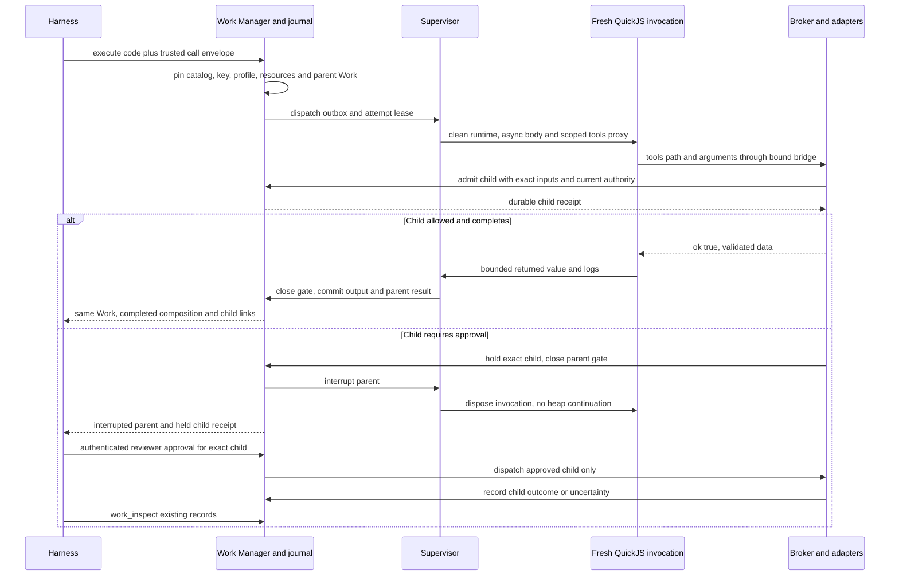

# Code execution: Executor's simple API over a small, brokered JavaScript runtime

Decision research · September 12, 2026; Executor source refresh September 13, 2026 · Companion to [ARCHITECTURE_ASTRA_XHIGH.md](ARCHITECTURE_ASTRA_XHIGH.md)

> **Implementation status:** Historical research, not a shipped API specification. [README](README.md) and [Executor integration](providers/executor/INTEGRATION.md) define the current implementation and exact package pins. Code execution now records one Work; nested MCP calls are diagnostic, and business approvals belong to servers/harnesses. The child-Work/approval proposals below are superseded. Private deployment references have been generalized for publication.

**Recommendation:** assuming in-company/self-hosted placement is valuable, use **QuickJS-WASM via `quickjs-emscripten`, the synchronous build with deferred Promises, inside disposable hardened runner processes**, with a separate TypeScript broker and the existing Postgres Work journal. **Fallback:** managed Cloudflare Dynamic Workers, if company hosting/data policies and private broker access permit it. Qualify containment and the actual embedded engine revision before shipping either profile. Do not run hostile tenants in ordinary Node `vm`, in a shared Node process protected only by a language wrapper, or in standalone OSS `workerd` assuming Cloudflare's production isolation/limits come with it.

The chosen public entry point is **`execute({code})`**, following Executor: async JS bodies use `tools.search({query, limit?})`, `tools.describe.tool({path})`, and `tools[path](args)` or dotted calls. Ordinary calls resolve to `{ok: true, data}` or `{ok: false, error}` for known failures; `return` supplies the answer and bounded `console.log` supplies diagnostics. Metadata methods return described objects directly. The [main architecture](ARCHITECTURE_ASTRA_XHIGH.md#3-lightweight-executor-one-execute-tool-with-brokered-discovery-and-calls) defines the exact proposed schemas and Work response extension. Internal Actions, Work, approvals and receipts remain Action Space concepts. Code execution has capability `code_execution`, lifecycle `invocation`, and no Context, mutable workspace or cross-invocation heap. Its action is `code.execute` and initial profile is `code-js-v1`. This supersedes the earlier public Compose name; Linux execution is the separate `sandbox` capability with `ephemeral` and `persistent` profiles. **Amp's private JS engine, process topology, scheduling and broker implementation remain unknown.**

Evidence below is labeled as **documented**, **source-verified**, **locally probed**, or **proposed**. Repository sources are pinned; hosted runtime documentation was read on September 12, 2026, and Executor's website and implementation were refreshed on September 13. A source review establishes what that revision says, not what any hosted or private deployment runs.

## 1. Requirements and threat model before choosing an engine

The customer job is “read these tool results, combine them, and return a small useful answer.” Native dependencies, large numerical kernels, terminals and retained development state belong to Sandbox. The realistic common path is bounded JS over JSON with asynchronous connector calls, not a general serverless application platform.

| Requirement | Required contract and adversarial case |
| --- | --- |
| Untrusted source | Agent output, retrieved code and imported third-party descriptions may be malicious. A valid JS program can exhaust CPU, allocate a huge object graph or deliberately call every allowed tool. Types/prompt instructions are not containment. |
| Minimal ambient authority | No filesystem, Node globals, process environment, raw sockets, general `fetch`, shell, native addons, WASI or arbitrary imports. A constructor/eval trick cannot obtain capabilities that the engine/host never supplied. Parsing an allowlist is not the only enforcement layer. |
| Async composition | Lazy `tools` proxy functions return Promises. `Promise.all` may overlap calls within a trusted concurrency budget. Guest microtasks must make progress without blocking cancellation/watchdog processing indefinitely. |
| Exact contracts | Search returns ranked paths/descriptions; exact `tools.describe.tool({path})` returns input/output TS, JSON Schemas, version and semantics. All discovery/execution in a tool-view revision uses the same immutable catalog. Missing output contracts produce `unknown` success data, not guessed types. |
| Per-call authorization | Every call validates current actor/delegation, account/connection, resource scope, destination, effect, approval and budget. Calling a different path or the bridge directly cannot forge tenant, parent, epoch or grants. |
| Resource limits | Separate limits for preparation, guest/runner CPU, QuickJS allocations, process/WASM overhead, stack, wall time, child count, concurrent admission, wire bytes, retained bytes and model output. Include serialization, schema validation and log/error amplification. |
| Clean invocation | Fresh JS heap, module instances and pending jobs. Reuse code and never-used prepared capacity, not a used tenant heap. A cached Worker identity or reused VM wrapper is not proof of reset. |
| Durable children | Admit child Work before dispatch. Parent loss, timeout or output failure cannot erase accepted children. Unknown effects reconcile through their Work records; no execution replay for recovery. |
| Approval/cancellation | Approval holds the exact child and interrupts the parent. It does not suspend/resume arbitrary JS. Deadline/cancellation closes admission, requests supported child cancellation, retains receipts and reports unresolved effects. |
| Fast interaction | Avoid per-tool VM allocation and repeated model/schema round-trips; keep catalog/validator caches and clean capacity warm. No startup SLA or cost ratio is assumed. Measure with authorization and journaling enabled. |
| Operations | Tenant-fair scheduling, explicit queue delay, patch provenance, revocable workload identities, private audit retention, useful errors and resumable event observation. Self-hosting/cloud, jurisdiction, deployment configuration and traffic expectations are not established. |

**Protected assets:** other tenants' code/results, connector credentials, the Work journal, provider/controller privileges and shared capacity. **Trusted components:** catalog admission/code generation, supervisor, broker, policy engine, connector adapters, storage and their deployment controls. Treat a runner as compromised for authorization design even when its engine behaves correctly. The runner must not hold database credentials, cloud instance identity or a tenant-wide bearer credential.

A qualified OS/runtime boundary contains engine/wrapper compromise; it does not stop a correctly authorized tool from disclosing data to the wrong business destination. That remains broker policy. Tenant process separation alone does not prove protection from kernel escapes or side channels. Namespaces, nonroot, seccomp, cgroups and default-deny networking are defense layers, not a claim equivalent to hardware isolation. A candidate deployment must be inspected before it can satisfy the outer-boundary requirement.

## 2. Small shortlist: distinguish hosted Workers from its open-source engine

| Dimension | QuickJS-WASM, sync embedding — preferred conditional starting point | Managed Cloudflare Dynamic Workers — fallback | Standalone workerd / native QuickJS — assessed, not preferred |
| --- | --- | --- | --- |
| Execution model | Embedded interpreter in WASM; create instance/runtime/context per invocation | V8 Worker created with `LOADER.load()`; supply module map and invoke once | workerd supplies Workers/V8; native QuickJS is an embedded C interpreter |
| Promise bridge | `newPromise()`, settle handles from async host calls, explicitly pump `executePendingJobs()` | Workers RPC/service bindings and runtime event loop | workerd has native async I/O; native QuickJS requires our event loop and Promise settlement |
| Module support, not exposed to agent source initially | `setModuleLoader`/normalizer exists, but an async body plus proxy needs no caller module loader | Trusted supplied ESM modules contain the request handler and broker binding; agent body has no imports | workerd bundled modules; development fallback loader is not a production policy layer. Native C normalize/load callbacks are synchronous |
| CPU/heap interruption | QuickJS allocator/stack caps and interrupt callback; outer watchdog/process budgets still mandatory | Hosted custom `cpuMs` and `subRequests`; platform memory limits; our wall/call/output controls still mandatory | OSS workerd has null standalone enforcers at inspected revision. Native QuickJS exposes allocator/interrupt APIs, not OS limits |
| Freshness | Explicit destruction; manual handle/late-callback discipline | `load()` creates fresh Worker; `get(id)` may reuse global state | Both permit reuse unless we arrange fresh lifecycle |
| Security | WASM memory isolation plus separate hardened process/sandbox; no host APIs by default | Provider operates a layered hostile-code sandbox; scoped bindings/default-deny outbound still our responsibility | workerd explicitly not hardened standalone. Native C engine compromise reaches embedding process |
| Deployment | Portable Node LTS + WASM assets and qualified runner substrate; own patches/capacity/supervisor | Paid Workers/open beta per current announcement; assess residency, procurement, networking and service availability | workerd adds a large V8/C++ service/operating burden; native QuickJS adds custom native embedding |
| License | quickjs-emscripten and Bellard QuickJS MIT | Managed service terms; public workerd Apache-2.0, Agents/codemode MIT | Native QuickJS MIT; OSS workerd Apache-2.0 |
| Main tradeoff | Best fit for deliberately small JS surface, but interpreter throughput, handle lifecycle and sandbox capacity need measurement | Less security fleet ownership and full V8 behavior, but vendor boundary/beta and private-data path may be unacceptable | Not a shortcut to a hardened service; only attractive if company already operates the relevant hardened embedding |

These are two credible runtime families, with native/WASM and managed/OSS deployment variants explicitly separated. Another general-purpose Node/Deno container offering would not answer this narrow decision better. A reviewed existing company V8 service could change the shortlist; plain `node:vm` cannot—Node's documentation explicitly says it is **not a security mechanism** [S11].

### What QuickJS actually supplies

**Source-verified [S1–S3]:** `evalCode` with module type supports ES modules and module top-level await. The module loader can map bare names to generated source. The ordinary build's host callback itself is synchronous, but returns a **guest Promise immediately**; external async work settles it later. Pumping pending jobs resumes guest continuations. “Sync build” therefore does not mean synchronous connector calls, or lack of `Promise.all` support.

Use an async function body and a preinstalled proxy whose calls return deferred Promises. **Do not use Asyncify initially.** It is useful for a host operation that looks synchronous to the guest, especially async module loading, but it adds transformed-code overhead and a one-suspension-per-WASM-module/reentrancy constraint. We do not need that tradeoff when there is no agent module loading and tools already return Promises. Native QuickJS similarly needs an embedder-owned Promise/event loop; no higher-level host scheduler is supplied by the C library.

`setMemoryLimit`, `setMaxStackSize` and `setInterruptHandler` are real controls, but their scope matters. Allocation accounting covers QuickJS-managed memory, not every host buffer, WASM reservation, compiler allocation or Node process byte. The callback is cooperative while the interpreter runs; it cannot preempt blocked host code or an awaited tool. A dedicated supervisor must terminate a runaway process or wall-time wait. Use bounded microtask batches plus interrupts within each batch; limiting job count alone does not stop one infinite microtask.

Allocate a new **WASM instance + runtime + context**, not merely another context in the old runtime. Separate contexts can share runtime limits/objects; an old runtime retains its job queue and internals. A `WebAssembly.Module` is compiled code, while a `WebAssembly.Instance` has memory/state: caching the former is potentially safe; reusing the latter is not our reset contract. Retire the disposable runner after its invocation. Leaked handles or resolving after disposal are concrete wrapper hazards, not hypothetical lifecycle niceties.

**Version qualification matters:** the probed npm `quickjs-emscripten@0.32.0` default `RELEASE_SYNC` uses the repository's patched vendored **Bellard QuickJS 2025-09-13**, not current Bellard 2026-06-04 and not quickjs-ng. The vendored subtree update records its upstream base in [S2]. Debug and release sync variants use that same source with different build flags. Record wrapper version, vendor tree/patches, build flags and WASM digest in the execution profile. **0.32.0 is a feasibility pin, not a security-approved production pin**: review intervening fixes or build/qualify a maintained variant before launch. A clean npm audit cannot establish that a vendored native engine contains all security fixes.

QuickJS's manual reports a small binary/short runtime lifecycle; those are upstream microbenchmark statements, not Node+WASM+OS sandbox+broker measurements. Bellard's newer feature claims do not automatically describe the older shipped WASM. Our ES2022 baseline still needs compatibility fixtures for the actual engine and approved libraries, especially runtime globals, Intl and errors. Prefer source input; never deserialize caller-supplied QuickJS bytecode, which upstream says is version-specific and not security-validated [S3].

### What hosted Dynamic Workers supplies—and what OSS workerd does not

**Documented current hosted API [S4]:** `LOADER.load(code)` creates a fresh Worker without ID caching; `get(id, callback)` may reuse an existing isolate. `globalOutbound: null` makes `fetch`/`connect` throw. **Omitting it inherits the parent's outbound access.** A module map and explicitly scoped service bindings form the capability surface. TypeScript must be compiled before loading. Custom per-invocation CPU/subrequest limits are documented; the lower limit wins when set at both code and entrypoint.

A hosted candidate would place the parsed async body inside a generated request handler with the scoped `tools` proxy. **Do not execute broker I/O at Worker module initialization:** request I/O needs the request context, even if the engine understands module TLA. Preserve source maps and test body/return semantics. Parse and verify the function boundary rather than repair or concatenate unchecked text into a trusted wrapper. The user still writes the same `execute({code})` body; the generated Worker entrypoint is an implementation adapter, not a new public API.

The platform provides web globals beyond our contract. Keep Node compatibility off, deny outbound at runtime, pass no raw storage/secret bindings and use only a broker capability. `fetch` may exist but must be unusable; the public promise is **no ambient network authority**, not portable `typeof fetch` identity across engines. Initial guest source rejects static and dynamic imports; the trusted wrapper's supplied module map does not authorize runtime package installation.

**Source-verified OSS distinction [S5]:** workerd's standalone `server.c++` installs `NullIsolateLimitEnforcer`, returns no enforcement from `enterJs` and never signals general limits exceeded. Dynamic Worker API fields do not supply Cloudflare's private production implementation. The README explicitly requires a VM or comparable secure sandbox for malicious code. Its V8/capability architecture is useful, but selecting it self-hosted still leaves hardening, total budgets and preemption to us. It adds more surface than needed if the job is small JS/JSON plus broker calls.

Hosted Workers' CPU/memory controls are also not our entire contract. Memory is a platform per-isolate bound, not a freely configurable QuickJS-style per-run allocator budget; subrequests are not necessarily a complete count of all business tool calls. Maintain broker-side counts. A Promise timeout or client disconnection is not proof of termination of the child Worker or cancellation of upstream effects. Qualify actual cancellation/disposal behavior, apply admission revocation independently and meter provider resource tail. If strict hard wall termination of compute is required and the provider cannot prove it, do not advertise that profile under that guarantee. Do not silently replace hard CPU budgets with a JS timer.

Cloudflare's open-beta announcement and API documentation are newer than the original code-mode post's closed-beta language [S4, S6]. Confirm account eligibility and current terms before adopting. Neither blog startup ratios nor official single-engine microbenchmarks justify a performance/cost ranking for Action Space. The hosted engine benefits from provider-run patching and multitenant hardening; acceptance of that provider/security boundary is still a company decision.

### Executor's actual code-mode implementation

**Source-verified on September 13 [S7a–S7f]:** the public repository linked from [executor.sh](https://executor.sh) was inspected at [this revision](https://github.com/UsefulSoftwareCo/executor/commit/cc0fd8f6099f3d05c73a285ef14932c01ac212fa). This replaces the earlier brief review, rather than treating that older commit or the website as current implementation evidence. Executor is a particularly relevant reference for **code mode plus an integration broker**, not a ready-made implementation of Action Space's Work lifecycle.

| Boundary | What Executor implements | What Action Space keeps or changes |
| --- | --- | --- |
| Agent facade | MCP `execute({code})`, with trimmed nonempty source. A skill describes `tools.search`, `tools.describe.tool` and `tools[path](args)`. HTTP additionally has operator `autoApprove` and artifact-routing `artifactId`; these are **not** MCP execute arguments. | Adopt that single entry point and in-code metadata/call names; add our durable Work envelope and retain `work_inspect`. Never expose an approval-bypass flag. |
| Discovery and invocation | Ranked/paginated search; exact descriptions return compact input/output TS and referenced definitions. A recursive lazy Proxy accumulates path segments, dispatches on invocation and rejects enumeration. Ordinary calls return `{ok: true, data, http?}` or `{ok: false, error}` for expected failures. | Adopt lazy path/dotted calls and the `ok`/`data`/`error` convention. Keep pinned runtime validation and child receipts; pending/uncertain outcomes interrupt rather than become retryable failures. Initial search is bounded with `incomplete`; no claim of full wire compatibility. |
| Source preparation | `recoverExecutionBody` accepts several body/function forms and strips fences; Sucrase erases TypeScript syntax. The QuickJS backend wraps the result in an async script. This is not semantic type checking or arbitrary npm/module support. | Accept an explicit async JS body with `await`/`return`; check generated proxy declarations and reject imports. Do not copy heuristic repair or TS erasure as a security boundary. |
| Runtime selection/reset | Self-host chooses QuickJS-WASM. Cloudflare chooses Dynamic Worker **only with a `LOADER` binding**, otherwise QuickJS. QuickJS reuses a resolved/preloaded `QuickJSWASMModule` but creates/disposes runtime and context per execution. | This supports the engine shortlist, not our stronger fresh-WASM-instance/disposable-runner claim. Do not confuse its reused wrapper object with a cache of compiled code alone. |
| Outputs | Console logs, a returned value and `emit()` items are distinct channels. MCP maps emitted files/content to native blocks and returns a structured envelope. | Adopt `return` and bounded `console.log`; use resource tools for explicit publication rather than add `emit` initially. Keep separate retained result/log/artifact fields and total budgets. |

For example, this **Executor-style body also matches the chosen Action Space interaction**; it is not a live integration result. It returns metadata so the model can write a subsequent schema-correct call; JavaScript does not infer the next call's arguments by reading a descriptor:

```js
const { items } = await tools.search({ query: "github issues", limit: 5 });
const path = items[0]?.path;
if (!path) return { kind: "no_match" };
const details = await tools.describe.tool({ path });
return { path, details };
```

The next invocation can call the described `tools[path](args)`, branch on `result.ok`, filter `result.data` and return selected output. Search and describe are broker-dispatched metadata operations, not access to a filesystem or raw network. Both surfaces avoid eager enumeration; Action Space additionally freezes the catalog and validates each call/result at the broker. The following diagram describes **Executor's implementation**, including its TS erasure, not all of our proposed semantics.

```diagram
┌──────────────────────────┐    ┌──────────────────────────┐
│ MCP execute({code})      │───▶│ Recover body; erase TS   │
└──────────────────────────┘    └────────────┬─────────────┘
                                             ▼
┌──────────────────────────┐    ┌──────────────────────────┐
│ tools.* lazy proxy       │◀───│ QuickJS / Dynamic Worker │
└────────────┬─────────────┘    └──────────────────────────┘
             ▼
┌──────────────────────────┐    ┌──────────────────────────┐
│ Discovery / tool broker  │───▶│ Policy, approval, creds  │
└──────────────────────────┘    └────────────┬─────────────┘
                                             ▼
┌──────────────────────────┐    ┌──────────────────────────┐
│ Guest Promise; results   │◀───│ Connector plugin invoke  │
└──────────────────────────┘    └──────────────────────────┘
```

**Async bridge and limits [S7b].** QuickJS installs a host function that creates a `QuickJSDeferredPromise`, invokes the broker through Effect's Promise runner, serializes the result and settles the guest Promise. The host pumps pending jobs and disposes deferreds/context/runtime on exit. A late host result is ignored if its deferred is disposed; that does **not** prove the external request stopped. The defaults at this revision are a five-minute timeout, 64 MiB QuickJS allocation limit and 1 MiB stack—not Action Space defaults or total process limits.

Its timeout is weaker than a cumulative CPU or absolute wall budget: while **any** host call is outstanding, the interrupt deadline is `null`; after a dispatch returns, a fresh full timeout starts. Repeated calls can keep resetting it, and an outstanding call disables this check even while guest code computes. Dynamic Worker uses guest/host watchdogs that likewise exclude broker-wait periods; a Promise race does not establish hard preemption. **Borrow deferred async bridging, not this budget contract.** Action Space keeps cumulative runner CPU accounting, an independent absolute deadline and trusted admission revocation. The inspected bridge does not establish cancellation of already-dispatched HTTP/MCP effects.

**Schemas, authority and credentials [S7c].** Executor combines owner policy rules using the most restrictive result, blocks before invocation, and can validate arguments before prompting for approval through a plugin hook. Ordinary execution still relies on the plugin's validation. Credentials are resolved **after** approval, so a declined call does not trigger token refresh; plugin invocation receives them outside the guest. Expected domain errors remain typed values; unexpected defects become opaque correlation-ID errors. These are mechanisms worth borrowing. This code path does not show universal runtime validation of every advertised output schema.

Descriptions can use **observed output-shape memory** when neither catalog nor plugin declares an output schema, and label it `outputTypeScriptNote`/`observed; may be incomplete`. This is useful exploratory metadata, not proof that future results satisfy the shape. Action Space may expose such hints, but an unvalidated upstream result remains `unknown`; it does not silently become a pinned contract. The narrow reactive OAuth retry on upstream 401 is also not a general idempotency guarantee for writes.

**Approval and restart [S7d].** General approval pauses hold an in-memory fiber/Deferred and retain the JS continuation; same-engine resume can join an in-flight resume or reuse a bounded cached outcome. Shutdown interrupts those fibers. There is a separate best-effort durable fallback for artifact-originated actions constrained to **exactly one resolved tool call**, approved before that call runs: an owner-scoped blob stores server-built code/address with a 15-minute expiry, and a later HTTP accept executes that resolved call if the live fiber is unavailable. This is not arbitrary durable JS continuation, nor replay safety after earlier effects.

The fallback's “single-use” comment is not a distributed guarantee: `consume` performs separate `blobs.get` and `blobs.delete` operations, with no atomic claim in the inspected abstraction. Two instances could read before either deletes; a crash after deletion but before completion also lacks a durable outcome in that record. A particular deployment might serialize requests, but the source does not establish it. Action Space instead transactionally claims the held child, records its attempt/outbox and retains outcome evidence; approval resumes that child, never parent source. Admission deduplication still does not make remote effects exactly once.

**Results and durability [S7e].** `formatExecuteResult` caps the successful *result preview* at 30,000 characters, then appends logs; structured results/logs remain untruncated there. On error, it caps combined error/log text, not the structured envelope. These are presentation limits, not total byte/allocation/retention budgets. The inspected path and bounded resume caches do not establish a durable journal of arbitrary runs and their child calls; the repository's durable-Run vision must not be cited as shipped behavior. Keep our Work/result store, input/output caps and reconciliation independently of this engine choice.

**Decision:** retain the conditional QuickJS-WASM recommendation and adopt Executor's single-tool interaction. Borrow (1) lazy, compact contract disclosure; (2) deferred async bridging; (3) schema checks and approval before credential resolution; and (4) expected-error envelopes with an opaque defect boundary. Implement our own pinned proxy contracts, outer containment, limits and journal integration. Executor demonstrates relevant mechanisms, not that reusing its executor package alone satisfies those contracts. No production Executor service, security boundary or performance benchmark was exercised in this review.

**Focused checks:** the example above executed in QuickJS-WASM with fixture tools for ranked results and an empty search, verifying that only the selected exact path is described and no-match performs no description. A mock-clock test executed the pinned source's extracted `makeDeadlineTracker`, confirming the disabled-during-dispatch/full-reset behavior. These check an example and one helper, not Executor end to end.

### Project Think supplies a different continuation model

**Project Think / `@cloudflare/codemode` [S8], source-verified:** the public execution tool chooses `DynamicWorkerExecutor`, builds a child Worker and bridges to provider/connector RPC. It defaults outbound to null in this wrapper, although the raw loader API defaults to inheritance. This is constructive capability routing worth borrowing. The package timeout is a Promise-level race, not sufficient evidence of preempting a synchronous loop or canceling remote effects. The inspected code also has a documented-versus-constructor timeout-default discrepancy; set explicit budgets rather than depend on defaults. It does not itself provide a universal vault/credential policy or our per-call budgets.

Think's durable connector journal includes approval **abort-and-replay** semantics. **Do not port that continuation model or introduce its journal alongside ours.** Reuse the ideas of bounded disclosure, discoverable connector contracts and parent/child evidence; our settled product promise terminates the JS invocation and resumes only the approved child Work. Fresh source may then inspect prior results. MIT licensing permits considering code reuse, but review dependencies, test boundaries and semantics before adopting code. A reference using the same engine is feasibility evidence, not proof of tenant isolation or exactly-once effects.

## 3. Concrete preferred stack and its control integration

Start with a TypeScript codebase on a supported **Node LTS** for the trusted catalog/broker and the runner wrapper. Node is an embedding host, **not where untrusted source executes**. Put compiler work and runtime evaluation in bounded workers/processes separate from the broker event loop. Keep the existing control application/Postgres/outbox design; do not add Temporal, Redis jobs or Durable Objects as another authority for code execution. The engine choice does not require those systems.

| Concern | Proposed implementation and ownership |
| --- | --- |
| Schema source | A reviewed JSON Schema 2020-12 subset as catalog source of truth; explicit supported-dialect conversion on import. Ajv 8's 2020 implementation validates exact inputs/outputs; `json-schema-to-typescript` generates declarations at catalog build time. Generation cannot represent every runtime refinement; document those separately. |
| Contract pinning | Canonical schema + reviewed effects/retry semantics + adapter and proxy digests → immutable catalog revision. One harness tool view pins it before discovery. A tool path never resolves “latest.” Work freezes the effective profile/catalog and resources. |
| Discovery | Postgres full-text/trigram search over authorized descriptors to start; exact-name lookup is deterministic. Return a bounded match set with `incomplete`; empty-query inventory is optional and bounded. No vector store or agent-side enumeration prerequisite. |
| Source preparation | Parse an async JS body with the TypeScript compiler API; verify wrapper boundaries, reject imports/exports, dynamic imports and TS syntax, then check with generated guest `.d.ts`, ES2022 and no Node/DOM types. Separate bounded workers; no compiler plugins, network resolution or user declaration injection. |
| Dependency policy | Initially the generated proxy and standard JS builtins, with no guest package-loading API. Trusted wrapper dependencies are pinned/reviewed at build time; no install scripts or arbitrary npm at invocation. Cap source/declaration size and preparation resources. |
| Runtime | Fresh `newQuickJSWASMModule()`/runtime/context; non-thenable lazy `tools` proxy and async body; `newPromise` bridge; `executePendingJobs` in bounded batches. No guest module loader. Closures/handles never leave the guest except serialized data. Knowing the bridge name grants no extra authority. |
| Containment | Disposable nonroot runner process with read-only runtime assets, no workspace/PVC, no inherited env secrets or service-account token, no host paths or metadata route, and only a supervisor channel. Harden with resource controls and a qualified gVisor/Kata/comparable VM boundary for hostile tenants. Keep privileged provider credentials elsewhere. |
| Transport | Bounded length-prefixed JSON over local IPC to supervisor; connection-bound attempt identity added outside guest; private authenticated HTTPS/JSON to the broker. Persisted admissions/events and normal HTTP retries with identical request IDs suffice initially; no need for a custom VM protocol or broad RPC object graph. |
| Connector adapters | Native TS functions and MCP client adapters behind the same Work admission/authorization/validation boundary. Broker owns connection pools keyed by tenant/account. Keep remote MCP servers separate; local stdio MCP plugins need their own reviewed deployment, not execution inside code execution. |
| Storage/events | Existing Postgres Work, attempt, child-link, event and outbox records. Object storage for bounded raw envelopes/artifacts with tenant-scoped retention and manifests. SSE follows monotonically ordered journal cursors; reconnect authenticates anew and reports expired cursors explicitly. |
| Observability | OpenTelemetry trace of parent Work/attempt/child IDs and phase durations; collect queue delay, preparation, execution CPU, host wait, bytes, interrupt reason and orphan/reconciliation age. Never put raw source, secrets or tool outputs in metric labels/traces by default. Audit data has separate restricted access. |

**Schema code is trusted code only after admission.** MCP discovery and imported OpenAPI can be hostile too. Limit schema bytes/depth, resolve only approved local `$ref`s, disallow executable/custom keywords from providers, review regex/format complexity, and compile outside latency-sensitive broker request handling. Ajv documents that it treats schemas as application-trusted and warns about compile/validation DoS [S9]. Reject unsupported schema dialect/features; do not silently broaden them or emit fictional precise types. Generate validators once per approved digest; no agent-supplied schemas may alter enforcement. Ajv `coerceTypes`, default mutation and removal of additional properties stay off; reject invalid input rather than change approved semantics. Avoid `allErrors` on hostile large values.

**TypeScript source policy:** v1 executes JavaScript only; TypeScript is the descriptor/checking language. Do not silently strip code that happens to contain type syntax. If accepting TS later becomes worthwhile, add a versioned profile that explicitly supports a restricted erasable subset and a pinned compiler transform; reject runtime-changing constructs/decorators/plugins and emit reviewed JS plus source map. `transpileModule` alone does not type-check or sandbox anything. Retain `agent.js`/original body and generated wrapper map in private Work evidence; show sanitized user-facing frames while retaining engine diagnostics separately. Nothing in the guest can load untrusted serialized bytecode.

### Bridge messages do not carry caller-chosen authority

This is a **proposed internal wire shape**, not an Amp or Executor API. IDs here are strings received over a bound authenticated channel and validated by the server, not cryptographic capabilities merely because they have a type.

```ts
type JsonValue = null | boolean | number | string | JsonValue[] | { [key: string]: JsonValue };
type BrokerCall = {
  requestId: string; // Allocated by the bridge, reused only for transport retransmission.
  name: string;     // Resolved against the connection's frozen catalog.
  input: JsonValue;
};
type BrokerReply =
  | { kind: "value"; child: string; output: JsonValue }
  | { kind: "accepted"; child: string } // Declared long-running binding returns a Work handle.
  | { kind: "error"; child: string | null; code: string; message: string }
  | { kind: "interrupt"; child: string | null;
      reason: "approval" | "child_pending" | "limit" | "cancelled" };
type RunnerBounds = {
  cpuBudgetMs: number; wallDeadline: string; heapBytes: number; stackBytes: number;
  sourceBytes: number; calls: number; inFlight: number;
  argumentBytes: number; responseBytes: number; resultBytes: number; logBytes: number;
};
```

The supervisor's workload identity maps to **parent Work + current attempt/gate + catalog + actor/grants + budget reservation** on the server. None of these is taken from user JSON. A compromised runner can request allowed operations within its grant, so trusted broker enforcement applies even if it bypasses generated wrappers or fabricates `requestId`s. Authenticated attempts cannot access another tenant's results or emit under a different parent. Admission atomically checks the gate, deduplicates `(parent, attempt, requestId)` with canonical request digest, reserves budget, creates child/link and commits dispatch outbox. Changing input under the same request ID conflicts.

Every ordinary tool invocation is a child Work, including reads that must leave receipts; search/describe are audited bounded catalog operations without their own child. A discovery-only `execute` still has a parent Work and retained return value. Metadata calls share the attempt's authority, deadline, call/concurrency and disclosure bounds; they are not free unmetered side channels. Keep bridge ordinal/source location only as diagnostics. A new JS call has a new request ID; source location, textual equality or a repeated provider tool-call ID cannot by itself establish retry safety. A runner death ends that invocation: do not start a replacement program and invent the same sequence of child IDs.

**Round-trip semantics:** the proxy maps internal `value` to `{ok: true, data: output}`, `accepted` to `{ok: true, data: {id: child}}`, and a known `error` to `{ok: false, error: {code, message, work}}`. Accepted handles mean admission, not completion. Unexpected defects throw sanitized errors. Approval, short-call wait expiry or reconciling effects instead close the parent gate and return `interrupt`; control terminates the invocation independently of user `try/catch`. Reconciling effects use `child_pending` while their child preserves the uncertainty. Metadata uses a separate typed read response, not a fabricated child Work. Track messages sent but not yet acknowledged: parent completion closes admission, drains the transport barrier and records accepted children, so unawaited Promises cannot hide dispatch. Late admission retries recover existing children before checking whether the closed gate permits anything new.

**MCP normalization [S10]:** `outputSchema` requires matching `structuredContent`; validate before returning the declared type. With no output schema, a bounded reviewed adapter can return structured JSON, parsed text JSON or text as `unknown`. Multimodal/resource blocks remain validated envelopes or explicit resource references, not coerced prose. `isError`, protocol errors, transport loss and schema failures remain distinguishable in retained evidence, but none generically means “not dispatched.” A successful write with invalid output is a decoding/reconciliation case, not retry permission. Upstream tools/list changes create a new reviewed catalog version; if old semantics cannot still be served, fail closed before dispatch. Pinning our schema cannot force a third-party API to preserve behavior.

No `.raw()` helper in the initial proposed facade. The observed Amp `.raw` **executes anew**; it is not readback. Use `work_inspect` or a separately authorized result-resource read to retrieve the original retained response without another provider call. An MCP transport/session/task ID is adapter evidence, not durable Context/Work identity. The broker keeps real provider credentials; arbitrary output strings or remote errors can still contain sensitive data, so returned content needs disclosure controls rather than trusting “credentials never injected into source” as sufficient.

### Budgets and shutdown need more than a timeout around `await`

| Budget/stop boundary | Enforcement and honest scope |
| --- | --- |
| Client observation wait | Bounds `execute` initial response wait or `work_inspect`; returns retained Work status without extending execution. |
| Preparation budget | Bound source/schema/module bytes before parser; compiler worker has process memory/CPU and wall limits. Fail before accepting any child. |
| CPU | Charge dedicated runner CPU, including compilation/serialization/pumping; inspect cumulative process/cgroup usage and interrupt guest work. cgroup CPU quota is a rate, not a cumulative execution budget; add supervisor accounting/kill and define finite enforcement overshoot. Do not pause/reset the total budget when a host call is outstanding. |
| Heap/stack/process | QuickJS caps for prompt failure, plus outer `memory.max`/process controls for WASM, Node and host buffers. OOM can kill the runner without a clean error; journal reconciliation must not depend on guest finalizers. |
| Wall deadline | Absolute execution deadline after dispatch, with separately bounded queue/admission expiry. Independent watchdog remains live while the guest spins or awaits nothing. Revoke admission before terminating process; already accepted child effects remain independent. |
| Calls/concurrency | Broker-side atomic call and concurrency reservations plus tenant-wide quotas. `Promise.all` can express parallelism, not bypass policy. Full concurrency can queue only within a bounded wait, then interrupt; never create an unbounded host backlog. |
| Input/output | Byte/depth limits before host parse/allocation and guest materialization. Encode inside bounded guest execution; cap IPC frames before parsing, then validate inert JSON. Avoid recursively dumping arbitrary guest objects/getters into an unrestricted host callback. Return serialization, logs and metadata share guest/disclosure bounds. |
| Cancellation | Stop admitting, signal supervisor, cancel connector I/O where supported; distinguish requested cancellation from confirmed stop/outcome. Driver/hypervisor authority must be outside a possibly compromised guest for eventual teardown. |

Closing the gate is a control transaction, not simply throwing `ApprovalRequired`. Children admitted immediately before closure remain visible. Completion only means JS completed and its return value/accepted logs committed; it does not turn an asynchronously accepted child into a completed result. If the runner dies after local `console.log` but before acknowledgment, the tail can be lost; an interrupted parent has no committed return value. If the broker loses contact after sending an upstream write, the child remains reconciling regardless of parent disposal. No unknown effect is rewritten as a generic failed invocation that invites rerunning the composition.

## 4. Invocation and recovery without another workflow engine



The same Work journal gives SSE readers and a replacement harness enough evidence to continue the conversation. SSE/HTTP reconnect is observation recovery, not durable JavaScript continuation. PostgreSQL outbox workers may wake supervisors; `LISTEN/NOTIFY` can be a latency hint, never the only durable queue. A lost supervisor lease revokes its gate and invokes provider/process reconciliation; the API must not promise a clean guest exception on node loss.

Placement starts with eligible locality, tenancy, policy and engine profile, then available clean capacity and fair-share budget. Prefer runners near the broker/control database for chatty tool compositions. No thread affinity or PVC is needed. Autoscaling should use queued eligible Work and clean-capacity scarcity, not only average CPU: an invocation can wait on tools while occupying isolation capacity. Warm processes have initialized runtime assets but no prior user inputs/heap; when dirty, retire them. If full disposable outer sandboxes are too slow/costly, measure tenant-dedicated warm outer sandboxes with disposable inner processes as an explicitly different, qualified reuse policy—not an unexamined cross-tenant optimization.

Choose an ephemeral Sandbox directly for native OCR, package ABI or large data processing. Code execution may invoke a typed Sandbox admission tool and receive a handle; its own JS runtime does not acquire Linux or stay alive for the Sandbox run's lifetime. A schema/runtime mismatch detected **before dispatch** may select another approved equivalent executor or produce a new action suggestion. After partial execution, inspect/reconcile children before any new agent decision; do not restart the source in a larger environment. Exports are explicit artifacts/trees, never heap migration.

## 5. Bounded local probe: one uncertainty resolved, several intentionally unproven

**Locally probed on September 12, 2026:** Linux x64 orb, Node **26.5.1**, `quickjs-emscripten` **0.32.0**, default `@jitl/quickjs-wasmfile-release-sync` **0.32.0**. Node here is the available probe host, not the production LTS recommendation. Each run created a new WASM module instance/runtime/context. A mock `finance` bare module exported a function returning a deferred guest Promise; the host settled asynchronous mock results in the opposite order from source calls and pumped jobs in bounded batches. No real connector, credentials or Work database was involved.

The npm release reports [this source revision](https://github.com/justjake/quickjs-emscripten/commit/df4efb9ef2cb25c417ecb57986da462d11b244ed); its default variant, vendor VERSION and Makefile were checked at that revision [S2], separately from the newer reviewed repository source [S1]. The tested release-sync WASM file has SHA-256 `105c3bed22d457e43e3d1c3c1c6959fda62a8fe06f0fc8a985303c3a2be72232`. This identifies the experiment's binary; it is not a reproducible-build attestation or a security assessment.

Command: `timeout 15s node spike.mjs` in a temporary directory with the pinned dependency. Decisive output:

```text
PASS bare import + top-level await + two overlapping host Promises (sync build)
PASS fresh WASM/runtime state + no default fetch/process/require in probe
PASS static node:fs and dynamic URL import denied by loader
PASS interpreter interrupt stops synchronous infinite loop
PASS QuickJS allocation cap raises out-of-memory
PASS unresolved guest Promise requires host wall deadline (interrupt is insufficient)
6 groups passed; no latency, OS isolation, broker authorization or durable Work claims
```

The async assertion checked exact result order `[21, 35]` for inputs `[3, 5]` and measured two simultaneously outstanding mock calls, not merely eventual completion. Separate invocations wrote `globalThis.secret = 47` and then observed it absent. The loop used a fixed interrupt-callback threshold, **not a calibrated CPU timer**. The allocation test used an 8 MiB QuickJS cap and the unresolved Promise used a 300 ms host deadline; these are fixture parameters, not offered limits. An initial test-wrapper double-disposal exposed the documented non-Promise handle ownership distinction and was fixed; disposal/promise lifecycle deserves dedicated tests.

This earlier probe establishes async host-call feasibility **without Asyncify**, not conformance to the now-chosen proxy API. It does not prove sandbox escape resistance, CPU-accounting precision, outer process isolation, fair scheduling, hard distributed cancellation, retention, performance, or provider availability. It does not test a real Worker Loader. No benchmark numbers from this probe are used to choose a faster engine. Temporary scripts/dependencies are scratch work and removed after checks; the mechanisms, pins and discriminating cases above are sufficient to reproduce the limited experiment.

**September 13 API-alignment check:** `node check.mjs` ran the five current documented JS bodies in QuickJS-WASM 0.32.0 using a small fixture proxy and asynchronous JSON host bridge. It checked exact finance results and error branches, search/describe, bracket/dotted equivalence, return/fallthrough, plus fixture non-thenability and rejected enumeration. Strict TS 5.9.3/7.0.2 checked 13 blocks, 16 negative fixtures and those bodies; Ajv checked input/output boundaries and all six Mermaid diagrams parsed. This is example/API-feasibility evidence, not a production implementation or proof of security, durable Work, cancellation or approval behavior. The main document records the full validation scope.

## 6. Feasible proof-of-concept and conformance gates

Build one code-execution vertical slice before integrating every connector. Two mock finance adapters, one controllable write adapter and an ephemeral-Sandbox admission stub suffice. Use a disposable Postgres/object-store test setup and the same Work APIs as the main architecture. Implement these three stages; each has a specific stop condition.

1. **Facade and contract slice:** exact `execute` and in-code search/describe schemas; generated proxy types, async-body checking and lazy dispatch; bounded return/log capture and status recovery. Validate descriptor schemas, test wrong input and unchecked `ok` branches, execute the documented comparison and narrow unknown outputs explicitly. Test bracket/dotted equivalence, metadata budgets, non-thenability, unknown paths and forbidden enumeration. Success is a correct durable answer, not a successful engine eval.
2. **Failure/authority slice:** child admission journal/outbox, exact approval, gate closure, cancellation and attempt fencing. Inject crashes at admission acknowledgment, upstream-send and parent-output commit. Success requires the following cases to retain correct receipts without source replay or cross-tenant access.
3. **Containment and operating slice:** deploy only to disposable qualified runner capacity. Measure limits/teardown, reset and tenant fairness; commission hostile-code/security review; then run a representative load comparison against the hosted fallback if permitted. Do not call the probe security qualification.

| Plausible wrong implementation | Discriminating conformance test and required observation |
| --- | --- |
| Timeout only wraps an await | Run a tight loop, an infinite microtask chain, a never-settled Promise and a hung host call. Bound all four; verify independent watchdog and no post-deadline new admission. |
| CPU quota confused with total budget | Repeated short compute bursts separated by async waits eventually exhaust the same cumulative budget; rate throttling alone must not let the run last forever. |
| Heap cap assumed to cover host | Oversized IPC prefix, deep input, huge error and getter-driven return/log serialization each stay within outer budgets; healthy tenant continues and the broker remains responsive. |
| Proxy is the authority | Invoke bridge directly with foreign parent/resource/path/version and forged request IDs; no unauthorized dispatch. Reject source imports and wrapper-breakout bodies. Test reserved namespaces, dangerous prototype members and enumeration without exposing ambient capabilities. |
| Cached module equals fresh state | Poison global/module state and reject pending Promises, then reuse the same source/catalog in a new invocation. No marker, callback or bytes from the prior invocation may appear. |
| Schema refresh silently changes meaning | Describe revision A, publish B, execute under A; either use A's adapter/validators or fail before dispatch. Change authority meanwhile: revoke despite A's cached descriptor. |
| Unknown output gets guessed types | Missing structured output on a declared schema fails; unschematized nested content remains unknown. Validate wrong scalar types, unsafe numbers, extra fields and 300/301 item boundaries. |
| Partial composition is blindly retried | Complete a read, accept a conditional write, lose isolate before response. Existing child is inspectable/reconciling; a new composition reads evidence instead of issuing the same write. |
| Catching approval keeps program alive | Guest catches approval and tries another write while an already-admitted sibling finishes. Gate rejects new admission, held child remains exact, sibling result is retained. |
| Fire-and-forget avoids receipts | Call a tool without awaiting, return and end. Transport barrier/gate ordering leaves either a durable visible child or a confirmed pre-dispatch rejection, never untracked work. |
| Cancellation means rollback | Cancel while provider commits then drops response. Child remains reconciling; parent cancellation does not create a false no-effects receipt. |
| Frame retry duplicates effects | Lose bridge admission response; retransmit same request ID/digest and get same Work. Change digest and receive conflict. A new model source submission is not automatically that retry. |
| Source maps or telemetry leak secrets | Return malicious tool errors and generated names; user sees bounded sanitized frames. Restricted audit contains only approved evidence; metrics contain IDs/bounds, not payload/credential values. |

Performance evaluation must include equivalent containment and semantics: cold/clean-warm runner creation, compilation, pure bounded joins, two parallel short reads, many small calls, maximum accepted payload, busy-tenant fairness and approval interruption. Record end-to-end and phase distributions, memory/CPU, queue delay, model round-trips, database writes and total retained/output bytes. Include external provider/network charges and idle clean-capacity overhead. A raw `qjs` startup number versus a remote Worker response is not comparable. Choose targets after customer and company deployment constraints are known.

**What would change the recommendation:** managed Dynamic Workers becomes first choice if approved hosting plus representative measurements reduce operating burden and satisfy the exact profile; self-host remains required if code/data cannot leave company infrastructure. Heavy JS/Intl/V8 compatibility requirements or unavailable maintained QuickJS builds weaken the default. Proven existing company V8 sandbox infrastructure can justify OSS workerd integration. Lack of qualified outer containment is a launch blocker, not a reason to trust a shared language VM. Conversely, expensive native tasks should move to Sandbox rather than inflate code execution into Linux.

**Open deployment decisions:** allowed code/data regions; private broker reachability and identity system; runtime/version/isolation and clean-capacity reuse; engine patch ownership; supported output schemas/connectors; customer limits and workload mix. None is established by public upstream Agent Sandbox. Keep the main design's declared-workspace-only persistent Sandbox promise, one Work journal and no-replay semantics independent of this engine decision.

## Source register

- **[S1] QuickJS-WASM API and source**, [`justjake/quickjs-emscripten` at reviewed revision](https://github.com/justjake/quickjs-emscripten/tree/7b7af98e4e69757c64c27aac46a74e1e07229545): [module/TLA and handle lifecycle](https://github.com/justjake/quickjs-emscripten/blob/7b7af98e4e69757c64c27aac46a74e1e07229545/README.md#L143-L220), [async bridge/job pumping/Asyncify](https://github.com/justjake/quickjs-emscripten/blob/7b7af98e4e69757c64c27aac46a74e1e07229545/README.md#L312-L486), [runtime loader and limits](https://github.com/justjake/quickjs-emscripten/blob/7b7af98e4e69757c64c27aac46a74e1e07229545/packages/quickjs-emscripten-core/src/runtime.ts#L169-L324), [MIT license](https://github.com/justjake/quickjs-emscripten/blob/7b7af98e4e69757c64c27aac46a74e1e07229545/LICENSE).
- **[S2] Exact default engine/build at npm 0.32.0's reported source revision**, [default RELEASE_SYNC selection](https://github.com/justjake/quickjs-emscripten/blob/df4efb9ef2cb25c417ecb57986da462d11b244ed/packages/quickjs-emscripten/src/variants.ts#L12-L31), [vendored Bellard VERSION](https://github.com/justjake/quickjs-emscripten/blob/df4efb9ef2cb25c417ecb57986da462d11b244ed/vendor/quickjs/VERSION), [subtree update with upstream base](https://github.com/justjake/quickjs-emscripten/commit/91e701752ed38b495550e10b44c51aae27e7d92c), [release-sync Makefile](https://github.com/justjake/quickjs-emscripten/blob/df4efb9ef2cb25c417ecb57986da462d11b244ed/packages/variant-quickjs-wasmfile-release-sync/Makefile). The probe records the local WASM digest; published binary provenance and intervening engine fixes still need production qualification.
- **[S3] Native QuickJS**, [manual, version 2026-06-04](https://bellard.org/quickjs/quickjs.html), [pinned C APIs](https://github.com/bellard/quickjs/blob/04be246001599f5995fa2f2d8c91a0f198d3f34c/quickjs.h#L353-L410), [module loader/job APIs](https://github.com/bellard/quickjs/blob/04be246001599f5995fa2f2d8c91a0f198d3f34c/quickjs.h#L938-L977). Runtime/contexts, allocator limits, interrupts, bytecode warning and MIT license; this revision is not the probed WASM engine.
- **[S4] Current hosted Dynamic Workers docs**, [API reference, updated September 10, 2026](https://developers.cloudflare.com/dynamic-workers/api-reference/), [CPU/subrequest custom limits, updated August 27, 2026](https://developers.cloudflare.com/dynamic-workers/usage/limits/), [egress control](https://developers.cloudflare.com/dynamic-workers/usage/egress-control/), [getting started/language handling](https://developers.cloudflare.com/dynamic-workers/getting-started/), [platform limits](https://developers.cloudflare.com/workers/platform/limits/). These document platform features, not self-host workerd guarantees or our tested integration.
- **[S5] OSS workerd**, [README and sandbox warning](https://github.com/cloudflare/workerd/blob/10c0673595ff30fc520e5d0da1c74be9b68b6977/README.md#L18-L36), [standalone server](https://github.com/cloudflare/workerd/blob/10c0673595ff30fc520e5d0da1c74be9b68b6977/src/workerd/server/server.c%2B%2B#L3271-L3340) (`NullIsolateLimitEnforcer`, no-op per-request `LimitEnforcer` and dynamic loader), [loader API](https://github.com/cloudflare/workerd/blob/10c0673595ff30fc520e5d0da1c74be9b68b6977/src/workerd/api/worker-loader.h#L62-L135), [module registry](https://github.com/cloudflare/workerd/blob/10c0673595ff30fc520e5d0da1c74be9b68b6977/docs/reference/detail/new-module-registry.md), [Apache-2.0 license](https://github.com/cloudflare/workerd/blob/10c0673595ff30fc520e5d0da1c74be9b68b6977/LICENSE).
- **[S6] Cloudflare product context**, [Project Think execution ladder](https://blog.cloudflare.com/project-think/#the-execution-ladder), [Dynamic Workers open-beta announcement](https://blog.cloudflare.com/dynamic-workers/), [earlier code-mode post](https://blog.cloudflare.com/code-mode/). Vendor startup/security claims are identified as such, not reproduced as a comparable benchmark.
- **[S7a] Executor facade and source preparation**, all at the September 13 reviewed revision: [MCP execute schema](https://github.com/UsefulSoftwareCo/executor/blob/cc0fd8f6099f3d05c73a285ef14932c01ac212fa/packages/hosts/mcp/src/tool-server.ts#L1548-L1563), [MCP result mapping](https://github.com/UsefulSoftwareCo/executor/blob/cc0fd8f6099f3d05c73a285ef14932c01ac212fa/packages/hosts/mcp/src/tool-server.ts#L595-L638), [separate HTTP schema](https://github.com/UsefulSoftwareCo/executor/blob/cc0fd8f6099f3d05c73a285ef14932c01ac212fa/packages/core/api/src/executions/api.ts#L10-L49), [execution skill](https://github.com/UsefulSoftwareCo/executor/blob/cc0fd8f6099f3d05c73a285ef14932c01ac212fa/packages/core/execution/src/skills.ts#L28-L65), [body recovery](https://github.com/UsefulSoftwareCo/executor/blob/cc0fd8f6099f3d05c73a285ef14932c01ac212fa/packages/kernel/core/src/code-recovery.ts), [Sucrase transform](https://github.com/UsefulSoftwareCo/executor/blob/cc0fd8f6099f3d05c73a285ef14932c01ac212fa/packages/kernel/core/src/strip-types.ts#L3-L34).
- **[S7b] Executor runtime mechanics**, [QuickJS defaults/deadline/proxy/bridge/teardown](https://github.com/UsefulSoftwareCo/executor/blob/cc0fd8f6099f3d05c73a285ef14932c01ac212fa/packages/kernel/runtime-quickjs/src/index.ts), [Dynamic Worker startup and host watchdog](https://github.com/UsefulSoftwareCo/executor/blob/cc0fd8f6099f3d05c73a285ef14932c01ac212fa/packages/kernel/runtime-dynamic-worker/src/executor.ts#L606-L752), [generated Worker and guest watchdog](https://github.com/UsefulSoftwareCo/executor/blob/cc0fd8f6099f3d05c73a285ef14932c01ac212fa/packages/kernel/runtime-dynamic-worker/src/module-template.ts#L182-L239). The source's host-wait exclusion is not an absolute deadline or cumulative CPU limit.
- **[S7c] Executor broker and schemas**, [policy resolution](https://github.com/UsefulSoftwareCo/executor/blob/cc0fd8f6099f3d05c73a285ef14932c01ac212fa/packages/core/sdk/src/policies.ts#L183-L228), [approval, validation, credential and invocation ordering](https://github.com/UsefulSoftwareCo/executor/blob/cc0fd8f6099f3d05c73a285ef14932c01ac212fa/packages/core/sdk/src/executor.ts#L6394-L6587), [expected errors/opaque defects](https://github.com/UsefulSoftwareCo/executor/blob/cc0fd8f6099f3d05c73a285ef14932c01ac212fa/packages/core/execution/src/tool-invoker.ts#L329-L379), [observed schema fallback](https://github.com/UsefulSoftwareCo/executor/blob/cc0fd8f6099f3d05c73a285ef14932c01ac212fa/packages/core/sdk/src/executor.ts#L5676-L5763), [description labels](https://github.com/UsefulSoftwareCo/executor/blob/cc0fd8f6099f3d05c73a285ef14932c01ac212fa/packages/core/execution/src/tool-invoker.ts#L823-L888), [shape memory](https://github.com/UsefulSoftwareCo/executor/blob/cc0fd8f6099f3d05c73a285ef14932c01ac212fa/packages/core/sdk/src/shape-memory.ts#L28-L79).
- **[S7d] Executor approval lifetime**, [resident pause/resume and shutdown](https://github.com/UsefulSoftwareCo/executor/blob/cc0fd8f6099f3d05c73a285ef14932c01ac212fa/packages/core/execution/src/engine.ts#L664-L862), [artifact approval record and non-atomic consume](https://github.com/UsefulSoftwareCo/executor/blob/cc0fd8f6099f3d05c73a285ef14932c01ac212fa/packages/core/sdk/src/pending-approval.ts#L1-L109), [blob get](https://github.com/UsefulSoftwareCo/executor/blob/cc0fd8f6099f3d05c73a285ef14932c01ac212fa/packages/core/sdk/src/blob.ts#L182-L196), [separate delete](https://github.com/UsefulSoftwareCo/executor/blob/cc0fd8f6099f3d05c73a285ef14932c01ac212fa/packages/core/sdk/src/blob.ts#L235-L245), [best-effort persistence and resolved-call replay](https://github.com/UsefulSoftwareCo/executor/blob/cc0fd8f6099f3d05c73a285ef14932c01ac212fa/packages/core/api/src/handlers/executions.ts#L101-L177). This establishes an intended restart path, not exactly-once effects or atomic cross-instance resume.
- **[S7e] Executor output/evidence scope**, [formatting](https://github.com/UsefulSoftwareCo/executor/blob/cc0fd8f6099f3d05c73a285ef14932c01ac212fa/packages/core/execution/src/engine.ts#L134-L195), [bounded in-memory resume caches](https://github.com/UsefulSoftwareCo/executor/blob/cc0fd8f6099f3d05c73a285ef14932c01ac212fa/packages/core/execution/src/engine.ts#L563-L598), [durable-Run vision, not implementation proof](https://github.com/UsefulSoftwareCo/executor/blob/cc0fd8f6099f3d05c73a285ef14932c01ac212fa/vision.md).
- **[S7f] Executor deployment and license**, [self-host QuickJS selection](https://github.com/UsefulSoftwareCo/executor/blob/cc0fd8f6099f3d05c73a285ef14932c01ac212fa/apps/host-selfhost/src/execution.ts#L67-L74), [Cloudflare LOADER/QuickJS selection](https://github.com/UsefulSoftwareCo/executor/blob/cc0fd8f6099f3d05c73a285ef14932c01ac212fa/apps/host-cloudflare/src/execution.ts#L20-L39), [MIT license](https://github.com/UsefulSoftwareCo/executor/blob/cc0fd8f6099f3d05c73a285ef14932c01ac212fa/LICENSE). No source claim establishes a private deployment's hardening or operating limits.
- **[S8] Think and codemode source**, reviewed [Cloudflare Agents revision](https://github.com/cloudflare/agents/tree/46760e635ce9599add0abbfe6c1a34af0d5d44f1), `@cloudflare/codemode` v0.5.2: [Think execute tool](https://github.com/cloudflare/agents/blob/46760e635ce9599add0abbfe6c1a34af0d5d44f1/packages/think/src/tools/execute.ts#L89-L116), [executor construction/timeout/RPC](https://github.com/cloudflare/agents/blob/46760e635ce9599add0abbfe6c1a34af0d5d44f1/packages/codemode/src/executor.ts#L160-L535), [approval/replay proxy contract](https://github.com/cloudflare/agents/blob/46760e635ce9599add0abbfe6c1a34af0d5d44f1/packages/codemode/src/proxy-tool.ts#L1-L19), [MIT license](https://github.com/cloudflare/agents/blob/46760e635ce9599add0abbfe6c1a34af0d5d44f1/LICENSE).
- **[S9] Contract tooling**, [Ajv security model](https://ajv.js.org/security.html), [Ajv JSON Schema dialect support](https://ajv.js.org/json-schema.html), [json-schema-to-typescript](https://github.com/bcherny/json-schema-to-typescript), [TypeScript compiler API](https://github.com/microsoft/TypeScript/wiki/Using-the-Compiler-API). Our dialect limits, pinning and hardened generation pipeline are proposed, not guaranteed by choosing these packages.
- **[S10] MCP specification 2025-11-25**, [tools](https://modelcontextprotocol.io/specification/2025-11-25/server/tools): schema dialect defaults, structured output and validation, untrusted annotations, tool/protocol error distinction. A transient MCP session is not a Work journal.
- **[S11] Node VM documentation**, [security warning](https://nodejs.org/api/vm.html): “The `node:vm` module is not a security mechanism. Do not use it to run untrusted code.” It may be useful for trusted example tests, not the proposed execution boundary.

The main document records the executed Markdown/type/JSON/Mermaid checks for this revision. Those checks and the six probe groups above are **design/API checks only**, not implementation, security, deployment/provider conformance, live connector behavior or production performance verification.
