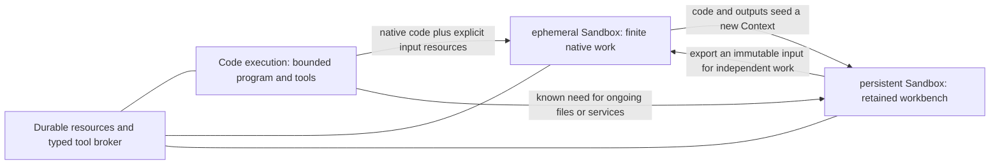
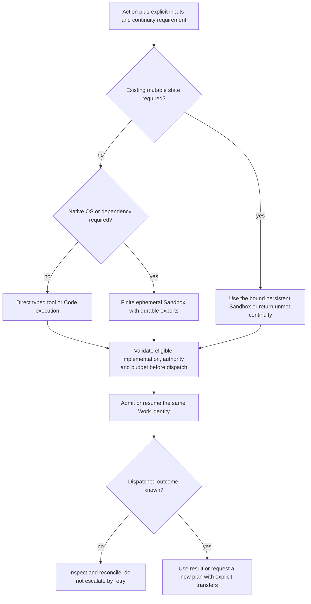
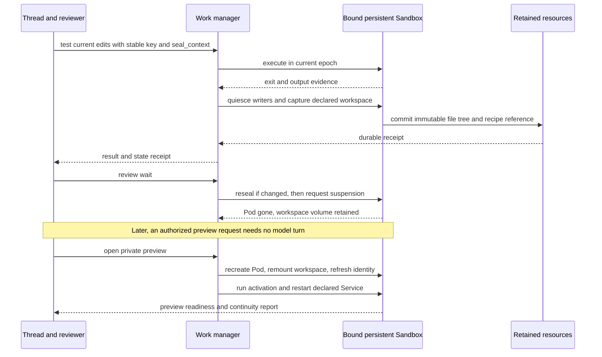

# Two Action Space capabilities: Code execution and Sandbox

Focused product/architecture proposal · September 12, 2026

> **Implementation status:** Historical design, not the shipped API. [README](README.md) and [Executor integration](providers/executor/INTEGRATION.md) define current behavior. Nested MCP calls are diagnostic within one Work; business approvals belong to servers/harnesses. Service/preview proposals below remain unimplemented. Private deployment references have been generalized for publication.

**Recommendation:** Start with two public capabilities: **Code execution** for bounded code-and-tool composition, and **Sandbox** for isolated Linux. Sandbox has **ephemeral** artifact-in/artifact-out and **persistent** retained-workspace lifecycle profiles; these are not separate products. Evaluate Kubernetes Agent Sandbox as a possible shared substrate. Initially promise **declared workspace persistence plus restarted services**, never implicit root-filesystem or RAM retention. Browser remains future and orthogonal.

This companion explains the product cut now consolidated in [ARCHITECTURE_ASTRA_XHIGH.md](ARCHITECTURE_ASTRA_XHIGH.md); it does not claim these APIs exist. Keep one Work journal, optional stateful Contexts, thread bindings, state lineage distinct from allocation epoch, and explicit publication/checkpoint failures. Two choices shape the initial profiles: **ship finite native jobs before arbitrary interpreter-memory continuity**, and **make persistent Sandbox recovery scope explicit instead of treating every Linux substrate as a machine-disk snapshot service**.

Runtime enforcement, storage and lifecycle configuration require deployment-specific verification. The supplied research of public Kubernetes SIGs Agent Sandbox is evidence about a possible implementation, not proof of any deployment's behavior.

## 1. Work backward from three usage profiles across two capabilities

| | **Code execution** | **ephemeral Sandbox** | **persistent Sandbox** |
| --- | --- | --- | --- |
| Customer asks | “Use these tools and calculate the answer.” | “Run this program on these inputs and return the outputs.” | “Keep this place where the agent and reviewer work.” |
| Typical example | Combine CRM and billing responses into a reviewable digest | OCR a batch of PDFs, run native Python analysis, render a document | Edit a repository, run tests repeatedly, install tools, maintain a private preview |
| Execution affordance | Bounded JS with typed broker tools; no source imports | Linux process tree, native dependencies, scratch disk, pinned image | Linux processes and live files, mutable disk, supervised services, terminal and preview |
| Allocation lifetime | One bounded composition invocation | One bounded Work execution plus output-finalization window | Demand-driven allocations for a durable Context |
| Runtime state between calls | None | None; following the same Work is not another execution call | Same live Context while allocated; declared workspace survives successful parking |
| Retained independently | Work/child receipts and explicitly published resources | Work/logs and committed output manifest | Work/logs, recovery points, file exports and Service definitions |
| Thread integration | Scoped tools; no environment binding | Default image/profile is a preference, not a Context binding | Versioned `sandbox` binding supplies shell/file target automatically |
| Idle behavior | Invocation ends | ephemeral Sandbox ends; no sleeping job environment | Drain, seal workspace, release Pod; remount workspace and restart Services on demand |
| Core exclusion | No arbitrary POSIX/Node/native package promise | No continuing shell, heap, daemon or private preview after completion | Root-layer changes, RAM and sockets do not survive the initial suspension contract |

The product progression is **composition → native work → retained native work**. It is not strictly increasing CPU size, isolation strength, or authority. A large ephemeral Sandbox can use more compute than a small persistent Sandbox. A Code execution invocation with a permitted payment tool can have more consequential authority than an offline persistent Sandbox.

Cloudflare Project Think's published ladder is workspace → isolate → npm → browser → sandbox. It establishes useful incremental capabilities, not our public taxonomy. Here, durable file/resource operations remain common primitives; compatible packages extend Code execution; browser access is composable. Sandbox lifecycle profiles distinguish **return outputs** from **retain a place of work**. [Sources](#9-evidence-and-validation)



The arrows are **explicit transfers or new requests**, not an obligation to visit each profile. Reading a saved result should wake none of them.

“Retained” means within an explicit retention policy, not forever. Return expiry/continuity information with results and Context receipts; the overnight promise requires valid volume, recipe, resource and recovery-point retention. Closing a persistent Sandbox stops admission and releases compute; purging its data is a separate authorized operation.

## 2. Why the middle should be a native ephemeral Sandbox

| Middle candidate | Distinct job and operational boundary | Decision |
| --- | --- | --- |
| **Finite native ephemeral Sandbox** | Needs real Python/native libraries, binaries or temporary files, but has declared inputs and outputs and no need to revisit the machine. End execution after publishing outputs. | **Choose it.** It adds material affordances beyond the isolate while avoiding retained-context management. |
| **Persistent interpreter** | Repeated questions depend on an expensive or progressively modified heap, such as an in-memory dataframe. Needs serialized cells and live or memory-checkpointed continuity. | A good analytical product, but not the default midpoint. Its preservation contract can be harder than a filesystem-continuous persistent Sandbox's. Choose it instead if repeated stateful analysis is the launch customer job. |
| **Managed browser** | Operate a website without a usable API, with profile/session continuity, observations and exclusive control. | An orthogonal interaction capability. It can be used from Code execution, ephemeral Sandbox, or persistent Sandbox; it does not fill the gap between compatible JS and general native code. |

“Short-lived container” is not yet a product definition. The ephemeral Sandbox promise is **an isolated native program with immutable inputs, a bounded run, and durable declared outputs**. A container, microVM, or provider sandbox can implement it. A plain shared-kernel container is not automatically a sufficient hostile-code tenant boundary; select and validate one isolation boundary for both ephemeral Sandboxes and persistent Sandboxes rather than weaken it to obtain a nominal middle price.

Similarly, Python support is a runtime affordance, not a lifecycle or a third public capability. A Python script can run in an ephemeral Sandbox; an ordinary Python process can run in a persistent Sandbox; neither implies a persistent interpreter service. Python-in-Wasm could eventually fit an isolate profile, but it is not the native-compatibility promise of this initial Code execution product.

The ephemeral profile is coherent because it solves a specific gap: **the customer needs native computation, not stateful environment ownership**. The benefit is less retained state and less lifecycle surface—not a claim that an ephemeral Sandbox VM-second is inherently cheaper than a persistent Sandbox VM-second. Its UX may be staged if almost every native task immediately becomes interactive; that does not create or remove a capability or product.

## 3. The two capabilities and Sandbox's two lifecycle profiles

### Code execution: useful execution without a machine identity

**Customer job.** Query approved systems, join responses, validate/filter JSON, and return a compact answer or an artifact. For example, gather overdue invoices and customer contacts without sending every intermediate record through the model. A single API call can use a direct typed tool without allocating a composition runtime at all.

**Code and dependencies.** Fresh JavaScript execution against a pinned catalog through the lazy `tools` proxy. No source imports, ambient filesystem, arbitrary outbound network, shell, native addons, install scripts, or full Node.js promise. TypeScript describes and checks contracts but is not accepted as guest source in the initial profile. Reviewed pure-JS helpers can be added through a versioned runtime bundle later; package resolution is not an agent-side `npm install` escape hatch.

**Trust and authority.** The isolate boundary contains generated code; typed bindings broker authorized resource/tool calls and attach credentials outside it. Grants, approvals, disclosure controls and child-work budgets are checked on every binding call. A larger catalog does not imply a larger grant. The program does not receive fleet credentials.

**Continuity and lifecycle.** Admit Work → pin/validate code and bindings → start a fresh invocation → record result/children → release. No cross-call heap and no sleep/wake API. Durable resource writes and child receipts survive; local variables do not. Initialization is deterministic runtime setup, not arbitrary project hooks. Approval or invocation loss returns completed/in-flight children and the pending action; do not replay the program to recreate its heap. A submitted long ephemeral Sandbox can outlive the composition that submitted it.

**Placement and reuse.** Choose an eligible isolate implementation by contract, locality, limits and catalog support. Reuse compiled bundles and clean runtime capacity, never another invocation's heap or credentials. The host binds authority and tool defaults, not an environment ID. A native dependency or OS process requirement is a reason to choose ephemeral Sandbox; a need for durable interactive files is a reason to choose persistent Sandbox. Neither is necessary for API aggregation merely because the thread happens to have a coding environment.

### Sandbox · ephemeral: native work whose deliverable is an output, not a machine

**Customer job.** OCR scanned invoices with a native engine, run a bounded pandas/DuckDB report, transcode a supplied file, or execute an isolated test shard from a captured source tree. Submit once, follow Work by ID, and retrieve outputs later without preserving a development machine.

**Code and dependencies.** A prepared image pins Python/Node/other binaries and OS packages; code and inputs are explicitly materialized. Proposed paths: read-only `/code` and `/inputs/<name>`, writable `/scratch` and `/out`. A build that needs to change its checkout explicitly copies source into `/scratch`; immutable inputs are not a pretend writable repository. Child processes are allowed within one owned process tree. Initially accept approved image versions, not arbitrary registry images or per-job package installation with open egress. Adding dependencies means building/selecting a new image; the job contract does not assume package installation is reproducible or safe.

**Trust and authority.** Tenant-isolated Linux execution with narrow workload identity, externally enforced egress, bounded CPU/RAM/disk/time/output and no host/provider control access. Start with **offline jobs plus scoped resource transfer**. External writes use separate typed broker actions after outputs are inspected/approved, rather than turning every shell program into a business-transaction workflow. If broker calls are enabled later, their effects still need independent receipts and reconciliation.

**Continuity and lifecycle.** Admit → allocate clean image → materialize/validate inputs → execute → quiesce all writers → publish outputs → release. There is no named mutable Context, continuing interpreter or environment sleep. A client disconnect does not terminate the job; its deadline and supervisor own it. A frozen output tree and its manifest become durable before success. Program exit and output publication are separate evidence: on export failure retain the program result, retry publication while the allocation is still available under a bounded finalization lease, and report `output_failed` if that cannot complete. Do not rerun user code just to repair a failed upload. At lease expiry, release and identify lost unexported bytes. Logs stream to retained storage with explicit truncation/gap handling; unacknowledged tail bytes can be lost on failure.

Preparation and export validation are controller stages, not arbitrary user `onComplete` hooks. The program can flush its data before exit; the supervisor drains/terminates descendants before taking a coherent output capture. On nonzero exit, report program failure and preserve available evidence; do not require success-only output files to exist. On zero exit, missing declared required outputs prevents successful completion. A transport timeout after publication recovers the existing Work/manifest by key.

**Placement and reuse.** A new ephemeral Sandbox needs image/ABI compatibility, resource limits, data locality and an effect-safe retry contract, but no affinity to a previous job's allocation. A running attempt remains attached to its allocation; statelessness between jobs does not permit moving a live process or heap. Shared clean images and verified caches are reusable; previous writable scratch is not. A failed offline attempt may be retried only after the old allocation is fenced/stopped and the Action's retry contract permits it. Nondeterministic code may return a different result, so “no external writes” is not a promise of bitwise replay. Keep the original Work identity and record attempts. No terminal or private preview survives completion.

**Why not either endpoint?** Native OCR libraries or binaries cannot be assumed to work in Code execution. A persistent Sandbox adds no customer value if the next step only reads the finished report. But if the agent repeatedly edits code, depends on unstored files, or needs a running service, stop packing interactive work into unrelated jobs and create a persistent Sandbox.

### Sandbox · persistent: an orb-like place to continue working

**Customer job.** Iterative coding and review: inspect an unfamiliar repository, modify it, run tests, install a project-local dependency, start a preview, and return the following morning. It can run the same native programs as ephemeral Sandbox, but the agent can rely on the working tree between calls. “Orb-like” describes the bound workbench experience; it does not claim the same underlying snapshot semantics as an Amp orb.

**Code and dependencies.** A pinned image/recipe provides OS packages and toolchains. The initial profile retains `/workspace` on a per-Context volume: uncommitted code, local dependency environments and declared application data belong there. `/inputs` can be rematerialized from retained resource references. Container root-layer installs and other paths are disposable; move an OS dependency into the prepared image/recipe if it must survive suspension. Pin compatibility for native virtual environments and rebuild explicitly when the image changes. Ordinary shell/file tools target the thread's `sandbox` binding. Services belong to a supervisor, not to one shell child or model turn. Full Linux means workload compatibility, not control of the host kernel or platform infrastructure.

**Trust and authority.** Use the same tenant isolation floor as ephemeral Sandbox, with current per-action/workload grants and identity refreshed after restore. Writable environment sharing requires compatible trust and serialized ownership, not a union of every participant's credentials. Human terminal takeover requires a control lease. Preview audience, application login and workload egress are separate policies. Arbitrary authenticated shell/browser access has coarser effect semantics than exact typed broker actions.

**Continuity and lifecycle.** Retain a logical Context independently of allocation. `prepare` builds reusable starting state; first demand installs fresh identity and runs `activate`. Admission pins the binding revision and Context, so rebinding cannot redirect accepted Work. Initial states are ready → draining → sealing → parked → waking → ready, with an explicit blocked state when retention, capture, attachment or readiness fails. Idle invokes bounded `quiesce` hooks, stops writers, commits scoped recovery and confirms compute release. Wake normally remounts the retained volume under the pinned image, rotates allocation epoch, reconnects the worker, runs bounded activation/repair and restarts declared Services. Required hooks gate readiness; optional service health remains separate. Ordinary process heaps and sockets are not sleep promises. A running foreground process blocks idle sleep unless explicitly stopped; a hard lease expiry can still interrupt it and must report that loss.

The Work ledger survives independently of guest storage. **A live retained PVC is not an immutable recovery point.** For the initial profile, `seal_context` publishes a quiescent, policy-filtered file tree of declared durable paths plus the pinned recipe/resource references; it does not snapshot the entire machine. Exclude injected credentials and unsupported filesystem entries under an explicit profile policy. A recorded shell result is not this seal. `seal_failed` retains completed output without claiming scoped recoverability; do not rerun the command. Failed sealing prevents a successful parked receipt; if a resource deadline forces termination, report continuity at risk instead of silently downgrading the contract.

Sealing has real quiescence and export cost. Ordinary shell calls can use `record_result`; explicit seals and orderly parking request the stronger recovery guarantee. A seal without parking resumes eligible activity after capture rather than leaving the workbench frozen.

On abrupt Pod loss the volume may contain newer data than the last seal, but in-flight writes/process outcomes can be uncertain. Reattach only after fencing the old allocation, inspect/report continuity and reconcile Work rather than replay shell history. If storage is unavailable or corrupted, restoration from the retained file tree is explicit recovery to its cursor, not normal wake or a guarantee of zero loss. An accepted rollback opens a new state lineage; epoch changes alone must not conceal lost files. Close, release compute and purge retained data remain distinct.

**Placement and reuse.** Affinity to current state, volume topology/attachment, image compatibility, residency, grants and supervised activity precede cost. Reuse the current healthy allocation when possible. Single-writer ownership requires executor fencing as well as storage attachment policy; PVC access modes alone are not a distributed execution lock. Preparation images can be shared under the right trust boundary; an existing Context's volume or recovery tree is not a reusable project template. Parking removes active compute, not storage/retention costs. An Action Space preview gateway can request wake without invoking a model; core provider routing alone does not establish that behavior. Do not start a persistent Sandbox when only a finite output is wanted; once active, do not export/recreate it merely to save an assumed price difference on a small command.

## 4. Correlate capability, lifecycle and profile in the types

There are exactly **two public capabilities**. `code_execution` correlates only with `invocation`; `sandbox` correlates with `ephemeral` or `persistent`. Control-only lifecycle Work may have `capability: null`; that is not a hidden third capability. Ephemeral Sandbox has no mutable Context. Persistent Sandbox uses Context kind and binding slot `sandbox`.

The examples use the [main typed SDK](ARCHITECTURE_ASTRA_XHIGH.md#5-typed-contracts-keep-execution-publication-and-continuity-distinct), including its correlated `ProfileRef`, `WorkRef`, `ThreadBinding` and `completed` inspection helper. They do not define a competing client or result envelope. The server registers immutable profiles and generates validation; agents select allowed references, not arbitrary provider configuration. Output/resource retention and grants are separate policies from runtime continuity.

```ts
const exampleProfiles = {
  codeExecution: { capability: "code_execution", lifecycle: "invocation", id: "code-js-v1" },
  ephemeralSandbox: { capability: "sandbox", lifecycle: "ephemeral", id: "sandbox-python-ephemeral-v1" },
  persistentSandbox: { capability: "sandbox", lifecycle: "persistent", id: "sandbox-linux-persistent-v1" },
} satisfies { codeExecution: ProfileRef<"invocation">;
  ephemeralSandbox: ProfileRef<"ephemeral">; persistentSandbox: ProfileRef<"persistent"> };
```

The concrete initial profile IDs are `code-js-v1`, `sandbox-python-ephemeral-v1`, and `sandbox-linux-persistent-v1`. The native Python image and persistent recipe can share prepared layers without sharing tenant state. Persistent continuity is a declared workspace contract, never a hidden machine-disk downgrade. `sandbox.run` succeeds only when exit is zero **and** required output publication succeeds; `sandbox.shell` reports a program's nonzero exit as data. Existing Work error, recovery, scheduler and fencing semantics remain unchanged.

Example keys represent logical request IDs persisted by the host before submission. A retry with the same key recovers the same Work; changed parameters under that key conflict. Context creation is lifecycle Work in the same journal, not a hidden second execution system.

Action permissions remain independently granted: process execution, live file access, broker calls, browser operations, service supervision and preview access. Browser work can compose with either capability at the workflow level; initial offline ephemeral Sandboxes consume explicitly exported browser-produced resources rather than acquiring direct session access. Code execution or an authorized persistent Sandbox can call an external browser tool whose session/observation lifecycle stays separate. Installing Chromium in a persistent Sandbox instead is a permitted native workload, not automatically our future managed-browser contract. Profile selection never implicitly supplies browser login or preserves an interpreter heap.

## 5. Automatic placement is not automatic semantic escalation

**Before execution:** the scheduler may pick or revise a placement for the same frozen Work when a reviewed Action declares equivalent implementations and all authority, state, resource and budget constraints still hold. For example, a named image-resize action may allow compatible isolate and native implementations. Record why it chose one. Preflight rejection may select another already-eligible implementation; there are no effects yet to reconcile.

**When semantics change:** changing generated JS into a Python program, adding a dependency outside the selected profile, accepting retained disk costs, importing more data, or widening authority is a new plan. The harness can authorize that plan automatically only under explicit developer policy; otherwise return a structured requirement to the agent or reviewer. `code.execute` is not “try JS everywhere,” and `sandbox.run` cannot silently acquire persistent continuity.

**After dispatch:** a runtime error or timeout is not permission to execute elsewhere. Recover the existing Work first. Reuse its key for submission retries; only retry an attempt under the reviewed retry contract. New code, outputs or continuity require a new Work with provenance linking prior results. Reconcile uncertain effects before any overlapping retry. Stateless heap semantics alone do not make code-mode children safe to replay.

| Boundary | What crosses | What does not |
| --- | --- | --- |
| Code execution → ephemeral Sandbox | Published JSON/files, immutable code tree, selected image/profile | JavaScript heap, implicit tool authority, pending program continuation |
| ephemeral Sandbox → persistent Sandbox | Code tree, committed output tree and authorized logs imported into a newly retained Context | Unexported scratch, running processes, installed packages not represented by image/recipe, provider allocation identity |
| persistent Sandbox → ephemeral Sandbox | Explicit, quiescent exported tree or artifact version plus compatible image | Unexported live changes, home-directory credentials, mutating shared branch, running services |
| Return to current persistent Sandbox | Read outputs or explicitly apply a candidate change under its mutation slot/version preconditions | Automatic overwrite of newer project files or external state |

Prefer staying put when the task depends on the current environment, or when materialization/startup/publication costs exceed expected savings. A small JSON calculation can reasonably run in an already-active persistent Sandbox as part of its current shell script. Conversely, a direct broker call or reading an old artifact should not wake that persistent Sandbox merely because it is bound. Dispatch an ephemeral Sandbox from a persistent Sandbox only when explicit isolation, parallelism, reproducibility or resource fit earns the transfer overhead.



This is a selection aid, not an optimizer implementation. If the required state is an interpreter heap or browser session that these initial profiles cannot preserve, return an unmet contract instead of misrouting it to persistent Sandbox and claiming equivalent continuity.

## 6. Three journeys to test the product choice

### A. A collections digest ends in Code execution

The agent queries a brokered billing page, filters invoices, and returns a bounded digest. There is no Linux allocation and no environment to wake tomorrow; the Work receipt remains readable. This uses the main document's exact `billing.list` contract; the harness injects the account, catalog, `code-js-v1` profile, stable request identity and limits.

```ts
async function collectionsDigest() {
  const { work } = await agent.execute({ code: `
      const response = await tools.billing.list({ limit: 100 });
      if (!response.ok) return response;
      const page = response.data;
      const large = page.items.filter(x => x.totalCents > 50000);
      return { invoiceIds: large.map(x => x.id), incomplete: page.hasMore };
    ` });
  return work; // Host follows the existing Work, not the invocation connection.
}
```

The `incomplete` flag prevents claiming that one page is the entire ledger. A subsequent typed message-send action can require approval; waiting for it retains the proposal, not the isolate. An orb adds no needed affordance here. The native ephemeral Sandbox becomes useful only if the task acquires inputs requiring native processing, not merely because the agent wrote more JavaScript.

### B. OCR starts as an ephemeral Sandbox; ongoing debugging becomes a persistent Sandbox

The caller already uploaded a code tree containing `extract.py` and a PDF bundle. The prepared image supplies Python and the native OCR engine. The job's output contract names the report and normalized rows; its process cannot silently acquire network-write authority.

```ts
async function extractInvoices(code: FileTree, invoices: Artifact) {
  return exec.work.submit({ action: "sandbox.run", version: "v1", target: null,
    input: { profile: exampleProfiles.ephemeralSandbox, code, inputs: { invoices },
      argv: ["python", "/code/extract.py", "/inputs/invoices", "/out"],
      deadlineMs: 600_000,
      outputs: { root: "/out", required: ["report.json", "rows.csv"] } },
  }, { key: "invoice-review-19/extract-v1" });
}

async function continueInPersistentSandbox(
  thread: ThreadId, code: FileTree, invoices: Artifact,
  extraction: WorkRef<SandboxRunOutput>,
) {
  const result = await completed(extraction); // Success requires the committed manifest.
  const context = await completed(await exec.contexts.ensure({
    key: "invoice-review-19/sandbox", owner: thread, name: "sandbox",
    spec: { kind: "sandbox", profile: exampleProfiles.persistentSandbox, seed: code,
      imports: { invoices, previousOutput: result.files },
      retentionUntil: "2026-10-12T00:00:00Z", idle: "seal_and_park" },
  }));
  return exec.threads.bind({ key: "invoice-review-19/bind", thread, context,
    slot: "sandbox", expectedRevision: null });
}
```

The deadline is an illustrative request bound, not a proposed product limit or performance prediction. If the report is sufficient, stop after `extractInvoices`: compute is released after finalization. If the reviewer asks for repeated changes to the parser, the second call creates a new persistent Sandbox from code and imported results. Its first use materializes `/workspace` from the code tree and read-only `/inputs/<name>` from the specified resources; subsequent work is sticky to that Context.

This is not “adopt the old job VM.” It still works after that allocation is gone, and it is auditable exactly which versions moved. If a failed run produced no committed outputs, import the available logs/source/input evidence explicitly instead of inventing an output tree. Retain only explicitly exported diagnostic files under a bounded policy; do not promise a debug machine for every finished job.

A dataframe can stay live inside this persistent Sandbox while its process lives, but sleeping the persistent Sandbox does not promise to preserve it. For finite analysis, persist Parquet/CSV and load it explicitly in the next ephemeral Sandbox. For genuinely heap-dependent repeated analysis, choose a separately negotiated Kernel contract later. Do not transparently reload a CSV and call that restoration of arbitrary prior mutations.

### C. A coding thread stays in its persistent Sandbox across review

The agent already has a `sandbox` binding. Files change repeatedly; tests and a preview share the working tree. Keep ordinary work there instead of exporting every command to a fresh ephemeral Sandbox.

```ts
async function testCurrentEdits(bound: ThreadBinding) {
  return exec.work.submit({ action: "sandbox.shell", version: "v1", target: bound,
    input: { command: "pnpm test", cwd: "/workspace", deadlineMs: 300_000 } },
  { key: "feature-81/test-edits-v3", finish: "seal_context" });
}
```

The native tool adapter injects `bound`; the model only supplies the command and workdir. Success under this finish contract requires the result and the profile's scoped workspace recovery point. If sealing fails after tests ran, return `seal_failed`, not “rerun tests.” Idle/review-wait signals cause the Context manager to evaluate sleep; an active process, human control or permitted Service lease can defer it. The sleep operation must seal again if the Context changed after the test receipt.



After an orderly workspace-preserving suspension, `/workspace` and compatible local dependencies return; the pinned image supplies OS tools, and the preview gets a new process and connection. An ad hoc root-layer `apt install`, `/tmp` data and an unexported Python heap do not return. That continuity report must reach the harness before it assumes yesterday's environment survived intact.

When genuinely independent test shards become useful, publish a source tree once and dispatch ephemeral Sandboxes using that version. They get independent scratch and no write lease on the active persistent Sandbox. Return logs/results or candidate trees; integrating changes is a separate checked mutation. This is a reason for the ephemeral profile even for coding customers—not a reason to relocate every test command.

## 7. Keep the first cut small

**Offer two capabilities; build two execution paths.** Code execution uses a restricted isolate plus the existing broker/resource primitives. Both Sandbox lifecycle profiles use one approved Linux isolation substrate, the same image preparation and process-supervision machinery, and the same Work journal. Only the persistent profile adds Context binding, retained workspace lifecycle, Services and private previews. The ephemeral profile requires its own export/finalization contract, not a second VM fleet or a new general workflow engine.

The initial cut should be:

1. **Code execution:** `execute({code})`, standard JS builtins, typed brokered `tools.*` and bounded result/log output. Direct typed tools remain available without composition.
2. **Sandbox**, with two explicit lifecycle profiles:
   - **Ephemeral:** offline native code, one useful prepared image family, read-only inputs, bounded scratch, declared durable outputs, cancellable/followable Work. No live terminal, service exposure or continued session after completion.
   - **Persistent:** prepared Linux coding/analysis workbench, a stable thread slot, a retained workspace volume, explicit file-tree seals, park/remount/restart, honest continuity reports and supervised service/preview workflow. No implicit root-layer or memory-survival promise.

Defer a standalone Kernel product and managed-browser session product until the customer job justifies their distinct lifecycle costs. Keep typed browser/connector integration possible through existing external tools; that is not a promise of universal hosted browser continuity. This recommendation changes rollout emphasis, not the baseline architecture's ability to add those kinds later.

### Kubernetes can supply capacity, not the execution domain model

**Evaluate candidate infrastructure against the required contracts.** The supplied pinned public Agent Sandbox research supports this mapping; it does not establish that any deployment has those APIs or guarantees. Kata/gVisor selection comes from the Pod's `runtimeClassName` and cluster configuration, not from the name “Sandbox.” Trusted admission must pin an allowed runtime class and prevent workloads from bypassing it, mounting host resources or obtaining Kubernetes control credentials.

| Supplied upstream finding | Proposed use or required Action Space responsibility |
| --- | --- |
| `Sandbox` owns a singleton Pod, optional headless Service and generated PVCs | Store the Sandbox UID as a provider handle. The Context ID and its thread binding remain Action Space identities; a new Pod UID creates a new fenced allocation epoch, not a new conversation. |
| Template + WarmPool + Claim supplies prepared capacity or cold creation | Use for clean ephemeral Sandbox admission when profile, region and trust match. Preparation must precede tenant identity injection. Reuse clean capacity, never return a used writable sandbox directly to the pool. |
| `operatingMode: Suspended` deletes the Pod while retaining Sandbox, Service and PVCs; `Running` recreates the Pod from its template | Fits workspace-preserving persistent Sandbox parking. Retain the Sandbox for the Context's lifetime; observe actual Pod termination before reporting parked, then gate wake on volume attachment and activation readiness. |
| Writable container root layer, `emptyDir`, RAM, processes and sockets do not survive that suspension | Put durable paths on PVCs and pin the image; restart rather than reconnect to old PIDs. This is neither a whole-disk nor a Python-memory checkpoint. |
| Sandbox deletion normally cascades to generated PVCs; Claim expiry `Retain` retains the claim record but deletes its Sandbox | **Do not use Claim expiry as persistent Sandbox parking.** Initially create persistent Sandboxes as directly Context-managed Sandboxes, without an expiring checkout lifetime. Delete ephemeral Sandbox capacity only after finalization; persistent Sandbox purge needs its own retained-data authorization and policy. |
| `sandboxd` supplies gRPC process and HTTP file APIs; its process registry is in memory and daemon shutdown kills its children | Reuse execution/file transport where compatible. Retain Work results/logs/attempts outside the Pod and reconcile missing process evidence. Durable Service definitions plus a supervisor must recreate desired services independently of a shell call; the upstream process API alone does not supply that contract. |
| Core suspension exists; automatic idle decisions and traffic-driven wake are additional work | Action Space owns activity leases, quiescence/sealing, sleep/wake reconciliation and the authenticated preview wake gateway. A Kubernetes Service retaining its name is not a running application, saved connection or private portal. |

For a persistent Sandbox, use the retained PVC for ordinary continuation and the immutable file-tree seal for an explicit recovery point. Keep writers quiesced from the last sleep seal until Pod termination; a spec patch acknowledging `Suspended` is not confirmation of either condition. Storage-class durability, volume attachment/fencing and backup retention must be qualified separately. A CSI volume snapshot could later replace file export for a compatible recovery profile, but availability and consistency are not implied by core Agent Sandbox and it still would not capture RAM or the container root layer.

The separate Python GKE PodSnapshot extension captures memory/container filesystem under GKE + gVisor constraints. It is **not portable core behavior and is not evidence of Kata snapshot support**. Do not build the launch persistent Sandbox or a persistent Kernel promise around it without a verified deployment-specific contract. Upstream router/SDK reconnect semantics likewise do not replace Work admission idempotency, effect reconciliation or thread bindings.

Before selecting a substrate, qualify four things against the **deployed** version: (1) enforced hostile-code isolation, egress and identities; (2) an actual suspend/recreate test across `/workspace`, root layer, `emptyDir`, heap and sockets; (3) volume ownership, deletion/expiry, storage durability and recovery/export behavior; (4) daemon/node-loss fencing, result/log recovery and Service restart. These are implementation acceptance checks to run later, not checks performed for this design note. If workspace-only continuity meets the customer job, this is a strong reuse candidate. If arbitrary machine changes must survive, select a proven machine-snapshot provider/profile rather than rename PVC retention.

## 8. Consequential choices to revisit

- **Who is first: batch/native workloads or interactive analysts?** Choose the ephemeral profile for finite native outputs. If customers mostly maintain and mutate costly in-memory datasets, revisit the deferred interpreter continuity contract; do not silently tack heap preservation onto either initial Sandbox profile.
- **When should the ephemeral Sandbox UX ship?** Measure how often native Work ends with useful outputs versus immediately asking for persistent continuity. If finite runs are rare, stage their UX while retaining `ephemeral` as a Sandbox lifecycle profile; do not market it as another product.
- **How open are dependencies and egress?** Approved images/offline ephemeral Sandboxes limit breadth but make repeatability, isolation and effect handling tractable. Arbitrary Docker images, package installation and authenticated network access would materially expand the launch responsibility.
- **How much persistent Sandbox continuity is required?** Declared workspace plus restarted Services is the starting promise, compatible with the researched upstream PVC model if the deployment qualifies. Preserving ad hoc system installs requires more than that; preserving arbitrary memory requires more again. Whole-machine behavior may justify a different provider, not a misleading guarantee on existing storage.
- **Who can authorize a product change?** The scheduler chooses among already-eligible implementations. A host policy may preauthorize opening a persistent Sandbox under explicit retention/budget limits; otherwise a new continuity/authority requirement goes back to the agent or reviewer. Never infer permission from a lower-tier error.

Judge the cut on completed customer jobs: successful artifact delivery without retained compute, useful persistent Sandbox continuation after review, time spent repackaging inputs, restore/export failures, and total execution plus storage/transfer cost. No price ordering or latency numbers are assumed. If repeated materialization dominates, staying in the existing persistent Sandbox may be both cheaper and easier.

## 9. Evidence and validation

**Established source material, reused rather than re-audited:**

- [Cloudflare Project Think](https://blog.cloudflare.com/project-think/#the-execution-ladder): publishes the workspace/isolate/npm/browser/sandbox ladder and explicit bindings. The earlier Compose/Job/Project comparison was our proposal, not Cloudflare offerings recovered from that article; those names are now superseded.
- [Amp Orbs](https://ampcode.com/docs/orbs), [customizing](https://ampcode.com/docs/orbs/customizing), [portals](https://ampcode.com/docs/orbs/portals), and [handling secrets](https://ampcode.com/docs/orbs/handling-secrets): support thread-bound machines, preparation/activation, resume repair, supervised services, identity separation and private previews. The current documented preparation-cache window in the transferred research is 72 hours, not existing-orb retention. A successful tool result is not proof of a committed machine recovery point.
- `ORB_IMPLEMENTATION_RESEARCH.md`: reports direct observations in the source orb of E2B envd, a Linux VM guest and guest Amp executor, plus public E2B source evidence of Firecracker and separate lifecycle/Connect-RPC guest APIs. Those are not MCP and do not reveal Amp's private protocol, retry guarantees or production snapshot settings. This note performs no new runtime inspection.
- `AGENT_INTERFACE.md`, `PR_FAQ.md`, `ARCHITECTURE.md`, and `ARCHITECTURE_ASTRA_XHIGH.md`: local transferred/evolved design context. In particular, code-mode heap lifetime, broker enforcement, durable Work identity and explicit Context continuity remain separate. These documents are not vendor API specifications or assumed contents of `origin/main`.

**New context supplied by the source thread, not independently re-audited here:** public [Kubernetes SIGs Agent Sandbox](https://agent-sandbox.sigs.k8s.io/) research pinned to [this upstream revision](https://github.com/kubernetes-sigs/agent-sandbox/commit/c8f29552bf6cc85c77d26ae2f24d88143b1201da). Its relevant primary-source locations are:

- [Sandbox types](https://github.com/kubernetes-sigs/agent-sandbox/blob/c8f29552bf6cc85c77d26ae2f24d88143b1201da/api/v1beta1/sandbox_types.go), [controller](https://github.com/kubernetes-sigs/agent-sandbox/blob/c8f29552bf6cc85c77d26ae2f24d88143b1201da/controllers/sandbox_controller.go), and [Claim types](https://github.com/kubernetes-sigs/agent-sandbox/blob/c8f29552bf6cc85c77d26ae2f24d88143b1201da/extensions/api/v1beta1/sandboxclaim_types.go): desired lifecycle, Pod/PVC ownership and expiry semantics.
- [`sandboxd` guide](https://github.com/kubernetes-sigs/agent-sandbox/blob/c8f29552bf6cc85c77d26ae2f24d88143b1201da/packages/sandboxd/USER_GUIDE.md): process/file transport and daemon-scoped process lifecycle.
- [Snapshot documentation](https://github.com/kubernetes-sigs/agent-sandbox/blob/c8f29552bf6cc85c77d26ae2f24d88143b1201da/site/content/docs/sandbox/snapshots/_index.md) and [Python GKE snapshot extension](https://github.com/kubernetes-sigs/agent-sandbox/blob/c8f29552bf6cc85c77d26ae2f24d88143b1201da/clients/python/agentic-sandbox-client/k8s_agent_sandbox/gke_extensions/snapshots/README.md): the separate GKE/gVisor snapshot path, not a portable Kata or core-controller guarantee.

Deployment-specific versions/configuration require qualification. The two capabilities, Sandbox profiles, approved dependency restrictions, ephemeral finalization, portable workspace sealing, lifecycle hooks and scheduler behavior above are **proposed semantics**, not recovered upstream or Amp APIs. No new provider performance/cost measurement is claimed.

The following negative fixtures use the main SDK types to check the product distinctions:

```ts
declare const bindingFixture: ThreadBinding;
declare const runInputFixture: Actions["sandbox.run"]["input"];
declare const runOutputFixture: SandboxRunOutput;
// @ts-expect-error Code execution cannot select a Sandbox lifecycle.
const wrongCodeProfile: ProfileRef = { capability: "code_execution", lifecycle: "ephemeral", id: "bad" };
// @ts-expect-error The persistent profile's actual continuity contract excludes machine-disk recovery.
const machineContinuityFixture: Extract<Profile, { lifecycle: "persistent" }>["continuity"] = { kind: "machine_disk", roots: ["/"], recovery: "portable_tree" };
// @ts-expect-error Native ephemeral Sandbox input cannot be supplied to the Code execution action.
exec.work.submit({ action: "code.execute", version: "v1", target: null, input: runInputFixture }, { key: "negative/profile" });
// @ts-expect-error A fresh ephemeral Sandbox cannot silently target a thread's live persistent Sandbox.
exec.work.submit({ action: "sandbox.run", version: "v1", target: bindingFixture, input: runInputFixture }, { key: "negative/target" });
// @ts-expect-error Nonzero exit is failure evidence, not a successful ephemeral Sandbox deliverable.
const failedEphemeralFixture: SandboxRunOutput = { ...runOutputFixture, exitCode: 2 };
async function checkInferredOutput() {
  const output = await completed(await collectionsDigest());
  // @ts-expect-error Code execution's inferred result does not acquire ephemeral Sandbox output fields.
  return output.files;
}
```

**Current two-capability revision checks, September 13:** `node check.mjs` checked this note's **five TypeScript blocks and six negative fixtures** against the main SDK declarations with TypeScript **5.9.3**, strict ES2022, empty ambient types, `noUncheckedIndexedAccess` and `exactOptionalPropertyTypes`. Removing suppression confirmed each negative fixture fails for the intended distinction. The embedded digest type-checked against `CodeExecutionGlobals` and ran in QuickJS-WASM **0.32.0** with three fixture responses: threshold/order/pagination, empty input and a known tool failure. Mermaid **11.17.2** parsed all **three diagrams**; combined JSON, local-link, fence and vocabulary checks passed across the design set. The main document records the combined totals.

These are historical syntax/type and example checks, not implementation, provider conformance, rendered-layout, security or recovery verification. No live OCR, billing integration, sandbox, VM or persistent service was executed in this design round. Validation scratch and dependencies were kept outside the repository and removed after checking. Deployment qualification remains a separate requirement; see README for subsequent implementation verification.
